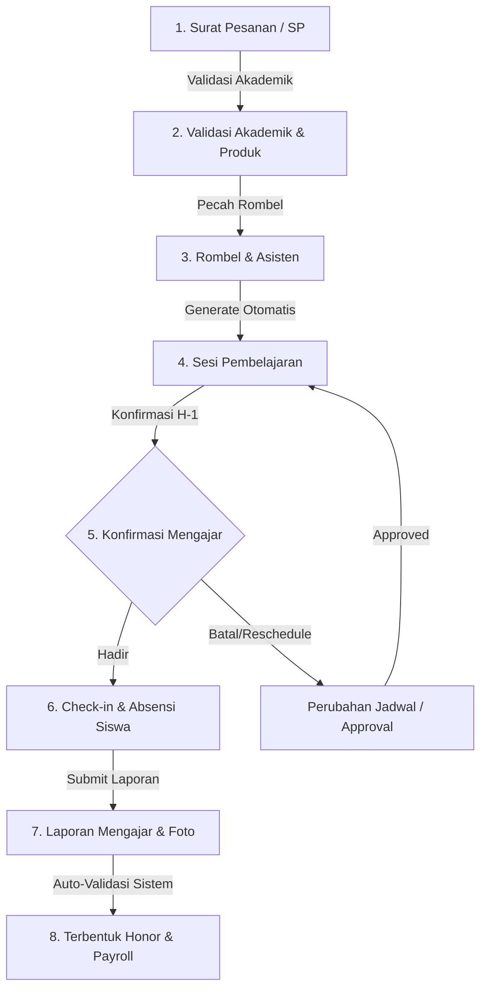
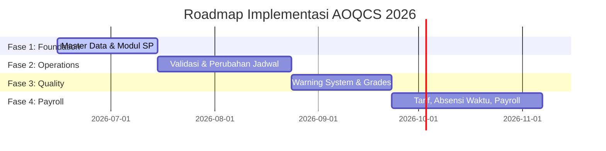

# 📐 Analisis Blueprint 2026 & Roadmap Pengembangan AOQCS (Academic Operations & Quality Control System)
## erlass.institute

> [!NOTE]
> Dokumen ini disusun oleh **Tech Lead Strategist** sebagai panduan arsitektur dan peta jalan (*roadmap*) transformasi sistem dari sistem manajemen ekstrakurikuler saat ini menuju ekosistem kontrol akademik dan finansial terpadu berdasarkan **Blueprint Laporan Mengajar 2026**.

---

## 🗺️ Visi Sistem AOQCS

Sistem **AOQCS (Academic Operations & Quality Control System)** dirancang dengan satu prinsip utama: 
> **"Jika tidak tercatat di AOQCS, maka kegiatan dianggap belum terjadi."**

Sistem ini memastikan seluruh kegiatan pembelajaran dari pesanan pelanggan (*Sales Order* / SP) hingga pembayaran honor instruktur (*Payroll*) dapat dipantau, diaudit, dan dikendalikan secara real-time. Unit terkecil dari sistem ini bukan lagi sekolah atau program, melainkan **1 Sesi Mengajar (*Teaching Session*)**.



---

## 🏛️ 6 Pilar Utama AOQCS

### 1. Operations Control (Kontrol Operasional)
*   **Fokus**: Mengatur rombongan belajar (rombel), jadwal per pertemuan, penugasan instruktur/asisten, dan alur perubahan jadwal.
*   **Aturan Bisnis Utama**:
    *   Jika jumlah siswa dalam satu rombel **melebihi 20 anak**, sistem wajib memberikan peringatan (*soft warning*) bahwa rombel membutuhkan Asisten Instruktur.
    *   Jadwal dibuat **per pertemuan (sesi)**, bukan hanya teks jadwal mingguan statis, untuk mengakomodasi libur nasional, ujian sekolah, dan kendala lapangan.
    *   **Perubahan Jadwal (Rescheduling)**: Jadwal tidak boleh berubah tanpa persetujuan formal. Perubahan harus melalui pengajuan yang mencatat alasan, siapa yang mengajukan, serta persetujuan dari pihak Akademik Erlass dan PIC Sekolah.

### 2. Learning Control (Kontrol Pembelajaran)
*   **Fokus**: Memantau topik materi yang diajarkan, keselarasan dengan silabus, serta kemajuan (*progress*) pembelajaran aktual dibanding rencana target.
*   **Aturan Bisnis Utama**:
    *   Sistem menghitung persentase progres secara otomatis: `(Pertemuan Selesai / Total Pertemuan Target) * 100%`.
    *   Topik materi harus divalidasi silabusnya secara otomatis (menggunakan referensi materi program).

### 3. Attendance Control (Kontrol Kehadiran)
*   **Fokus**: Memantau kehadiran siswa secara real-time dan mengelola kehadiran instruktur (termasuk konfirmasi kehadiran H-1).
*   **Aturan Bisnis Utama**:
    *   **Konfirmasi Mengajar H-1**: Instruktur menerima notifikasi satu hari sebelum mengajar dan wajib mengonfirmasi (`Hadir` atau `Berhalangan`). Jika berhalangan, sistem segera memicu peringatan merah agar koordinator akademik mencari instruktur pengganti (*Substitute Trainer*).
    *   Presensi siswa tidak lagi berupa boolean sederhana (`hadir`/`tidak hadir`), tetapi mendukung status detail: `Hadir`, `Izin`, `Sakit`, `Alpha`.

### 4. Performance Control (Kontrol Performa & Portofolio)
*   **Fokus**: Mencatat nilai perkembangan siswa dan menyimpan berkas portofolio karya siswa sebagai bukti fisik hasil belajar.
*   **Aturan Bisnis Utama**:
    *   Penilaian siswa mencakup empat aspek minimal: Kehadiran, Tugas, Proyek, dan Sikap (skala 0-100).
    *   Setiap kategori program memiliki berkas portofolio wajib: file `.sb3` untuk Scratch, file `.hex` untuk Micro:bit, source code untuk Python, serta foto/video untuk program Robotik.

### 5. Quality Control (Kontrol Kualitas & Mitigasi Risiko)
*   **Fokus**: Mengidentifikasi masalah operasional secara dini sebelum berdampak buruk pada kepuasan pelanggan.
*   **Aturan Bisnis Utama (Warning System)**:
    *   🚨 **Warning Merah (Urgent)**:
        *   Jadwal besok belum ada instruktur utama.
        *   Jadwal hari ini belum dikonfirmasi instruktur (H-1 terlewati).
        *   Kelas sudah selesai dilaksanakan tetapi belum ada input absensi/laporan mengajar.
    *   ⚠️ **Warning Kuning (Warning/Tren Negatif)**:
        *   Tingkat kehadiran siswa rombel turun di bawah 70%.
        *   Jumlah perubahan jadwal rombel terlalu tinggi (lebih dari 3 kali dalam satu periode).
        *   Kemajuan pembelajaran tertinggal dibanding target mingguan.

### 6. Compensation Control (Kontrol Honorarium & Payroll)
*   **Fokus**: Otomatisasi perhitungan honorarium instruktur dan asisten berdasarkan realisasi mengajar yang valid untuk mencegah manipulasi dan kesalahan hitung manual.
*   **Aturan Bisnis Utama**:
    *   Honor terbentuk secara otomatis dari status operasional sesi yang sudah divalidasi sistem (`Mengajar Selesai` -> `Laporan Lengkap` -> `Layak Dibayar`).
    *   **Master Tarif**: Tarif mengajar dibedakan berdasarkan Level Instruktur (Junior, Madya, Senior, Expert, Master Trainer) dan kepakaran produk (Scratch, Microbit, Python, dll.).
    *   **Faktor Disiplin**: Hadir 10 menit sebelum kelas dianggap `Excellent`, tepat waktu dianggap `On Time`. Keterlambatan 5-15 menit memicu `Warning`, dan keterlambatan >15 menit memicu `Penalty` (potongan honor otomatis).
    *   Sistem menghitung **Discipline Score** akumulatif bulanan untuk setiap instruktur.

---

## 📊 Perbandingan Skema Database: Saat Ini vs Rekomendasi Blueprint

Berikut adalah analisis gap detail antara struktur database erlass.institute saat ini dengan kebutuhan entitas di Blueprint 2026.

| Entitas/Fitur | Kondisi Saat Ini (Laravel 12) | Kebutuhan Blueprint AOQCS | Analisis Gap & Tindakan |
| :--- | :--- | :--- | :--- |
| **Sales Order / SP** | Ada tabel `orders_sp` & `order_items` beserta Eloquent Model. | Tabel `orders_sp` & `order_items` dengan status: *Draft, Menunggu Validasi, Disetujui, Berjalan, Selesai, Batal*. | **Selesai (Skema DB & Model)**: Tabel-tabel dan relasi models sudah siap. Sisa implementasi bisnis UI dan impor Excel. |
| **Master Salesman** | Ada tabel `salesmen` beserta Eloquent Model (terhubung ke users). | Tabel `salesmen` yang mencatat Kode Sales, Nama, Group Leader, dan Wilayah. | **Selesai (Skema DB & Model)**: Skema data terintegrasi. Sisa implementasi UI dan impor Excel. |
| **Master Produk** | Ada tabel `products` beserta Eloquent Model. | Tabel `products` dinamis berisi Kode Produk, Nama Produk, Durasi Standar (60/75/90 menit), dan Harga. | **Selesai (Skema DB & Model)**: Produk terpusat dan dinamis siap digunakan. |
| **Validasi Akademik** | Status program langsung dirubah dari `draft` -> `diajukan` -> `disetujui`. | Tabel checklist `academic_approvals` (verifikasi ruang, jadwal, instruktur, dan kuota siswa). | **Baru**: Buat tabel/log persetujuan kelayakan program sebelum dijadwalkan. |
| **Status Rombel** | Status: `belum_mulai`, `berlangsung`, `selesai`, `dibatalkan` pada [EkstrakurikulerRombel.php](file:///root/webapperlass/app/Models/EkstrakurikulerRombel.php). | Status: *Belum Mulai, Aktif, Ditunda, Selesai, Batal*. | **Penyelarasan**: Mapping enum status saat ini dengan istilah operasional blueprint. |
| **Jadwal Sesi** | Menggunakan [EkstrakurikulerSession.php](file:///root/webapperlass/app/Models/EkstrakurikulerSession.php) status: *terjadwal, berlangsung, selesai, dibatalkan, ditunda, tidak_hadir*. | Status: *Terjadwal, Berlangsung, Selesai, Ditunda, Diganti, Libur, Batal*. | **Peningkatan**: Perluas enum status session dengan menambahkan opsi `libur` dan `diganti` (rescheduled). |
| **Perubahan Jadwal** | Method `reschedule` langsung mengubah tanggal di session tanpa pencatatan alur approval. | Tabel `schedule_changes` berisi jadwal lama, jadwal baru, pengusul, approval akademik & PIC sekolah. | **Baru**: Buat tabel `schedule_changes` untuk mengunci audit trail perubahan jadwal. |
| **Kehadiran Siswa** | Tabel `absensi` dengan status boolean `hadir`. | Tabel `attendance` dengan status enum: *Hadir, Izin, Sakit, Alpha*. | **Peningkatan**: Ubah kolom `hadir` (boolean) di tabel `absensi` menjadi status (enum/string). |
| **Warning System** | Belum ada. | Tabel `warnings` untuk log otomatis peringatan merah/kuning beserta status resolusinya. | **Baru**: Buat tabel `warnings` untuk mengelola notifikasi dasbor kepengawasan akademik. |
| **Pilar Honor & Tarif** | Belum ada. | Tabel `instructor_rates` (tarif per level & produk), `session_honor` (perhitungan per sesi), dan `payroll_recap`. | **Baru**: Buat modul kompensasi terpisah yang berelasi dengan `laporan_mengajar` terverifikasi. |

---

## 🚀 Roadmap Rencana Kerja Pengembangan (Phased Roadmap)

Untuk meminimalkan risiko gangguan operasional pada aplikasi erlass.institute yang sedang berjalan, pengembangan dibagi menjadi **4 Fase Strategis**.



### 🗓️ FASE 1: Standardisasi Master Data & Modul Surat Pesanan (SP)
*Fase ini meletakkan fondasi manajemen data dan kontrol penjualan sebelum kelas dibentuk.*

*   **Pilar Terkait**: *Operations Control* (Master Data).
*   **Target Implementasi**:
    1.  **Migrasi Database [SELESAI]**:
        *   Membuat tabel `products` (migrasi data dari konstanta hardcoded).
        *   Membuat tabel `salesmen` (Sales) dan relasinya ke `users` (Role `sales`).
        *   Membuat tabel `orders_sp` (SP) dan `order_items` sebagai pintu masuk program sekolah.
    2.  **Modifikasi Model Sekolah [SELESAI]**:
        *   Menambahkan kolom data PIC sekolah, email/WA PIC (`pic_nama`, `pic_kontak`, `pic_email`), dan lokasi default pembelajaran (`lokasi_default`) ke tabel `sekolah`.
    3.  **UI/UX & Import Modul SP & Sales [PROSES]**:
        *   Form penginputan SP oleh sales dengan status *Draft* -> *Menunggu Validasi*.
        *   **Fitur Import**: Menyediakan modul import massal data Salesman dan Surat Pesanan (SP) dari format Excel atau Google Sheets ke dalam sistem.
*   **Indikator Sukses (KPI)**: Seluruh program baru wajib masuk melalui entry data `orders_sp` (baik via form input maupun import Excel) dan tidak bisa dibuat secara manual langsung di level program.

---

### 🗓️ FASE 2: Validasi Akademik, Rombel, & Kontrol Perubahan Jadwal
*Fase ini berfokus pada transisi dari dokumen SP ke operasional jadwal riil di lapangan.*

*   **Pilar Terkait**: *Operations Control* & *Learning Control*.
*   **Target Implementasi**:
    1.  **Modul Validasi Akademik**:
        *   Halaman checklist bagi admin akademik untuk memvalidasi ketersediaan instruktur, alat, ruangan, dan konfirmasi sekolah terhadap suatu SP.
    2.  **Logika Asisten Rombel**:
        *   Menambahkan sistem validasi pada form rombel: memunculkan peringatan wajib asisten apabila kuota siswa > 20.
    3.  **Alur Approval Perubahan Jadwal**:
        *   Membuat tabel `schedule_changes` untuk menampung pengajuan perubahan hari/jam mengajar.
        *   Membuat workflow approval bertingkat (diusulkan instruktur/admin -> diajukan ke akademik -> disetujui akademik -> disetujui PIC sekolah -> diterapkan ke sesi).
    4.  **Konfirmasi Kehadiran H-1**:
        *   Pengembangan cron job otomatis untuk mendeteksi sesi H-1.
        *   Mengirim notifikasi konfirmasi ke instruktur melalui WhatsApp Gateway (Fonnte).
*   **Indikator Sukses (KPI)**: Tidak ada perubahan tanggal pada tabel `ekstrakurikuler_sessions` yang terjadi tanpa adanya record di tabel `schedule_changes` dengan status `disetujui`.

---

### 🗓️ FASE 3: Kontrol Presensi Detail, Portofolio, & Warning System
*Fase ini meningkatkan pengawasan mutu harian kelas yang sedang berjalan.*

*   **Pilar Terkait**: *Attendance Control*, *Performance Control*, & *Quality Control*.
*   **Target Implementasi**:
    1.  **Refactoring Presensi**:
        *   Mengubah tipe data `hadir` di tabel `absensi` dari boolean menjadi enum (`hadir`, `izin`, `sakit`, `alpha`).
        *   Memperbarui antarmuka presensi instruktur untuk mendukung opsi status tersebut.
    2.  **Modul Penilaian & Portofolio**:
        *   Membuat tabel `student_scores` (kehadiran, tugas, proyek, sikap).
        *   Membuat tabel `student_portfolios` untuk menyimpan file `.sb3`, `.hex`, program Python, atau link video.
    3.  **Warning Engine (Quality Dashboard)**:
        *   Algoritma deteksi otomatis untuk peringatan Merah dan Kuning.
        *   Dasbor khusus Akademik untuk memantau indikator warning yang aktif secara real-time.
*   **Indikator Sukses (KPI)**: Dasbor akademik dapat menampilkan alert instan apabila ada kelas hari ini yang sudah selesai namun belum mengunggah laporan mengajar dalam waktu 24 jam.

---

### 🗓️ FASE 4: Otomatisasi Kompensasi (Honorarium) & Payroll
*Fase terakhir yang menghubungkan seluruh data operasional valid menjadi data pembayaran.*

*   **Pilar Terkait**: *Compensation Control*.
*   **Target Implementasi**:
    1.  **Master Tarif & Kompetensi**:
        *   Membuat tabel `instructor_levels` (Junior, Madya, Senior, dll.) dan `product_tariffs` (tarif Scratch, Python, dll.).
        *   **Skema Tarif Fleksibel**: Menyiapkan aturan tarif umum (*General Tariffs*) serta kolom koreksi khusus (*Override Tariffs*) per sekolah/wilayah (role-based rate adjustment per geografi).
    2.  **Pencatatan Presensi Waktu (Punctuality Factor)**:
        *   Menambahkan logic saat instruktur check-in mengajar untuk mencatat gap waktu dibanding jadwal seharusnya.
        *   Penentuan otomatis status kedisiplinan: `Excellent`, `On Time`, `Warning`, `Penalty`.
    3.  **Generator Honor Otomatis**:
        *   Ketika `laporan_mengajar` divalidasi oleh koordinator, sistem secara otomatis menghitung tarif dasar (dengan koreksi wilayah jika ada), tambahan asisten (jika ada), dan denda keterlambatan (jika ada) untuk sesi tersebut.
        *   Data disimpan ke tabel `session_honor`.
    4.  **Dasbor Keuangan & Payroll**:
        *   Halaman rekap payroll bulanan per instruktur bagi admin keuangan untuk pencairan dana (*Disbursement*).
*   **Indikator Sukses (KPI)**: Waktu pemrosesan rekap honor instruktur di akhir bulan turun dari hitungan hari menjadi hitungan menit secara otomatis tanpa input manual.

---

## 🛠️ Rekomendasi Teknis & Strategi Transaksi

Agar implementasi berjalan aman di Laravel 12.x, beberapa strategi teknis berikut direkomendasikan:

### 1. Keamanan Database dengan Database Transaction
Seluruh proses kritis seperti persetujuan perubahan jadwal (`schedule_changes`) yang merubah record sesi harus dibungkus menggunakan `DB::transaction` untuk mencegah inkonsistensi data jika terjadi kegagalan server di tengah proses.
```php
use Illuminate\Support\Facades\DB;

DB::transaction(function () use ($changeRequest) {
    // 1. Update status perubahan jadwal
    $changeRequest->update(['status' => 'sudah_diterapkan']);
    
    // 2. Update tanggal/jam di session terkait
    $changeRequest->session->update([
        'tanggal_terjadwal' => $changeRequest->tanggal_baru,
        'jam_mulai_terjadwal' => $changeRequest->jam_mulai_baru,
        'jam_selesai_terjadwal' => $changeRequest->jam_selesai_baru,
        'status' => 'terjadwal'
    ]);
});
```

### 2. Notifikasi H-1 dengan Scheduled Queue
Gunakan Laravel Scheduler (`routes/console.php` di Laravel 12) untuk menjalankan pengecekan harian pada pukul 08:00 pagi guna mengirimkan WhatsApp konfirmasi H-1 kepada instruktur yang terjadwal esok hari.
```php
use Illuminate\Support\Facades\Schedule;
use App\Jobs\SendInstructorConfirmationReminder;

Schedule::job(new SendInstructorConfirmationReminder)->dailyAt('08:00');
```

### 3. Separation of Concerns (SoC) pada Honorarium
Buat tabel honorarium sebagai tabel transaksi terpisah (`session_honor`) yang berelasi ke `ekstrakurikuler_session_id`. Hindari menambahkan kolom-kolom payroll langsung pada tabel core `ekstrakurikuler_session` agar data performa query tetap optimal.

> [!TIP]
> **Keputusan Desain Hasil Review**:
> 1. **Data SP & Sales**: Identitas SP dan Sales diinput langsung ke dalam sistem dengan dukungan modul **Import dari Excel atau Google Sheets** untuk tabel `orders_sp` dan `salesmen`.
> 2. **Master Tarif & Koreksi Wilayah**: Penentuan tarif mengajar menggunakan aturan umum (*General Tariffs*) dengan fleksibilitas koreksi khusus (*Override/Corrections*) per sekolah/wilayah geografi.
> 3. **Status Pengembangan**: Cetak biru ini disetujui sebagai acuan dokumentasi. Fondasi database migrations dan Eloquent Models untuk Fase 1 telah diimplementasikan dengan sukses (2026-06-11). Saat ini pengerjaan sedang berjalan pada UI/UX, Controller/Routing, dan logic import Excel/Google Sheets untuk Modul SP & Sales.

