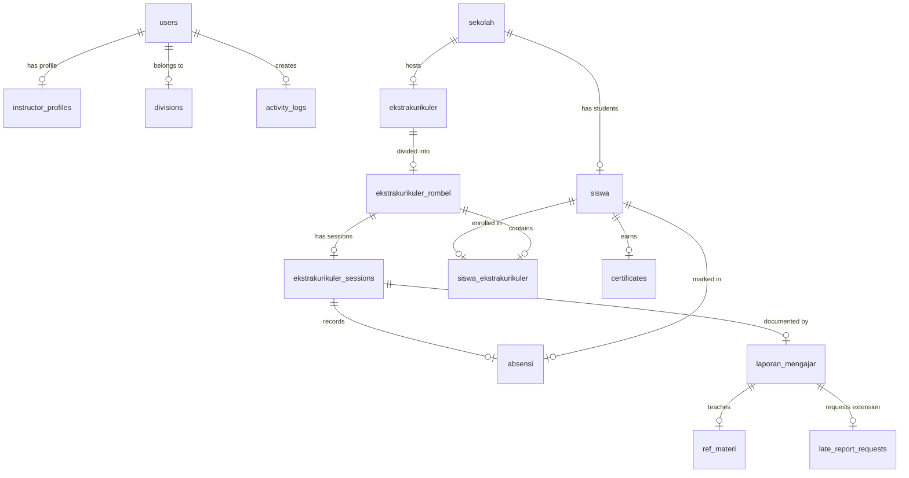

# 🏫 Dokumen Presentasi Eksekutif: Sistem Manajemen Erlass Institute (erlass.institute)

> **Untuk:** Direksi / Stakeholder / Client  
> **Judul:** Transformasi Digital Operasional & Dashboard Terintegrasi Erlass Institute  
> **Tanggal:** 10 Juni 2026  
> **Penyusun:** Tim Pengembang Erlass  

---

## 🎯 1. Ringkasan Eksekutif (Executive Summary)

Erlass Institute mengelola program ekstrakurikuler (coding, robotik, dll.) tingkat SD dan SMP di berbagai sekolah mitra. Untuk meningkatkan efisiensi operasional, kami membangun **Web Apperlass (erlass.institute)**, sebuah sistem ERP terintegrasi yang menangani seluruh siklus operasional:
*   **Pengelolaan Siswa**: Otomatisasi pendaftaran, pemetaan rombongan belajar (rombel), hingga kelulusan.
*   **Manajemen Instruktur**: Proses seleksi mandiri, upload berkas legal (KTP/NPWP/CV), verifikasi profil, hingga penugasan mengajar.
*   **Penjadwalan Pintar**: Pembuatan jadwal sesi otomatis untuk satu semester penuh yang melompati hari libur nasional secara dinamis.
*   **Pelaporan Real-Time**: Pencatatan materi ajar berbasis kurikulum, bukti foto, dan absensi siswa di setiap sesi.
*   **WhatsApp Gateway (Fonnte)**: Pengiriman notifikasi otomatis kepada orang tua siswa secara berkala sebagai bentuk transparansi.

---

## 👥 2. Sistem Otorisasi & Peran Pengguna (Role Matrix)

Sistem menerapkan **Role-Based Access Control (RBAC)** menggunakan package `spatie/laravel-permission` untuk mengamankan data berdasarkan tanggung jawab:

| Role | Level | Tanggung Jawab Utama |
|------|-------|----------------------|
| **Webmaster** | Level 1 (Tertinggi) | Pengendalian penuh server, audit log sistem, keamanan data, dan konfigurasi environment. |
| **Admin Sistem** | Level 2 (Admin Core) | Verifikasi profil dan dokumen instruktur baru, audit laporan mengajar global, serta manajemen data siswa & sekolah. |
| **Admin** | Level 3 (Admin Regional) | Manajemen program ekstrakurikuler, rombel, dan penjadwalan sesi tatap muka di wilayah tertentu. |
| **Sales** | Level 4 (Marketing) | Penginputan data kerja sama program ekstrakurikuler baru dengan sekolah mitra. |
| **Instruktur** | Level 5 (Pengajar) | Penginputan laporan mengajar harian (maksimal H+1), pengambilan absensi siswa, dan melihat jadwal mengajar pribadi. |

---

## 🧙 3. Alur Bisnis & Fitur Unggulan

### A. Intelligent Scheduling (Penjadwalan Cerdas)
*   **Deteksi Bentrok (Hard Conflict)**: Sistem memblokir otomatis penjadwalan instruktur jika mereka sudah memiliki sesi aktif di rombel atau sekolah lain pada jam yang sama.
*   **Pencocokan Preferensi (Soft Conflict)**: Sistem membandingkan jadwal dengan preferensi waktu luang yang diisi instruktur saat registrasi. Jika bentrok dengan kesibukan pribadi, sistem menampilkan peringatan kuning, namun tetap memberikan keleluasaan bagi admin untuk menyimpan jika darurat.
*   **Auto-Generation Sesi**: Cukup input rombel sekali, sistem langsung menggenerasi jadwal tatap muka satu semester sekaligus dengan kemampuan mendeteksi dan melewati hari libur nasional secara otomatis.

### B. Kontrol Disiplin Laporan H+1
*   Instruktur wajib mengisi laporan mengajar maksimal H+1 setelah kelas selesai.
*   Sistem membatasi input setelah melewati batas waktu tersebut untuk memastikan data kemajuan siswa tercatat secara real-time dan mencegah penumpukan laporan di akhir bulan.

### C. WhatsApp Gateway (Fonnte Integration)
*   **Welcome Message**: Notifikasi otomatis yang dikirim ke nomor WhatsApp orang tua ketika siswa baru didaftarkan ke dalam rombel.
*   **Progress Reminder**: Dikirim otomatis ke orang tua setiap kelipatan **4 kali kehadiran** siswa. Sistem secara cerdas menarik 4 ringkasan materi terakhir beserta foto kegiatan belajar dari database.
*   **Schedule Reminder**: Pengingat jadwal otomatis yang dikirim ke instruktur pada H-1 sesi mengajar.

---

## 🏗️ 4. Arsitektur & Tech Stack Sistem

```mermaid
graph TD
    Client[Browser / Client] -->|HTTPS| Nginx{Nginx Reverse Proxy}
    Nginx -->|Port 443| CoreApp[Web Apperlass / Laravel 12]
    
    subgraph Web Apperlass (Core ERP)
        CoreApp --> CoreDB[(MySQL: erlass_db)]
        CoreApp --> Redis[(Redis Cache & Queue)]
        CoreApp --> Fonnte[WhatsApp Gateway API]
    end
```

### Detail Teknologi:
*   **Backend**: Laravel 12.x (MVC) dengan PHP 8.2+
*   **Database**: MySQL 8.x (`erlass_db` dengan 24 tabel operasional)
*   **Caching & Queue**: Redis (digunakan untuk mengelola antrean pengiriman WhatsApp agar web tetap responsif tanpa *lag*)
*   **Frontend**: Blade Templates, CSS Bootstrap 5, Alpine.js (interaktivitas ringan), jQuery (AJAX & DataTables), Flatpickr (pemilih tanggal), dan Select2 (pencarian dropdown).
*   **Library Kunci**:
    *   `Spatie Laravel Permission` (Manajemen Role & Hak Akses)
    *   `Maatwebsite Excel` (Import/Export data siswa & laporan)
    *   `Barryvdh Laravel DomPDF` (Pembuatan e-sertifikat & laporan PDF)
    *   `Sentry` (Monitoring error secara real-time)

---

## 🗄️ 5. Skema Relasi Database (ERD)

Berikut adalah skema relasi database untuk **Web Apperlass (`erlass_db`)** yang mengelola seluruh proses operasional:



### Penjelasan Relasi Kunci:
1.  **`users` ke `instructor_profiles`**: Menyimpan berkas registrasi (KTP, CV, NPWP) serta spesialisasi mengajar dan waktu luang mingguan instruktur (JSON).
2.  **`sekolah` ke `siswa`**: Relasi berdasarkan kode sekolah (`sekolah.kodlan`) untuk menghubungkan siswa ke asal sekolah masing-masing.
3.  **`ekstrakurikuler` ke `ekstrakurikuler_rombel`**: Membagi kelas program ekstrakurikuler menjadi beberapa rombongan belajar (Rombel) untuk pengelolaan kapasitas.
4.  **`ekstrakurikuler_sessions`**: Jadwal tatap muka per sesi yang mendasari pengisian form `absensi` dan `laporan_mengajar`.
5.  **`ref_materi`**: Tabel referensi kurikulum yang disinkronkan untuk memudahkan instruktur memilih materi ajar yang valid secara dinamis via AJAX.

---

## ⚙️ 6. Keamanan & Pemeliharaan Server

*   **Keamanan HTTPS (SSL)**: Domain `erlass.institute` dan `sandboxlms.erlass.institute` diamankan menggunakan SSL Let's Encrypt dengan pembaruan otomatis yang sudah terintegrasi melalui Nginx.
*   **Error Real-Time**: Integrasi Sentry membantu melacak performa aplikasi dan menangkap bug sebelum disadari oleh pengguna.

---

## 🚀 7. Rencana Pengembangan (Future Roadmap)

1.  **School Management Portal**: Portal mandiri untuk Kepala Sekolah mitra untuk memantau absensi siswa dan mengunduh laporan bulanan.
2.  **Instructor Payroll Estimator**: Perhitungan otomatis honor instruktur berdasarkan akumulasi laporan mengajar yang telah disetujui (Approved).
3.  **Digital Certificates (Automated PDF)**: Pembuatan otomatis e-sertifikat berformat PDF untuk siswa yang lulus program ekstrakurikuler.
4.  **AI Agent Integration**:
    *   *Admin*: Analisis data operasional lewat perintah bahasa alami (natural language).
    *   *Orang Tua*: WhatsApp chatbot 24/7 untuk menanyakan jadwal anak dan progres pembelajaran.
