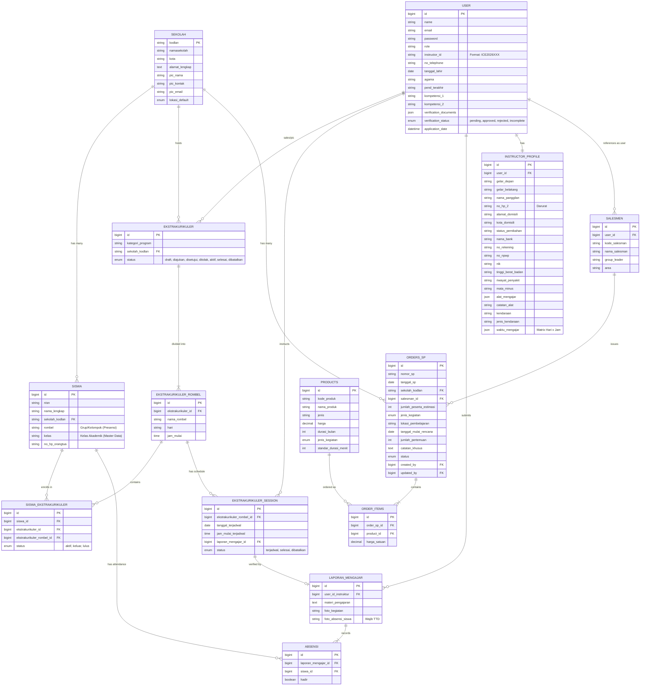

# Skema Database & Relasi
## Sistem Manajemen Ekstrakurikuler Erlass

Dokumen ini menjelaskan struktur database dan hubungan antar entitas (ERD) untuk memudahkan pemahaman teknis bagi developer dan administrator sistem.

### Entity Relationship Diagram (ERD)

### Penjelasan Entitas Utama

1.  **SEKOLAH (`sekolah`)**:
    *   Data induk institusi pendidikan.
    *   Primary Key: `kodlan` (Kode Layanan/NPSN).

2.  **SISWA (`siswa`)**:
    *   Data induk siswa yang terdaftar di sekolah.
    *   Siswa terikat pada sekolah (`sekolah_kodlan`), grup/kelompok belajar (`rombel`), dan kelas akademik asal (`kelas`).

3.  **EKSTRAKURIKULER (`ekstrakurikuler`)**:
    *   Program level atas. Contoh: "Robotika SMAN 1 Jakarta".
    *   Bisa memiliki banyak Rombel (Kelompok Belajar).

4.  **ROMBEL EKSKUL (`ekstrakurikuler_rombel`)**:
    *   Pembagian kelas dalam satu program ekskul.
    *   Contoh: "Robotika Group A" (Senin), "Robotika Group B" (Kamis).
    *   Siswa mendaftar (Enrollment) ke entitas ini.

5.  **SESSION (`ekstrakurikuler_session`)**:
    *   Jadwal pertemuan spesifik.
    *   Dibuat otomatis oleh sistem berdasarkan jadwal Rombel (e.g., 12 pertemuan per semester).

6.  **LAPORAN MENGAJAR (`laporan_mengajar`)**:
    *   Bukti pelaksanaan sesi.
    *   Wajib menyertakan Foto Kegiatan dan Foto Absensi Fisik.
    *   Memiliki relasi 1-to-1 dengan Session.

7.  **ABSENSI (`absensi`)**:
    *   Record kehadiran digital per siswa per pertemuan.
    *   Linked ke Laporan Mengajar.

### Catatan Keamanan & Integritasi
*   **Soft Deletes**: Digunakan pada tabel `ekstrakurikuler` dan `siswa` untuk mencegah kehilangan data tidak sengaja.
*   **Foreign Keys**: Constraint SQL aktif untuk menjaga integritas (misal: menghapus Rombel akan gagal jika masih ada Siswa terdaftar).
*   **File Storage**: Foto disimpan menggunakan path yang di-hash di `storage/app/public` dan tidak dapat diakses langsung tanpa symlink yang benar.
*   **Data Integrity Fallbacks**: Model `User` memiliki logic `boot` (creating/updating) untuk memastikan field krusial seperti `agama`, `pend_terakhir`, dan `kompetensi_1` tidak bernilai `NULL` demi menjaga stabilitas sistem.
