# Skema Database & Relasi
## Sistem Manajemen Akademik & Quality Control (AOQCS) Erlass

Dokumen ini menjelaskan struktur database dan hubungan antar entitas (ERD) untuk memudahkan pemahaman teknis bagi developer dan administrator sistem.

### Entity Relationship Diagram (ERD)

```mermaid
erDiagram
    SEKOLAH ||--o{ SISWA : "has many"
    SEKOLAH ||--o{ EKSTRAKURIKULER : "hosts"
    SEKOLAH ||--o{ ORDERS_SP : "has many"
    SEKOLAH ||--o{ SCHOOL_PICS : "has pics"
    
    SISWA ||--o{ SISWA_EKSTRAKURIKULER : "enrolls in"
    SISWA ||--o{ ABSENSI : "has attendance"
    
    USER ||--o{ EKSTRAKURIKULER : "sales/pic"
    USER ||--o{ EKSTRAKURIKULER_SESSION : "instructs"
    USER ||--o{ LAPORAN_MENGAJAR : "submits"
    USER ||--|| INSTRUCTOR_PROFILE : "has"
    USER ||--o{ SALESMEN : "references as user"
    USER ||--o{ SCHEDULE_CHANGES : "requests/approves"
    USER ||--o{ SESSION_CONFIRMATIONS : "confirm instructor"
    
    EKSTRAKURIKULER ||--|{ EKSTRAKURIKULER_ROMBEL : "divided into"
    EKSTRAKURIKULER_ROMBEL ||--o{ SISWA_EKSTRAKURIKULER : "contains"
    EKSTRAKURIKULER_ROMBEL ||--o{ EKSTRAKURIKULER_SESSION : "has schedule"
    
    LAPORAN_MENGAJAR ||--|| EKSTRAKURIKULER_SESSION : "belongs to session"
    LAPORAN_MENGAJAR ||--|{ ABSENSI : "records"

    SALESMEN ||--o{ ORDERS_SP : "issues"
    ORDERS_SP ||--|{ ORDER_ITEMS : "contains"
    PRODUCTS ||--o{ ORDER_ITEMS : "ordered as"

    EKSTRAKURIKULER_SESSION ||--o{ SCHEDULE_CHANGES : "has schedule changes"
    SCHOOL_PICS ||--o{ SCHEDULE_CHANGES : "approves change request"
    EKSTRAKURIKULER_SESSION ||--o{ SESSION_CONFIRMATIONS : "tracked via H-1 confirmations"
    EKSTRAKURIKULER_SESSION ||--o{ WARNINGS : "triggers warnings (polymorphic)"

    SISWA ||--o{ STUDENT_SCORES : "has scores"
    SISWA ||--o{ STUDENT_PORTFOLIOS : "has portfolios"
    SISWA ||--o{ REPORT_CARDS : "has report cards"
    SISWA ||--o{ CERTIFICATES : "has certificates"
    
    EKSTRAKURIKULER ||--o{ STUDENT_SCORES : "grades"
    EKSTRAKURIKULER ||--o{ STUDENT_PORTFOLIOS : "portfolios"
    EKSTRAKURIKULER ||--o{ REPORT_CARDS : "report cards"
    EKSTRAKURIKULER ||--o{ CERTIFICATES : "certificates"
    
    EKSTRAKURIKULER_ROMBEL ||--o{ STUDENT_SCORES : "scores"
    EKSTRAKURIKULER_ROMBEL ||--o{ STUDENT_PORTFOLIOS : "portfolios"
    EKSTRAKURIKULER_ROMBEL ||--o{ REPORT_CARDS : "report cards"
    
    STUDENT_SCORES ||--o{ REPORT_CARDS : "referenced in"

    USER ||--o{ SALARY_RATES : "creates/updates"
    USER ||--o{ PAYROLL_BATCHES : "processes/pays"
    USER ||--o{ PAYROLL_ITEMS : "receives salary"
    PAYROLL_BATCHES ||--|{ PAYROLL_ITEMS : "contains"
    PAYROLL_ITEMS ||--o{ EKSTRAKURIKULER_SESSION : "pays sessions"


    SEKOLAH {
        string kodlan PK
        string namasekolah
        string kota
        text alamat_lengkap
        enum lokasi_default
        decimal kustom_transport_fee "null"
    }

    SCHOOL_PICS {
        bigint id PK
        string sekolah_kodlan FK
        string nama
        string kontak
        string email
        string jabatan
        bigint user_id FK
    }

    SISWA {
        bigint id PK
        string nisn
        string nama_lengkap
        string sekolah_kodlan FK
        string rombel "Grup/Kelompok (Presensi)"
        string kelas "Kelas Akademik (Master Data)"
        string no_hp_orangtua
    }

    USER {
        bigint id PK
        string name
        string email
        string password
        string role
        string instructor_id "Format: ICE2026XXX"
        string no_telephone
        date tanggal_lahir
        string agama
        string pend_terakhir
        string kompetensi_1
        string kompetensi_2
        json verification_documents
        enum verification_status "pending, approved, rejected, incomplete"
        datetime application_date
    }

    INSTRUCTOR_PROFILE {
        bigint id PK
        bigint user_id FK
        string gelar_depan
        string gelar_belakang
        string nama_panggilan
        string no_hp_2 "Darurat"
        string alamat_domisili
        string kota_domisili
        string status_pernikahan
        string nama_bank
        string no_rekening
        string no_npwp
        string nik
        string tinggi_berat_badan
        string riwayat_penyakit
        string mata_minus
        json alat_mengajar
        string catatan_alat
        string kendaraan
        string jenis_kendaraan
        json waktu_mengajar "Matrix Hari x Jam"
        string level "Junior, Madya, Senior, Expert, Master Trainer"
    }

    EKSTRAKURIKULER {
        bigint id PK
        string kategori_program
        string sekolah_kodlan FK
        enum status "draft, diajukan, disetujui, ditolak, aktif, selesai, dibatalkan"
    }

    EKSTRAKURIKULER_ROMBEL {
        bigint id PK
        bigint ekstrakurikuler_id FK
        string nama_rombel
        string hari
        time jam_mulai
    }

    SISWA_EKSTRAKURIKULER {
        bigint id PK
        bigint siswa_id FK
        bigint ekstrakurikuler_id FK
        bigint ekstrakurikuler_rombel_id FK
        enum status "aktif, keluar, lulus"
    }

    EKSTRAKURIKULER_SESSION {
        bigint id PK
        bigint ekstrakurikuler_rombel_id FK
        date tanggal_terjadwal
        time jam_mulai_terjadwal
        enum status "terjadwal, selesai, dibatalkan, ditunda, libur, diganti"
        string payment_status "unpaid, processing, paid"
        bigint payroll_item_id FK
        string actual_checkin_status "excellent, on_time, warning, penalty"
        decimal actual_checkin_penalty
        decimal calculated_fee
        decimal override_fee
        decimal transport_fee
    }

    LAPORAN_MENGAJAR {
        bigint id PK
        bigint user_id_instruktur FK
        bigint ekstrakurikuler_session_id FK "Inverted 1-to-1 relation"
        text materi_pengajaran
        string foto_kegiatan
        string foto_absensi_siswa "Wajib TTD"
    }

    ABSENSI {
        bigint id PK
        bigint laporan_mengajar_id FK
        bigint siswa_id FK
        enum status "hadir, izin, sakit, alpha"
    }

    PRODUCTS {
        bigint id PK
        string kode_produk
        string nama_produk
        string jenis
        decimal harga
        int durasi_bulan
        enum jenis_kegiatan
        int standar_durasi_menit
    }

    SALESMEN {
        bigint id PK
        bigint user_id FK
        string kode_salesman
        string nama_salesman
        string group_leader
        string area
    }

    ORDERS_SP {
        bigint id PK
        string nomor_sp
        date tanggal_sp
        string sekolah_kodlan FK
        bigint salesman_id FK
        int jumlah_peserta_estimasi
        enum jenis_kegiatan
        string lokasi_pembelajaran
        date tanggal_mulai_rencana
        int jumlah_pertemuan
        text catatan_khusus
        enum status
        bigint created_by FK
        bigint updated_by FK
    }

    ORDER_ITEMS {
        bigint id PK
        bigint order_sp_id FK
        bigint product_id FK
        decimal harga_satuan
    }

    SCHEDULE_CHANGES {
        bigint id PK
        bigint ekstrakurikuler_session_id FK
        bigint requested_by FK
        date original_date
        time original_start_time
        time original_end_time
        date proposed_date
        time proposed_start_time
        time proposed_end_time
        text reason
        bigint academic_approver_id FK
        datetime academic_approved_at
        bigint school_pic_approver_id FK
        datetime school_pic_approved_at
        enum status "pending, approved_academic, approved_pic, rejected, applied"
        text rejection_reason
    }

    SESSION_CONFIRMATIONS {
        bigint id PK
        bigint ekstrakurikuler_session_id FK
        bigint user_id_instruktur FK
        enum status "pending, confirmed, absent"
        datetime confirmed_at
        text notes
    }

    WARNINGS {
        bigint id PK
        enum warning_type "no_instructor, not_confirmed, missing_report, low_attendance, reschedule_limit, behind_target"
        string sourceable_type
        bigint sourceable_id
        enum severity "yellow, red"
        enum status "active, resolved, ignored"
        bigint resolved_by FK
        datetime resolved_at
        text notes
    }

    STUDENT_SCORES {
        bigint id PK
        bigint siswa_id FK
        bigint ekstrakurikuler_id FK
        bigint ekstrakurikuler_rombel_id FK
        decimal nilai_tugas_1
        decimal nilai_tugas_2
        decimal nilai_tugas_3
        decimal nilai_tugas_4
        decimal nilai_sikap_1
        decimal nilai_sikap_2
        decimal nilai_sikap_3
        decimal nilai_sikap_4
        decimal nilai_proyek_1
        decimal nilai_proyek_2
        decimal nilai_proyek_3
        decimal nilai_proyek_4
        decimal nilai_kehadiran
        decimal nilai_tugas
        decimal nilai_proyek
        decimal nilai_sikap
        decimal nilai_akhir
        text catatan_guru
        string projek_scratch
        string periode
        datetime finalized_at
        bigint finalized_by FK
        bigint created_by FK
        bigint updated_by FK
    }

    STUDENT_PORTFOLIOS {
        bigint id PK
        bigint siswa_id FK
        bigint ekstrakurikuler_id FK
        bigint ekstrakurikuler_rombel_id FK
        string tipe_file
        string judul
        text deskripsi
        string file_path
        string url_eksternal
        int pertemuan_ke
        bigint created_by FK
    }

    REPORT_CARDS {
        bigint id PK
        bigint siswa_id FK
        bigint ekstrakurikuler_id FK
        bigint ekstrakurikuler_rombel_id FK
        bigint student_score_id FK
        string periode
        string file_path
        datetime generated_at
        bigint generated_by FK
    }

    CERTIFICATES {
        bigint id PK
        bigint siswa_id FK
        bigint ekstrakurikuler_id FK
        string certificate_code
        date issued_at
        string file_path
        string status
        string qr_code_path
    }

    SALARY_RATES {
        bigint id PK
        string level "junior, madya, senior, expert, master_trainer"
        decimal base_rate
        string product_category
        decimal product_bonus
        bigint created_by FK
        bigint updated_by FK
    }

    PAYROLL_BATCHES {
        bigint id PK
        string code "Format: PAY-YYYYMM"
        date periode
        string status "draft, processed, paid"
        text notes
        datetime processed_at
        bigint processed_by FK
        datetime paid_at
        bigint paid_by FK
    }

    PAYROLL_ITEMS {
        bigint id PK
        bigint payroll_batch_id FK
        bigint user_id_instruktur FK
        int total_sessions
        decimal total_base_fee
        decimal total_product_bonus
        decimal total_transport_fee
        decimal total_penalty
        decimal total_bonus
        decimal net_salary
        string status "pending, approved, paid"
        text notes
    }
```

### Penjelasan Entitas Utama

1.  **SEKOLAH (`sekolah`)**:
    *   Data induk institusi pendidikan.
    *   Primary Key: `kodlan` (Kode Layanan/NPSN).
    *   PIC sekolah dipisahkan ke tabel `school_pics` untuk memfasilitasi pencatatan kontak ganda (normalisasi).

2.  **SCHOOL PICS (`school_pics`)**:
    *   Informasi kontak perwakilan sekolah/PIC (nama, WA/telepon, email, jabatan).
    *   Berelasi 1-to-N dengan Sekolah dan digunakan dalam approval perubahan jadwal.

3.  **SISWA (`siswa`)**:
    *   Data induk siswa yang terdaftar di sekolah.
    *   Siswa terikat pada sekolah (`sekolah_kodlan`), grup/kelompok belajar (`rombel`), dan kelas akademik asal (`kelas`).

4.  **EKSTRAKURIKULER (`ekstrakurikuler`)**:
    *   Program level atas. Contoh: "Robotika SMAN 1 Jakarta".
    *   Bisa memiliki banyak Rombel (Kelompok Belajar).

5.  **ROMBEL EKSKUL (`ekstrakurikuler_rombel`)**:
    *   Pembagian kelas dalam satu program ekskul.
    *   Contoh: "Robotika Group A" (Senin), "Robotika Group B" (Kamis).
    *   Siswa mendaftar (Enrollment) ke entitas ini.

6.  **SESSION (`ekstrakurikuler_session`)**:
    *   Jadwal pertemuan spesifik.
    *   Dibuat otomatis oleh sistem berdasarkan jadwal Rombel (e.g., 12 pertemuan per semester).

7.  **LAPORAN MENGAJAR (`laporan_mengajar`)**:
    *   Bukti pelaksanaan sesi.
    *   Wajib menyertakan Foto Kegiatan dan Foto Absensi Fisik.
    *   **Inverted Relation**: Relasi 1-to-1 dengan Session sekarang merujuk dari `laporan_mengajar` ke `ekstrakurikuler_session_id` (sebelumnya sebaliknya).

8.  **ABSENSI (`absensi`)**:
    *   Record kehadiran digital per siswa per pertemuan.
    *   Linked ke Laporan Mengajar.
    *   Mendukung status ENUM: `hadir`, `izin`, `sakit`, `alpha` (sebelumnya boolean `hadir`).

9.  **SCHEDULE CHANGES (`schedule_changes`)**:
    *   Mencatat riwayat audit trail pengajuan perubahan jadwal pertemuan beserta alur approval bertingkat (Akademik + PIC Sekolah).

10. **SESSION CONFIRMATIONS (`session_confirmations`)**:
    *   Menyimpan log konfirmasi kehadiran instruktur H-1 kelas dimulai.

11. **WARNINGS (`warnings`)**:
    *   Tabel log quality control yang terpicu secara polymorphic berdasarkan kriteria monitoring QC.

12. **PENILAIAN SISWA (`student_scores`)**:
    *   Menyimpan sub-nilai siswa (Tugas, Sikap, Proyek) sebanyak 4x input beserta rata-rata dan Nilai Akhir (NA) otomatis.

13. **PORTOFOLIO SISWA (`student_portfolios`)**:
    *   Menampung file portofolio karya digital siswa (Scratch .sb3, Microbit .hex, Python .py, Gambar, Video, PDF) atau tautan link eksternal per rombel.

14. **RAPOR DIGITAL (`report_cards`)**:
    *   Menyimpan tautan file PDF rapor yang digenerasi otomatis saat finalisasi nilai.

15. **SERTIFIKAT DIGITAL (`certificates`)**:
    *   Menyimpan data sertifikat kelulusan siswa yang eligible, beserta kode unik dan tautan QR Code verifikasi publik.

### Catatan Keamanan & Integritas
*   **Soft Deletes**: Digunakan pada tabel `ekstrakurikuler` dan `siswa` untuk mencegah kehilangan data tidak sengaja.
*   **Foreign Keys**: Constraint SQL aktif untuk menjaga integritas (misal: menghapus Rombel akan gagal jika masih ada Siswa terdaftar).
*   **File Storage**: Foto disimpan menggunakan path yang di-hash di `storage/app/public` dan tidak dapat diakses langsung tanpa symlink yang benar.
*   **Data Integrity Fallbacks**: Model `User` memiliki logic `boot` (creating/updating) untuk memastikan field krusial seperti `agama`, `pend_terakhir`, dan `kompetensi_1` tidak bernilai `NULL` demi menjaga stabilitas sistem.
*   **Compensation Control Integrity**: Sesi yang telah masuk dalam payroll batch dikunci status pembayarannya (`payment_status = 'processing'`) dan nominalnya tidak dapat di-override sampai batch dibayar lunas (`payment_status = 'paid'`).

