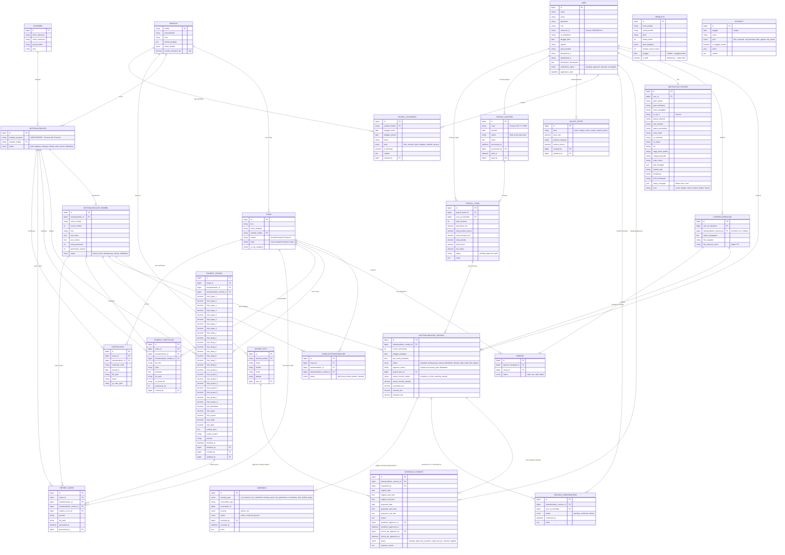

# Skema Database & Relasi
## Sistem Manajemen Akademik & Quality Control (AOQCS) Erlass

Dokumen ini menjelaskan struktur database dan hubungan antar entitas (ERD) untuk memudahkan pemahaman teknis bagi developer dan administrator sistem.

### Entity Relationship Diagram (ERD)


```mermaid
erDiagram
    SEKOLAH ||--o{ SISWA : "has many"
    SEKOLAH ||--o{ EKSTRAKURIKULER : "hosts"
    SEKOLAH ||--o{ SCHOOL_PICS : "has pics"
    SEKOLAH ||--o{ SCHOOL_CALENDARS : "has calendars"
    
    SISWA ||--o{ SISWA_EKSTRAKURIKULER : "enrolls in"
    SISWA ||--o{ ABSENSI : "has attendance"
    
    SALESMEN ||--o{ EKSTRAKURIKULER : "sales/pic"
    USER ||--o{ EKSTRAKURIKULER_SESSION : "instructs"
    USER ||--o{ LAPORAN_MENGAJAR : "submits"
    USER ||--|| INSTRUCTOR_PROFILE : "has"
    USER ||--o{ SCHEDULE_CHANGES : "requests/approves"
    USER ||--o{ SESSION_CONFIRMATIONS : "confirm instructor"
    USER ||--o{ SCHOOL_CALENDARS : "creates"
    
    EKSTRAKURIKULER ||--|{ EKSTRAKURIKULER_ROMBEL : "divided into"
    EKSTRAKURIKULER_ROMBEL ||--o{ SISWA_EKSTRAKURIKULER : "contains"
    EKSTRAKURIKULER_ROMBEL ||--o{ EKSTRAKURIKULER_SESSION : "has schedule"
    
    LAPORAN_MENGAJAR ||--|| EKSTRAKURIKULER_SESSION : "belongs to session"
    LAPORAN_MENGAJAR ||--|{ ABSENSI : "records"
    
    EKSTRAKURIKULER_SESSION ||--o{ SCHEDULE_CHANGES : "has schedule changes"
    SCHOOL_PICS ||--o{ SCHEDULE_CHANGES : "approves change request"
    EKSTRAKURIKULER_SESSION ||--o{ SESSION_CONFIRMATIONS : "tracked via H-1 confirmations"
    EKSTRAKURIKULER_SESSION ||--o{ WARNINGS : "triggers warnings (polymorphic)"
    
    SISWA ||--o{ STUDENT_SCORES : "has scores"
    SISWA ||--o{ STUDENT_PORTFOLIOS : "has portfolios"
    SISWA ||--o{ REPORT_CARDS : "has report cards"
    SISWA ||--o{ CERTIFICATES : "has certificates"
    
    EKSTRAKURIKULER ||--o{ STUDENT_SCORES : "grades"
    EKSTRAKURIKULER ||--o{ STUDENT_PORTFOLIOS : "portfolios"
    EKSTRAKURIKULER ||--o{ REPORT_CARDS : "report cards"
    EKSTRAKURIKULER ||--o{ CERTIFICATES : "certificates"
    
    EKSTRAKURIKULER_ROMBEL ||--o{ STUDENT_SCORES : "scores"
    EKSTRAKURIKULER_ROMBEL ||--o{ STUDENT_PORTFOLIOS : "portfolios"
    EKSTRAKURIKULER_ROMBEL ||--o{ REPORT_CARDS : "report cards"
    
    STUDENT_SCORES ||--o{ REPORT_CARDS : "referenced in"

    USER ||--o{ SALARY_RATES : "creates/updates"
    USER ||--o{ PAYROLL_BATCHES : "processes/pays"
    USER ||--o{ PAYROLL_ITEMS : "receives salary"
    PAYROLL_BATCHES ||--|{ PAYROLL_ITEMS : "contains"
    PAYROLL_ITEMS ||--o{ EKSTRAKURIKULER_SESSION : "pays sessions"


    SEKOLAH {
        string kodlan PK
        string namasekolah
        string kota
        text alamat_lengkap
        enum lokasi_default
        decimal kustom_transport_fee "null"
    }

    SCHOOL_PICS {
        bigint id PK
        string sekolah_kodlan FK
        string nama
        string kontak
        string email
        string jabatan
        bigint user_id FK
    }

    SISWA {
        bigint id PK
        string nisn
        string nama_lengkap
        string sekolah_kodlan FK
        string rombel "Grup/Kelompok (Presensi)"
        string kelas "Kelas Akademik (Master Data)"
        string no_hp_orangtua
    }

    USER {
        bigint id PK
        string name
        string email
        string password
        string role
        string instructor_id "Format: ICE2026XXX"
        string no_telephone
        date tanggal_lahir
        string agama
        string pend_terakhir
        string kompetensi_1
        string kompetensi_2
        json verification_documents
        enum verification_status "pending, approved, rejected, incomplete"
        datetime application_date
    }

    INSTRUCTOR_PROFILE {
        bigint id PK
        bigint user_id FK
        string gelar_depan
        string gelar_belakang
        string nama_panggilan
        string no_hp_2 "Darurat"
        string alamat_domisili
        string kota_domisili
        string status_pernikahan
        string nama_bank
        string no_rekening
        string no_npwp
        string nik
        string tinggi_berat_badan
        string riwayat_penyakit
        string mata_minus
        json alat_mengajar
        string catatan_alat
        string kendaraan
        string jenis_kendaraan
        json waktu_mengajar "Matrix Hari x Jam"
        string level "Junior, Madya, Senior, Expert, Master Trainer"
    }

    EKSTRAKURIKULER {
        bigint id PK
        string kategori_program "VARCHAR(255) - Dinamis dari Products"
        string sekolah_kodlan FK
        enum status "draft, diajukan, disetujui, ditolak, aktif, selesai, dibatalkan"
    }

    EKSTRAKURIKULER_ROMBEL {
        bigint id PK
        bigint ekstrakurikuler_id FK
        string nama_rombel
        int nomor_rombel
        string hari
        time jam_mulai
        time jam_selesai
        int total_pertemuan
        int pertemuan_selesai
        enum status "belum_mulai, berlangsung, selesai, dibatalkan"
    }

    SISWA_EKSTRAKURIKULER {
        bigint id PK
        bigint siswa_id FK
        bigint ekstrakurikuler_id FK
        bigint ekstrakurikuler_rombel_id FK
        enum status "aktif, lulus, keluar, pindah, nonaktif"
    }

    EKSTRAKURIKULER_SESSION {
        bigint id PK
        bigint ekstrakurikuler_rombel_id FK
        int nomor_pertemuan
        date tanggal_terjadwal
        time jam_mulai_terjadwal
        enum status "terjadwal, berlangsung, selesai, dibatalkan, ditunda, tidak_hadir, libur, diganti"
        string payment_status "unpaid, processing, paid, dibatalkan"
        bigint payroll_item_id FK
        string actual_checkin_status "excellent, on_time, warning, penalty"
        decimal actual_checkin_penalty
        decimal calculated_fee
        decimal override_fee
        decimal transport_fee
    }

    LAPORAN_MENGAJAR {
        bigint id PK
        bigint user_id_instruktur FK
        bigint ekstrakurikuler_session_id FK "Inverted 1-to-1 relation"
        text materi_pengajaran
        string foto_kegiatan
        string foto_absensi_siswa "Wajib TTD"
    }

    ABSENSI {
        bigint id PK
        bigint laporan_mengajar_id FK
        bigint siswa_id FK
        enum status "hadir, izin, sakit, alpha"
    }

    PRODUCTS {
        bigint id PK
        string kode_produk
        string nama_produk
        string jenis
        int durasi_bulan
        enum jenis_kegiatan
        int standar_durasi_menit
        date tanggal "nullable - tanggal produk"
        boolean is_aktif "default true - status aktif"
    }

    SALESMEN {
        bigint id PK
        string kode_salesman
        string nama_salesman
        string group_leader
        string area
    }

    SCHEDULE_CHANGES {
        bigint id PK
        bigint ekstrakurikuler_session_id FK
        bigint requested_by FK
        date original_date
        time original_start_time
        time original_end_time
        date proposed_date
        time proposed_start_time
        time proposed_end_time
        text reason
        bigint academic_approver_id FK
        datetime academic_approved_at
        bigint school_pic_approver_id FK
        datetime school_pic_approved_at
        enum status "pending, approved_academic, approved_pic, rejected, applied"
        text rejection_reason
    }

    SESSION_CONFIRMATIONS {
        bigint id PK
        bigint ekstrakurikuler_session_id FK
        bigint user_id_instruktur FK
        enum status "pending, confirmed, absent"
        datetime confirmed_at
        text notes
    }

    WARNINGS {
        bigint id PK
        enum warning_type "no_instructor, not_confirmed, missing_report, low_attendance, reschedule_limit, behind_target"
        string sourceable_type
        bigint sourceable_id
        enum severity "yellow, red"
        enum status "active, resolved, ignored"
        bigint resolved_by FK
        datetime resolved_at
        text notes
    }

    STUDENT_SCORES {
        bigint id PK
        bigint siswa_id FK
        bigint ekstrakurikuler_id FK
        bigint ekstrakurikuler_rombel_id FK
        decimal nilai_tugas_1
        decimal nilai_tugas_2
        decimal nilai_tugas_3
        decimal nilai_tugas_4
        decimal nilai_tugas_5
        decimal nilai_tugas_6
        decimal nilai_tugas_7
        decimal nilai_tugas_8
        decimal nilai_sikap_1
        decimal nilai_sikap_2
        decimal nilai_sikap_3
        decimal nilai_sikap_4
        decimal nilai_sikap_5
        decimal nilai_sikap_6
        decimal nilai_sikap_7
        decimal nilai_sikap_8
        decimal nilai_proyek_1
        decimal nilai_proyek_2
        decimal nilai_proyek_3
        decimal nilai_proyek_4
        decimal nilai_proyek_5
        decimal nilai_proyek_6
        decimal nilai_proyek_7
        decimal nilai_proyek_8
        decimal nilai_kehadiran
        decimal nilai_tugas
        decimal nilai_proyek
        decimal nilai_sikap
        decimal nilai_akhir
        text catatan_guru
        string projek_scratch
        string periode
        datetime finalized_at
        bigint finalized_by FK
        bigint created_by FK
        bigint updated_by FK
    }

    STUDENT_PORTFOLIOS {
        bigint id PK
        bigint siswa_id FK
        bigint ekstrakurikuler_id FK
        bigint ekstrakurikuler_rombel_id FK
        string tipe_file
        string judul
        text deskripsi
        string file_path
        string url_eksternal
        int pertemuan_ke
        bigint created_by FK
    }

    REPORT_CARDS {
        bigint id PK
        bigint siswa_id FK
        bigint ekstrakurikuler_id FK
        bigint ekstrakurikuler_rombel_id FK
        bigint student_score_id FK
        string periode
        string file_path
        datetime generated_at
        bigint generated_by FK
    }

    CERTIFICATES {
        bigint id PK
        bigint siswa_id FK
        bigint ekstrakurikuler_id FK
        string certificate_code
        date issued_at
        string file_path
        string status
        string qr_code_path
    }

    SALARY_RATES {
        bigint id PK
        string level "junior, madya, senior, expert, master_trainer"
        decimal base_rate
        string product_category
        decimal product_bonus
        bigint created_by FK
        bigint updated_by FK
    }

    PAYROLL_BATCHES {
        bigint id PK
        string code "Format: PAY-YYYYMM"
        date periode
        string status "draft, processed, paid"
        text notes
        datetime processed_at
        bigint processed_by FK
        datetime paid_at
        bigint paid_by FK
    }

    PAYROLL_ITEMS {
        bigint id PK
        bigint payroll_batch_id FK
        bigint user_id_instruktur FK
        int total_sessions
        decimal total_base_fee
        decimal total_product_bonus
        decimal total_transport_fee
        decimal total_penalty
        decimal total_bonus
        decimal net_salary
        string status "pending, approved, paid"
        text notes
    }

    HOLIDAYS {
        bigint id PK
        date tanggal "unique"
        string nama
        enum jenis "libur_nasional, cuti_bersama, libur_agama, hari_besar"
        boolean is_tanggal_merah
        year tahun
        text catatan
    }

    SCHOOL_CALENDARS {
        bigint id PK
        string sekolah_kodlan FK
        date tanggal_mulai
        date tanggal_selesai
        string nama
        enum jenis "libur_sekolah, ujian, kegiatan_sekolah, lainnya"
        boolean is_blocking
        text catatan
        bigint created_by FK
    }
```

### Penjelasan Entitas Utama

1.  **SEKOLAH (`sekolah`)**:
    *   Data induk institusi pendidikan.
    *   Primary Key: `kodlan` (Kode Layanan/NPSN).
    *   PIC sekolah dipisahkan ke tabel `school_pics` untuk memfasilitasi pencatatan kontak ganda (normalisasi).

2.  **SCHOOL PICS (`school_pics`)**:
    *   Informasi kontak perwakilan sekolah/PIC (nama, WA/telepon, email, jabatan).
    *   Berelasi 1-to-N dengan Sekolah dan digunakan dalam approval perubahan jadwal.

3.  **SISWA (`siswa`)**:
    *   Data induk siswa yang terdaftar di sekolah.
    *   Siswa terikat pada sekolah (`sekolah_kodlan`), grup/kelompok belajar (`rombel`), dan kelas akademik asal (`kelas`).

4.  **EKSTRAKURIKULER (`ekstrakurikuler`)**:
    *   Program level atas. Contoh: "Robotika SMAN 1 Jakarta".
    *   Bisa memiliki banyak Rombel (Kelompok Belajar).

5.  **ROMBEL EKSKUL (`ekstrakurikuler_rombel`)**:
    *   Pembagian kelas dalam satu program ekskul.
    *   Contoh: "Robotika Group A" (Senin), "Robotika Group B" (Kamis).
    *   Siswa mendaftar (Enrollment) ke entitas ini.

6.  **SESSION (`ekstrakurikuler_session`)**:
    *   Jadwal pertemuan spesifik.
    *   Dibuat otomatis oleh sistem berdasarkan jadwal Rombel (e.g., 12 pertemuan per semester).

7.  **LAPORAN MENGAJAR (`laporan_mengajar`)**:
    *   Bukti pelaksanaan sesi.
    *   Wajib menyertakan Foto Kegiatan dan Foto Absensi Fisik.
    *   **Inverted Relation**: Relasi 1-to-1 dengan Session sekarang merujuk dari `laporan_mengajar` ke `ekstrakurikuler_session_id` (sebelumnya sebaliknya).

8.  **ABSENSI (`absensi`)**:
    *   Record kehadiran digital per siswa per pertemuan.
    *   Linked ke Laporan Mengajar.
    *   Mendukung status ENUM: `hadir`, `izin`, `sakit`, `alpha` (sebelumnya boolean `hadir`).

9.  **SCHEDULE CHANGES (`schedule_changes`)**:
    *   Mencatat riwayat audit trail pengajuan perubahan jadwal pertemuan beserta alur approval bertingkat (Akademik + PIC Sekolah).

10. **SESSION CONFIRMATIONS (`session_confirmations`)**:
    *   Menyimpan log konfirmasi kehadiran instruktur H-1 kelas dimulai.

11. **WARNINGS (`warnings`)**:
    *   Tabel log quality control yang terpicu secara polymorphic berdasarkan kriteria monitoring QC.

12. **PENILAIAN SISWA (`student_scores`)**:
    *   Menyimpan sub-nilai siswa (Tugas, Sikap, Proyek) hingga 8x input (jumlah dinamis mengikuti kontrak pertemuan/rombel) beserta rata-rata dan Nilai Akhir (NA) otomatis.

13. **PORTOFOLIO SISWA (`student_portfolios`)**:
    *   Menampung file portofolio karya digital siswa (Scratch .sb3, Microbit .hex, Python .py, Gambar, Video, PDF) atau tautan link eksternal per rombel.

14. **RAPOR DIGITAL (`report_cards`)**:
    *   Menyimpan tautan file PDF rapor yang digenerasi otomatis saat finalisasi nilai.

15. **SERTIFIKAT DIGITAL (`certificates`)**:
    *   Menyimpan data sertifikat kelulusan siswa yang eligible, beserta kode unik dan tautan QR Code verifikasi publik.

16. **HARI LIBUR NASIONAL (`holidays`)**:
    *   Menyimpan hari libur resmi nasional (tanggal merah/cuti bersama) untuk validasi penjadwalan.

17. **KALENDER AKADEMIK SEKOLAH (`school_calendars`)**:
    *   Kalender khusus per sekolah (libur internal, ujian, kegiatan sekolah) yang dapat memblokir pembuatan sesi mengajar jika bertanda `is_blocking = true`.

18. **INVOICE APPROVALS (`invoice_approvals`)**:
    *   Tabel induk penagihan resmi level sekolah.
    *   Primary Key: `id`, Foreign Key: `sekolah_kodlan` merujuk ke `sekolah.kodlan`.
    *   Menyimpan agregasi sekolah: `total_rombel`, total `jumlah_siswa_billable`, `skema_tagihan` (`bulanan`, `semester`, `tahunan`, `per_4_pertemuan`, `csr_reguler_soga`), `periode_label`, rentang sesi, dan `nomor_invoice`.
    *   Alur verifikasi 2 tahap dengan gerbang checklist:
        *   **Pemeriksaan Produk (Operasional)**: `operasional_status`, `operasional_approved_at`, `is_konfirmasi_pic` (flag konfirmasi sekolah), `pic_konfirmasi_nama` (nama PIC sekolah), `pic_konfirmasi_catatan`, dan `operasional_checklist` (JSON: presensi, modul materi, kesesuaian data billable).
        *   **Distribusi & Dokumen (Akunting)**: `akunting_status`, `akunting_approved_at`, `is_invoice_tercetak` (flag cetak fisik/digital PDF), dan `akunting_checklist` (JSON: rekening Erlass valid, nominal tarif diverifikasi, berkas siap edar).
    *   Nomor invoice berstatus draft (`DRAFT/ERLASS/...`, tanpa kata INV) hingga disetujui resmi oleh Staff Akunting (Gate 2), kemudian difinalisasi otomatis menjadi nomor resmi (`INV/ERLASS/...`).
    *   Siklus Approval: Gate 1 Admin Produksi hanya melakukan verifikasi & konfirmasi (koreksi via fitur yang tersedia). Jika Akunting Gate 2 mengembalikan invoice, status mundur ke `pending_operasional` untuk revisi.

19. **INVOICE APPROVAL ITEMS (`invoice_approval_items`)**:
    *   Rincian tagihan per rombel dalam invoice sekolah (relasi 1-to-N dari `invoice_approvals`).
    *   Foreign Key: `invoice_approval_id` dan `ekstrakurikuler_rombel_id`.
    *   Menyimpan rentang sesi (`sesi_dari`, `sesi_sampai`, `jumlah_sesi`) dan hitungan siswa sistem (`jumlah_siswa_billable`).
    *   Audit trail koreksi manual per rombel: `koreksi_siswa_billable`, `koreksi_catatan`, `koreksi_by`, `koreksi_at`.
    *   Unique index pada `[invoice_approval_id, ekstrakurikuler_rombel_id]`.


### Siklus Hidup & Status Entitas (Program Ekskul s/d Rombel, Sesi, dan Siswa)

Hirarki operasional pembelajaran dari level program hingga ke tingkat presensi siswa digambarkan sebagai berikut:

```
[EKSTRAKURIKULER] (Program Tingkat Sekolah)
       │
       ├───> [EKSTRAKURIKULER_ROMBEL] (Grup / Rombongan Belajar)
       │            │
       │            ├───> [EKSTRAKURIKULER_SESSION] (Sesi Pertemuan Mengajar)
       │            │            │
       │            │            └───> [LAPORAN_MENGAJAR] & [ABSENSI]
       │            │
       │            └───> [SISWA_EKSTRAKURIKULER] (Enrollment / Keanggotaan Siswa)
```

---

#### 1. Status Program (`ekstrakurikuler.status`)
Kolom: `enum('draft','diajukan','disetujui','ditolak','aktif','selesai','dibatalkan')` | Default: `'draft'`

| Status | Label | Arti Bisnis & Kondisi | Transisi Berikutnya |
|---|---|---|---|
| `draft` | Draft | Program baru dibuat/disusun oleh admin/sales, data belum lengkap atau belum diajukan. | `diajukan` |
| `diajukan` | Diajukan | Form wizard telah disubmit, menunggu peninjauan dan persetujuan koordinator/tim akademik (`canBeApproved()`). | `disetujui`, `ditolak` |
| `disetujui` | Disetujui | Disetujui oleh akademik/manajemen, siap diaktifkan dan digenerate rombel serta sesinya (`canBeActivated()`). | `aktif` |
| `ditolak` | Ditolak | Pengajuan program ditolak karena alasan administrasi atau operasional. | `draft` (revisi) |
| `aktif` | Aktif | Program sedang aktif berjalan di sekolah mitra. Rombel aktif dan sesi pertemuan bergulir. | `selesai`, `dibatalkan` |
| `selesai` | Selesai | Seluruh periode kegiatan program telah selesai tuntas (`canBeCompleted()`). | - |
| `dibatalkan` | Dibatalkan | Program dihentikan/dibatalkan sebelum tuntas (misal pembatalan kerja sama oleh pihak sekolah). | - |

##### Contoh Record Nyata Database:
```json
// Status: aktif (Contoh ID 1 - Program berjalan aktif)
{
    "id": 1,
    "sekolah_kodlan": "20101901",
    "kategori_program": "Ekskul Robotik Microbit Learning Kit",
    "status": "aktif",
    "tahun_ajaran": "2026/2027",
    "semester": "ganjil",
    "created_at": "2026-07-21 15:12:03"
}

// Status: selesai (Contoh ID 15 - Program tuntas seluruh pertemuan)
{
    "id": 15,
    "sekolah_kodlan": "20103617",
    "kategori_program": "Ekskul Robotik Microbit Learning Kit",
    "status": "selesai",
    "created_at": "2026-07-31 08:08:11"
}

// Status: dibatalkan (Contoh ID 145 - Free Trial / Kelas dibatalkan)
{
    "id": 145,
    "sekolah_kodlan": "20604630",
    "kategori_program": "Free Trial Class",
    "status": "dibatalkan",
    "created_at": "2026-08-05 10:35:21"
}
```

---

#### 2. Status Rombel (`ekstrakurikuler_rombel.status`)
Kolom: `enum('belum_mulai','berlangsung','selesai','dibatalkan')` | Default: `'belum_mulai'`

| Status | Label | Arti Bisnis & Kondisi | Transisi & Logika Sistem |
|---|---|---|---|
| `belum_mulai` | Belum Mulai | Rombel baru dibuat saat aktivasi program, belum ada sesi yang berjalan. | Berubah ke `berlangsung` saat sesi pertama berjalan. |
| `berlangsung` | Berlangsung | Rombel sedang aktif berjalan. Sesi terjadwal sedang berlangsung sesuai hari & jam mengajar. | Berubah ke `selesai` via auto-increment pertemuan. |
| `selesai` | Selesai | Rombel telah menyelesaikan target seluruh pertemuan. Terpicu otomatis oleh method `incrementPertemuanSelesai()` ketika `pertemuan_selesai >= total_pertemuan`. | - |
| `dibatalkan` | Dibatalkan | Rombel dibatalkan (misal kuota murid tidak tercapai, digabungkan ke rombel lain, atau program dibatalkan). | - |

##### Aturan Integritas Penghapusan Rombel (`canBeDeleted()`):
Sistem memiliki pengaman ketat agar rombel tidak dihapus secara tidak sengaja jika sudah terdapat aktivitas operasional/akademik. Rombel **DILARANG DIHAPUS** (`getDeleteRestrictionReason()`) jika:
1. **Memiliki Siswa Aktif**: Masih ada siswa dengan enrollment `status = 'aktif'` di rombel tersebut (`activeEnrollments()->count() > 0`). Siswa harus dipindahkan (`pindah`) atau dibatalkan (`keluar`) terlebih dahulu.
2. **Memiliki Laporan Mengajar**: Terdapat sesi pada rombel ini yang sudah memiliki relasi `laporan_mengajar` terbit.
3. **Memiliki Sesi Non-Terjadwal**: Terdapat sesi yang statusnya bukan `terjadwal` (misalnya `selesai`, `berlangsung`, `ditunda`, atau `libur`).
4. **Terkunci Payroll / Keuangan**: Sesi dalam rombel telah masuk ke dalam `payroll_items` (penggajian instruktur) atau `invoice_approval_items` (penagihan sekolah).

##### Contoh Record Nyata Database:
```json
// Status: berlangsung (Contoh ID 1 - Rombel aktif, 10 dari 32 pertemuan selesai)
{
    "id": 1,
    "ekstrakurikuler_id": 1,
    "nama_rombel": "Rombel 1",
    "nomor_rombel": 1,
    "hari": "kamis",
    "jam_mulai": "14:30:00",
    "jam_selesai": "16:30:00",
    "total_pertemuan": 32,
    "pertemuan_selesai": 10,
    "status": "berlangsung",
    "user_id_instruktur": 122
}

// Status: selesai (Contoh ID 20 - Rombel telah tuntas 4 dari 4 pertemuan)
{
    "id": 20,
    "ekstrakurikuler_id": 15,
    "nama_rombel": "Rombel 1",
    "nomor_rombel": 1,
    "hari": "jumat",
    "jam_mulai": "13:00:00",
    "jam_selesai": "14:30:00",
    "total_pertemuan": 4,
    "pertemuan_selesai": 4,
    "status": "selesai",
    "user_id_instruktur": 199
}

// Status: dibatalkan (Contoh ID 406 - Rombel dihentikan sebelum kuota tuntas)
{
    "id": 406,
    "ekstrakurikuler_id": 321,
    "nama_rombel": "Rombel 1",
    "nomor_rombel": 1,
    "hari": "kamis",
    "jam_mulai": "13:40:00",
    "jam_selesai": "15:10:00",
    "total_pertemuan": 32,
    "pertemuan_selesai": 4,
    "status": "dibatalkan",
    "user_id_instruktur": 244
}
```

---

#### 3. Status Sesi Pertemuan (`ekstrakurikuler_session.status`)
Kolom: `enum('terjadwal','berlangsung','selesai','dibatalkan','ditunda','tidak_hadir','libur','diganti')` | Default: `'terjadwal'`

| Status | Label | Arti Bisnis & Kondisi | Dampak Operasional & Finansial |
|---|---|---|---|
| `terjadwal` | Terjadwal | Sesi rencana yang telah digenerate otomatis berdasarkan hari dan jam rombel. | Belum ada honor instruktur (`payment_status = 'unpaid'`). |
| `berlangsung` | Berlangsung | Sesi sedang aktif berjalan pada jam pelaksanaan atau instruktur telah melakukan check-in via GPS. | Menunggu submit Laporan Mengajar & Presensi. |
| `selesai` | Selesai | Sesi telah selesai dilaksanakan, laporan mengajar & foto absensi telah diverifikasi. | Masuk perhitungan honor instruktur (`payroll_items`) dan dasar tagihan sekolah (`invoice_approvals`). |
| `dibatalkan` | Dibatalkan | Pertemuan dibatalkan secara permanen karena kondisi khusus / kesepakatan sekolah. | `payment_status = 'dibatalkan'`, tidak ditagihkan ke sekolah. |
| `ditunda` | Ditunda | Pertemuan diundur karena berhalangan (misal instruktur sakit / ujian sekolah) dan menunggu penetapan jadwal pengganti. | Menunggu proses pengajuan perubahan jadwal (`schedule_changes`). |
| `tidak_hadir` | Tidak Hadir | Instruktur tidak hadir tanpa konfirmasi / tidak digantikan. | Memicu warning QC (`warnings.warning_type = 'no_instructor'`). |
| `libur` | Libur | Sesi ditiadakan karena bertepatan dengan Hari Libur Nasional (`holidays`) atau Kalender Sekolah (`school_calendars.is_blocking = true`). | Tidak dihitung sebagai pertemuan mengajar selesai. |
| `diganti` | Diganti | Sesi telah resmi digantikan oleh sesi pengganti (rescheduled). | Pertemuan dipindahkan ke record sesi pengganti. |

##### Contoh Record Nyata Database:
```json
// Status: terjadwal (Contoh ID 7918 - Sesi mendatang)
{
    "id": 7918,
    "ekstrakurikuler_id": 150,
    "ekstrakurikuler_rombel_id": 179,
    "nomor_pertemuan": 1,
    "tanggal_terjadwal": "2026-07-11",
    "jam_mulai_terjadwal": "09:00:00",
    "jam_selesai_terjadwal": "11:00:00",
    "status": "terjadwal",
    "payment_status": "unpaid",
    "payroll_item_id": null
}

// Status: selesai (Contoh ID 7930 - Sesi tuntas & masuk payroll)
{
    "id": 7930,
    "ekstrakurikuler_id": 150,
    "ekstrakurikuler_rombel_id": 179,
    "nomor_pertemuan": 13,
    "tanggal_terjadwal": "2026-07-11",
    "jam_mulai_terjadwal": "09:00:00",
    "jam_selesai_terjadwal": "11:00:00",
    "status": "selesai",
    "payment_status": "processing",
    "payroll_item_id": 1912
}

// Status: libur (Contoh ID 70826 - Sesi libur otomatis karena kalender akademik)
{
    "id": 70826,
    "ekstrakurikuler_id": 370,
    "ekstrakurikuler_rombel_id": 552,
    "nomor_pertemuan": 5,
    "tanggal_terjadwal": "2026-08-10",
    "jam_mulai_terjadwal": "15:15:00",
    "jam_selesai_terjadwal": "16:30:00",
    "status": "libur",
    "payment_status": "unpaid",
    "payroll_item_id": null
}

// Status: ditunda (Contoh ID 18369 - Sesi ditunda)
{
    "id": 18369,
    "ekstrakurikuler_id": 254,
    "ekstrakurikuler_rombel_id": 310,
    "nomor_pertemuan": 1,
    "tanggal_terjadwal": "2026-08-08",
    "jam_mulai_terjadwal": "10:00:00",
    "jam_selesai_terjadwal": "11:30:00",
    "status": "ditunda",
    "payment_status": "unpaid",
    "payroll_item_id": null
}
```

---

#### 4. Status Enrollment Siswa (`siswa_ekstrakurikuler.status`)
Kolom: `enum('aktif','lulus','keluar','pindah','nonaktif')` | Default: `'aktif'`

| Status | Label | Arti Bisnis & Kondisi | Perhitungan Tagihan & Kuota |
|---|---|---|---|
| `aktif` | Aktif | Siswa terdaftar aktif mengikuti kegiatan di rombel tersebut. | Dihitung dalam `getJumlahSiswaAktual()`, presensi, dan tagihan invoice billable. |
| `pindah` | Pindah | Siswa dipindahkan ke rombel lain dalam program ekskul yang sama (misal dari Rombel 6 ke Rombel 3). Tanggal keluar tercatat, siswa dibuatkan enrollment baru di rombel tujuan. | Tidak lagi dihitung di rombel lama, tetapi historis presensi di sesi lampau tetap terjaga. |
| `keluar` | Keluar | Siswa mengundurkan diri / berhenti dari kegiatan ekstrakurikuler. Tanggal keluar & alasan keluar wajib tercatat. | Tidak dihitung dalam kuota aktif dan tagihan periode berikutnya. |
| `lulus` | Lulus | Siswa telah menyelesaikan seluruh pertemuan dan berhak atas sertifikat digital (`certificates`). | Diikutsertakan dalam penerbitan rapor dan sertifikat. |
| `nonaktif` | Nonaktif | Dinonaktifkan sementara oleh staf admin untuk verifikasi administrasi. | Kuota ditangguhkan sementara. |

##### Contoh Record Nyata Database:
```json
// Status: aktif (Contoh ID 1 - Siswa aktif di Rombel)
{
    "id": 1,
    "siswa_id": 37,
    "ekstrakurikuler_id": 2,
    "ekstrakurikuler_rombel_id": 3,
    "status": "aktif",
    "tanggal_daftar": "2026-07-28",
    "tanggal_keluar": null,
    "alasan_keluar": null
}

// Status: pindah (Contoh ID 283 - Siswa pindah ke rombel lain)
{
    "id": 283,
    "siswa_id": 375,
    "ekstrakurikuler_id": 13,
    "ekstrakurikuler_rombel_id": 17,
    "status": "pindah",
    "tanggal_daftar": "2026-07-30",
    "tanggal_keluar": "2026-08-26",
    "alasan_keluar": "Pindah rombel (bulk)"
}

// Status: keluar (Contoh ID 111 - Siswa berhenti dari ekskul)
{
    "id": 111,
    "siswa_id": 177,
    "ekstrakurikuler_id": 8,
    "ekstrakurikuler_rombel_id": 10,
    "status": "keluar",
    "tanggal_daftar": "2026-07-29",
    "tanggal_keluar": "2026-08-31",
    "alasan_keluar": "Berhenti mengikuti ekstrakurikuler"
}
```


### Catatan Keamanan & Integritas
*   **Soft Deletes**: Digunakan pada tabel `ekstrakurikuler` dan `siswa` untuk mencegah kehilangan data tidak sengaja.
*   **Foreign Keys**: Constraint SQL aktif untuk menjaga integritas (misal: menghapus Rombel akan gagal jika masih ada Siswa terdaftar).
*   **File Storage**: Foto disimpan menggunakan path yang di-hash di `storage/app/public` dan tidak dapat diakses langsung tanpa symlink yang benar.
*   **Data Integrity Fallbacks**: Model `User` memiliki logic `boot` (creating/updating) untuk memastikan field krusial seperti `agama`, `pend_terakhir`, dan `kompetensi_1` tidak bernilai `NULL` demi menjaga stabilitas sistem.
*   **Compensation Control Integrity**: Sesi yang telah masuk dalam payroll batch dikunci status pembayarannya (`payment_status = 'processing'`) dan nominalnya tidak dapat di-override sampai batch dibayar lunas (`payment_status = 'paid'`).

