# 🏫 Dokumentasi Tech Stack — Web Apperlass (erlass.institute)

> **Nama Aplikasi:** Web Apperlass — Dashboard Manajemen Sistem Erlass  
> **URL Produksi:** https://webapperlass.com  
> **Lokasi Project:** `/root/webapperlass`  
> **Database:** `erlass_db` (MySQL)  
> **Terakhir Diperbarui:** 22 Juni 2026

---

## 🎯 Tentang Aplikasi

**Web Apperlass** adalah sistem manajemen pendidikan (ERP) untuk **Erlass Institute** — lembaga ekstrakurikuler yang mengelola program coding/robotik di sekolah-sekolah (SD/SMP). Aplikasi ini mengatur seluruh siklus operasional: dari pendaftaran program, penjadwalan, laporan mengajar instruktur, absensi siswa, hingga sertifikasi.

### Fitur Utama
- 🧙 **Wizard Ekstrakurikuler** — Wizard 10-langkah untuk membuat program baru
- 📅 **Penjadwalan Otomatis** — Pembuatan sesi yang melewati hari libur secara cerdas
- 📋 **Laporan Mengajar** — Laporan per-sesi instruktur lengkap dengan foto & absensi
- 👥 **Manajemen Siswa** — Enrollment, transfer antar rombel, kelulusan
- 📲 **WhatsApp Gateway** — Notifikasi otomatis via Fonnte
- 📊 **Analytics Dashboard** — Distribusi jadwal, performa program
- ✅ **Verifikasi Instruktur** — Workflow approval KTP, NPWP, CV
- 🔐 **Role-Based Access** — 5 level role dengan Spatie Permission

---

## 🏗️ Arsitektur Sistem

```
Client (Browser)
      │
      ▼
  Nginx (Reverse Proxy + SSL/TLS)
      │
      ▼
  Laravel 12 Application (PHP 8.2)
  ├── Routes (web.php, api.php, auth.php)
  ├── Middleware (Auth, Role, etc.)
  ├── Controllers (15+ controllers)
  ├── Models (Eloquent ORM) ─── 25+ models
  ├── Views (Blade + Bootstrap 5)
  └── Jobs/Notifications (Queue via Redis)
      │
      ├── MySQL Database (erlass_db) ── 38 tabel
      ├── Redis (Cache + Session + Queue)
      └── File Storage (public disk)
           ├── Foto kegiatan mengajar
           ├── Foto absensi siswa
           ├── Foto KTP / NPWP instruktur
           └── File project / sertifikat
```

---

## 🔧 Backend Stack

### Bahasa & Framework Utama

| Teknologi | Versi | Peran |
|-----------|-------|-------|
| **PHP** | ^8.2 | Bahasa pemrograman server-side |
| **Laravel** | ^12.0 | Framework MVC utama |
| **Laravel UI** | ^4.6 | Scaffolding auth (login/register) |
| **Laravel Tinker** | ^2.10 | REPL interaktif debugging |

### Library Utama

| Library | Versi | Fungsi |
|---------|-------|--------|
| **Spatie Laravel Permission** | ^6.19 | Role & Permission management (RBAC) |
| **Maatwebsite Excel** | ^3.1 | Import/export Excel (data siswa, laporan) |
| **Barryvdh Laravel DomPDF** | ^3.1 | Generate PDF (sertifikat, laporan) |
| **Sentry Laravel** | ^4.20 | Error monitoring & performance tracking |

### Dev Dependencies

| Library | Versi | Fungsi |
|---------|-------|--------|
| **Laravel Breeze** | ^2.3 | Auth starter kit |
| **PHPUnit** | ^11.5.3 | Unit & feature testing |
| **Faker** | ^1.23 | Data dummy untuk seeder |
| **Laravel Pint** | ^1.13 | Code formatter |
| **Laravel Sail** | ^1.41 | Docker dev environment |
| **Laravel Pail** | ^1.2.2 | Real-time log viewer |

---

## 🎨 Frontend Stack

| Teknologi | Versi | Peran |
|-----------|-------|-------|
| **Blade** | (bawaan Laravel) | Template engine |
| **Bootstrap** | ^5.3.7 | CSS framework utama |
| **Vite** | ^6.0.11 | Build tool & HMR |
| **Alpine.js** | ^3.4.2 | Reactivity ringan (dropdown, modal, dll.) |
| **jQuery** | ^3.7.1 | DOM manipulation & AJAX |
| **Axios** | ^1.7.4 | HTTP client JavaScript |
| **DataTables** | ^2.2.2 | Tabel interaktif (sorting, searching, pagination) |
| **DataTables-BS5** | ^2.3.7 | DataTables tema Bootstrap 5 |
| **Flatpickr** | ^4.6.13 | Date & time picker |
| **Select2** | ^4.1.0-rc.0 | Dropdown searchable |
| **SASS** | ^1.90.0 | CSS preprocessor |
| **PopperJS** | ^2.11.8 | Positioning (tooltip, dropdown) |

---

## ⚙️ Infrastruktur & Konfigurasi

| Komponen | Konfigurasi | Keterangan |
|----------|-------------|------------|
| **Web Server** | Nginx (Reverse Proxy + SSL) | Melayani HTTPS dan static files secara langsung |
| **Database** | MySQL — `erlass_db` | Database utama untuk aplikasi |
| **Cache** | Redis (`webapperlass_cache`) | Cache data dan setting |
| **Session** | Redis (encrypted) | Session storage user |
| **Queue Driver** | Redis | Menggunakan daemon Systemd `webapperlass-worker.service` |
| **Task Scheduler** | Crontab (`www-data`) | Menjalankan `php artisan schedule:run` setiap menit |
| **Storage** | Public disk (local filesystem) | Menyimpan dokumen & foto laporan |
| **Error Monitoring** | Sentry (traces sample rate: 20%) | Integrasi error tracking |
| **WA Notifikasi** | Fonnte WhatsApp Gateway | API pengiriman pesan WhatsApp |
| **Timezone** | Asia/Jakarta | WIB |
| **Containerization** | Docker (tersedia `docker-compose.yml`) | Lingkungan pengembangan lokal |


---

## 🔐 Sistem Role & Otorisasi

Menggunakan **Spatie Laravel Permission** dengan 5 role:

| Role | Level | Akses |
|------|-------|-------|
| `webmaster` | Tertinggi | Full access semua fitur + debug |
| `admin_sistem` | Admin | Kelola user, verifikasi, analytics |
| `admin` | Admin regional | Kelola program di wilayahnya |
| `sales` | Sales | Input & kelola program baru |
| `instruktur` | Instruktur | Input laporan mengajar, lihat jadwal sendiri |

---

## 🗄️ Database Schema — `erlass_db`

### Daftar Semua Tabel (40 tabel)

| Tabel | Kategori | Keterangan |
|-------|----------|------------|
| `users` | Auth | Data instruktur & admin |
| `instructor_profiles` | Auth | Profil lengkap instruktur |
| `divisions` | Org | Pembagian divisi internal |
| `sekolah` | Master | Data sekolah mitra |
| `school_pics` | Master | Kontak PIC Sekolah |
| `siswa` | Master | Data siswa |
| `products` | Master | Standardisasi produk program |
| `salesmen` | Master | Data salesman & area kerja |
| `holidays` | Master | Hari libur resmi nasional (tanggal merah/cuti bersama) |
| `school_calendars` | Master | Kalender akademik khusus per sekolah mitra |
| `orders_sp` | Sales | Surat Pesanan (SP) |
| `order_items` | Sales | Item produk dalam SP |
| `ekstrakurikuler` | Program | Program ekskul di sekolah |
| `ekstrakurikuler_rombel` | Program | Rombel/grup dalam program |
| `ekstrakurikuler_session` | Program | Sesi pertemuan per rombel |
| `siswa_ekstrakurikuler` | Enrollment | Pendaftaran siswa ke program |
| `laporan_mengajar` | Laporan | Laporan per sesi mengajar |
| `absensi` | Laporan | Absensi siswa per laporan |
| `ref_materi` | Master | Referensi materi pengajaran |
| `schedule_changes` | Workflow | Log & approval perubahan jadwal |
| `session_confirmations` | Workflow | Log konfirmasi kehadiran H-1 |
| `warnings` | Workflow | Log system quality control (Warning QC) |
| `student_scores` | Penilaian | Nilai siswa tugas, sikap, proyek s.d 8x (dinamis sesuai rombel/kontrak) |
| `student_portfolios` | Penilaian | Portofolio file/tautan karya siswa |
| `report_cards` | Output | Rapor belajar siswa (PDF) |
| `certificates` | Output | Sertifikat kelulusan siswa (PDF + QR) |
| `salary_rates` | Payroll | Master tarif honorarium & bonus |
| `payroll_batches` | Payroll | Batch siklus pembayaran payroll bulanan |
| `payroll_items` | Payroll | Struk rekap slip gaji per instruktur |
| `late_report_requests` | Workflow | Permohonan laporan terlambat |
| `activity_logs` | Audit | Log aktivitas sistem |
| `roles` | RBAC | Data role (Spatie) |
| `permissions` | RBAC | Data permission (Spatie) |
| `model_has_roles` | RBAC | Pivot user ↔ role |
| `model_has_permissions` | RBAC | Pivot user/role ↔ permission |
| `role_has_permissions` | RBAC | Pivot role ↔ permission |
| `sessions` | System | Session data |
| `cache` / `cache_locks` | System | Cache Laravel |
| `migrations` | System | Riwayat migrasi |

---

### 📋 Detail Schema Tabel

#### `users`
| Kolom | Tipe | Keterangan |
|-------|------|------------|
| `id` | bigint PK | Auto increment |
| `instructor_id` | varchar UNIQUE | ID instruktur (kode internal, nullable) |
| `nama_lengkap` | varchar | Nama lengkap |
| `email` | varchar UNIQUE | Email login |
| `password` | varchar | Bcrypt hash |
| `tanggal_lahir` | date | Tanggal lahir |
| `no_telephone` | varchar | Nomor HP |
| `status` | varchar | Status aktif/nonaktif |
| `agama` | varchar | Agama |
| `pend_terakhir` | varchar | Pendidikan terakhir |
| `kompetensi_1` | varchar | Kompetensi utama |
| `kompetensi_2` | varchar nullable | Kompetensi kedua |
| `role` | enum | `instruktur`, `admin`, `admin_sistem`, `sales`, `webmaster` |
| `division_id` | bigint FK nullable | FK → divisions.id |
| `email_verified_at` | timestamp nullable | Verifikasi email |
| `sekolah_nama` | varchar nullable | Nama sekolah instruktur |
| `created_at` / `updated_at` | timestamp | |

#### `instructor_profiles`
| Kolom | Tipe | Keterangan |
|-------|------|------------|
| `id` | bigint PK | |
| `user_id` | bigint FK | FK → users.id (CASCADE) |
| `gelar_depan` / `gelar_belakang` | varchar nullable | Gelar akademik |
| `nama_panggilan` | varchar nullable | |
| `no_hp_2` | varchar nullable | Kontak darurat/keluarga |
| `alamat_domisili` | text nullable | |
| `kota_domisili` | varchar nullable | |
| `status_pernikahan` | varchar nullable | |
| `foto_ktp` | varchar nullable | Path file KTP |
| `foto_npwp` | varchar nullable | Path file NPWP |
| `cv_link` | varchar nullable | Link CV |
| `pekerjaan_terakhir` | varchar nullable | |
| `jenjang_mengajar` | varchar nullable | SD / SMP |
| `universitas_jurusan` | varchar nullable | |
| `nama_bank` / `no_rekening` | varchar nullable | Info rekening |
| `no_npwp` / `nik` | varchar nullable | |
| `tinggi_berat_badan` | varchar nullable | |
| `riwayat_penyakit` | text nullable | |
| `mata_minus` | varchar nullable | |
| `alat_mengajar` | text nullable | Laptop, dll. |
| `kendaraan` / `jenis_kendaraan` | varchar nullable | Moda transportasi |
| `waktu_mengajar` | json nullable | Jadwal ketersediaan mengajar |
| `catatan_approval` | text nullable | Catatan verifikasi |
| `alasan_penolakan` | text nullable | |
| `ditolak_oleh` | bigint FK nullable | FK → users.id |
| `diaktifkan_oleh` | bigint FK nullable | FK → users.id |
| `dibatalkan_oleh` | bigint FK nullable | FK → users.id |

#### `divisions`
| Kolom | Tipe | Keterangan |
|-------|------|------------|
| `id` | bigint PK | |
| `name` | varchar | Nama divisi |
| `description` | text nullable | |
| `division_id` | bigint FK nullable | Parent division (self-referential) |

#### `sekolah`
| Kolom | Tipe | Keterangan |
|-------|------|------------|
| `kodlan` | varchar **PK** | Kode sekolah (bukan auto-increment!) |
| `namasekolah` | varchar | Nama sekolah |
| `rank` | varchar nullable | Peringkat |
| `jenjang` | enum | `SD`, `SMP` |
| `sub_jenjang` | varchar nullable | |
| `status` | enum | `Swasta`, `Negeri` |
| `pd` | varchar nullable | |
| `kec` | varchar | Kecamatan |
| `kotkab` | varchar | Kota/Kabupaten |
| `kota` | varchar | Kota |
| `provinsi` | varchar | Provinsi |
| `alamat` | text nullable | Alamat lengkap |

#### `siswa`
| Kolom | Tipe | Keterangan |
|-------|------|------------|
| `id` | bigint PK | |
| `nama_lengkap` | varchar | |
| `nisn` | varchar UNIQUE | Nomor Induk Siswa Nasional |
| `sekolah_kodlan` | varchar FK | FK → sekolah.kodlan |
| `rombel` | varchar | Nama rombel di sekolah |
| `kelas` | varchar nullable | Tingkat kelas |
| `no_hp_orangtua` | varchar nullable | Kontak orang tua |

#### `ekstrakurikuler`
| Kolom | Tipe | Keterangan |
|-------|------|------------|
| `id` | bigint PK | |
| `nama_program` | varchar | Nama program ekskul |
| `kategori_program` | enum | Kategori program |
| `deskripsi` | text nullable | |
| `user_id_sales` | bigint FK nullable | FK → users.id (Sales) |
| `user_id_admin` | bigint FK nullable | FK → users.id (Admin) |
| `region` | varchar nullable | Wilayah |
| `city` | varchar nullable | Kota |
| `sekolah_kodlan` | varchar FK | FK → sekolah.kodlan |
| `alamat_lengkap` | text nullable | |
| `google_maps_link` | varchar nullable | |
| `jarak_km` | decimal(8,2) nullable | Jarak tempuh |
| `kepala_sekolah` | varchar nullable | |
| `penanggung_jawab` | varchar nullable | |
| `no_telepon` | varchar nullable | |
| `email` | varchar nullable | |
| `koneksi_internet` | enum | `ada`, `tidak_ada`, `tidak_diketahui` |
| `proyektor` | enum | `ada`, `tidak_ada`, `tidak_diketahui` |
| `kabel_hdmi` / `kabel_vga` / `kabel_roll` | enum | Ketersediaan alat |
| `total_siswa` / `total_ruangan` / `total_rombel` | integer | |
| `tanggal_mulai` / `tanggal_selesai` | date | |
| `total_pertemuan` | integer | |
| `frekuensi` | enum | `harian`, `mingguan`, `dua_minggu`, `bulanan` |
| `jenis_pembayaran` | enum | Jenis pembayaran program |
| `jenis_alat` | enum | Alat yang digunakan |
| `status` | enum | `draft`, `diajukan`, `disetujui`, `ditolak`, `aktif`, `selesai`, `dibatalkan` |
| `catatan_status` | text nullable | |
| `tanggal_disetujui` | timestamp nullable | |
| `disetujui_oleh` / `created_by` / `updated_by` | bigint FK nullable | FK → users.id |
| `deleted_at` | timestamp nullable | **Soft Delete** |

#### `ekstrakurikuler_rombel`
| Kolom | Tipe | Keterangan |
|-------|------|------------|
| `id` | bigint PK | |
| `ekstrakurikuler_id` | bigint FK | FK → ekstrakurikuler.id (CASCADE) |
| `nama_rombel` | varchar | Contoh: "Rombel 1", "Kelas A" |
| `nomor_rombel` | integer | Urutan rombel (unique per program) |
| `jumlah_siswa` | integer | |
| `ruangan` | varchar nullable | |
| `tanggal_mulai` / `tanggal_selesai` | date | |
| `hari` | enum | `senin`..`minggu` |
| `jam_mulai` / `jam_selesai` | time | |
| `total_pertemuan` | integer | |
| `frekuensi` | enum | |
| `pertemuan_selesai` | integer default 0 | Counter sesi selesai |
| `user_id_instruktur` | bigint FK nullable | FK → users.id |
| `user_id_asisten` | bigint FK nullable | FK → users.id |
| `status` | enum | `belum_mulai`, `berlangsung`, `selesai`, `dibatalkan` |
| `catatan` | text nullable | |
| `created_by` / `updated_by` | bigint FK nullable | |
| `deleted_at` | timestamp nullable | **Soft Delete** |

#### `ekstrakurikuler_session`
| Kolom | Tipe | Keterangan |
|-------|------|------------|
| `id` | bigint PK | |
| `ekstrakurikuler_id` | bigint FK | FK → ekstrakurikuler.id (CASCADE) |
| `ekstrakurikuler_rombel_id` | bigint FK | FK → ekstrakurikuler_rombel.id (CASCADE) |
| `nomor_pertemuan` | integer | Urutan pertemuan |
| `tanggal_terjadwal` | date | Jadwal rencana |
| `jam_mulai_terjadwal` / `jam_selesai_terjadwal` | time | |
| `tanggal_pelaksanaan` | date nullable | Aktual pelaksanaan |
| `jam_mulai_aktual` / `jam_selesai_aktual` | time nullable | |
| `status` | enum | `terjadwal`, `berlangsung`, `selesai`, `dibatalkan`, `ditunda`, `tidak_hadir` |
| `user_id_instruktur` | bigint FK nullable | FK → users.id |
| `user_id_asisten` | bigint FK nullable | FK → users.id |
| `topik_materi` | varchar nullable | |
| `deskripsi_kegiatan` | text nullable | |
| `laporan_mengajar_id` | bigint FK nullable | FK → laporan_mengajar.id |
| `catatan` / `alasan_pembatalan` | text nullable | |
| `tanggal_pengganti` | date nullable | Jika ditunda |
| `created_by` / `updated_by` | bigint FK nullable | |
| `deleted_at` | timestamp nullable | **Soft Delete** |

#### `siswa_ekstrakurikuler` *(Tabel Pivot Enrollment)*
| Kolom | Tipe | Keterangan |
|-------|------|------------|
| `id` | bigint PK | |
| `siswa_id` | bigint FK | FK → siswa.id (CASCADE) |
| `ekstrakurikuler_id` | bigint FK | FK → ekstrakurikuler.id (CASCADE) |
| `ekstrakurikuler_rombel_id` | bigint FK | FK → ekstrakurikuler_rombel.id (CASCADE) |
| `status` | enum | `aktif`, `lulus`, `keluar`, `pindah`, `nonaktif` |
| `tanggal_daftar` | date | Default: now() |
| `tanggal_keluar` | date nullable | |
| `alasan_keluar` | text nullable | |
| `catatan` | text nullable | |
| `created_by` / `updated_by` | bigint FK nullable | FK → users.id |

> **Constraint:** `UNIQUE(siswa_id, ekstrakurikuler_id)` — satu siswa hanya bisa terdaftar sekali per program

#### `laporan_mengajar`
| Kolom | Tipe | Keterangan |
|-------|------|------------|
| `id` | bigint PK | |
| `user_id_instruktur` | bigint FK | FK → users.id (**required**) |
| `user_id_assisten` | bigint FK nullable | FK → users.id |
| `pertemuan_ke` | integer | Nomor pertemuan |
| `rombel` | varchar | Nama rombel |
| `kelas` | varchar nullable | Tingkat kelas |
| `jadwal_mengajar` | date | Tanggal mengajar |
| `jam_mulai` / `jam_selesai` | time | |
| `kategori_pengajaran` | varchar | |
| `materi_pengajaran` | text | |
| `sekolah_nama` | varchar | Nama sekolah |
| `sekolah_kota` | varchar | Kota sekolah |
| `sekolah_kecamatan` | varchar | Kecamatan sekolah |
| `jumlah_siswa_hadir` | integer | |
| `jumlah_siswa_tidak_hadir` | integer default 0 | |
| `jumlah_siswa_keluar` | integer | |
| `foto_kegiatan` | varchar nullable | Path foto |
| `file_project` | varchar nullable | Path file proyek siswa |
| `refleksi_siswa` | text | |
| `refleksi_capaian` | text | |
| `keaktifan` | enum | `sangat_pasif`, `pasif`, `aktif`, `sangat_aktif` |
| `pemahaman_materi` | enum | `belum_paham`, `sedikit_paham`, `paham`, `sangat_paham` |
| `metadata_json` | json nullable | Data tambahan fleksibel |

#### `absensi`
| Kolom | Tipe | Keterangan |
|-------|------|------------|
| `id` | bigint PK | |
| `laporan_mengajar_id` | bigint FK | FK → laporan_mengajar.id (CASCADE) |
| `siswa_id` | bigint FK | FK → siswa.id (CASCADE) |
| `hadir` | boolean default false | Status kehadiran |
| `e_signature_instruktur` | varchar nullable | TTD digital instruktur |
| `e_signature_pic` | varchar nullable | TTD digital PIC sekolah |

> **Constraint:** `UNIQUE(laporan_mengajar_id, siswa_id)` — satu siswa satu absensi per laporan

#### `ref_materi`
| Kolom | Tipe | Keterangan |
|-------|------|------------|
| `id` | bigint PK | |
| `kategori` | varchar | Kategori materi |
| `materi` | varchar | Nama materi pengajaran |

#### `certificates`
| Kolom | Tipe | Keterangan |
|-------|------|------------|
| `id` | bigint PK | |
| `user_id` | bigint FK | FK → users.id (CASCADE) — Siswa/instruktur |
| `ekstrakurikuler_id` | bigint FK | FK → ekstrakurikuler.id (CASCADE) |
| `certificate_code` | varchar UNIQUE | Kode sertifikat (contoh: `CERT-2026-001`) |
| `issued_at` | date | Tanggal diterbitkan |
| `file_path` | varchar nullable | Path PDF sertifikat |

#### `late_report_requests`
| Kolom | Tipe | Keterangan |
|-------|------|------------|
| `id` | bigint PK | |
| `user_id` | bigint FK | FK → users.id (CASCADE) — Instruktur |
| `session_id` | bigint FK | FK → ekstrakurikuler_session.id (CASCADE) |
| `reason` | text | Alasan terlambat lapor |
| `status` | enum | `pending`, `approved`, `rejected` |
| `admin_id` | bigint FK nullable | FK → users.id — Admin yang memproses |

#### `activity_logs`
| Kolom | Tipe | Keterangan |
|-------|------|------------|
| `id` | bigint PK | |
| `user_id` | bigint FK nullable | FK → users.id (SET NULL) |
| `action` | varchar | Aksi: `create`, `update`, `delete`, `login` |
| `description` | text nullable | |
| `properties` | json nullable | Data lama/baru |
| `ip_address` | varchar(45) nullable | |
| `user_agent` | varchar nullable | |

---

## 🔗 Diagram Relasi Antar Tabel (ERD)

```mermaid
erDiagram
    SEKOLAH ||--o{ SISWA : "has many"
    SEKOLAH ||--o{ EKSTRAKURIKULER : "hosts"
    SEKOLAH ||--o{ ORDERS_SP : "has many"
    SEKOLAH ||--o{ SCHOOL_PICS : "has pics"
    
    SISWA ||--o{ SISWA_EKSTRAKURIKULER : "enrolls in"
    SISWA ||--o{ ABSENSI : "has attendance"
    
    USER ||--o{ EKSTRAKURIKULER : "sales/pic"
    USER ||--o{ EKSTRAKURIKULER_SESSION : "instructs"
    USER ||--o{ LAPORAN_MENGAJAR : "submits"
    USER ||--|| INSTRUCTOR_PROFILE : "has"
    USER ||--o{ SALESMEN : "references as user"
    USER ||--o{ SCHEDULE_CHANGES : "requests/approves"
    USER ||--o{ SESSION_CONFIRMATIONS : "confirm instructor"
    
    EKSTRAKURIKULER ||--|{ EKSTRAKURIKULER_ROMBEL : "divided into"
    EKSTRAKURIKULER_ROMBEL ||--o{ SISWA_EKSTRAKURIKULER : "contains"
    EKSTRAKURIKULER_ROMBEL ||--o{ EKSTRAKURIKULER_SESSION : "has schedule"
    
    LAPORAN_MENGAJAR ||--|| EKSTRAKURIKULER_SESSION : "belongs to session"
    LAPORAN_MENGAJAR ||--|{ ABSENSI : "records"
 
    SALESMEN ||--o{ ORDERS_SP : "issues"
    ORDERS_SP ||--|{ ORDER_ITEMS : "contains"
    PRODUCTS ||--o{ ORDER_ITEMS : "ordered as"
 
    EKSTRAKURIKULER_SESSION ||--o{ SCHEDULE_CHANGES : "has schedule changes"
    SCHOOL_PICS ||--o{ SCHEDULE_CHANGES : "approves change request"
    EKSTRAKURIKULER_SESSION ||--o{ SESSION_CONFIRMATIONS : "tracked via H-1 confirmations"
    EKSTRAKURIKULER_SESSION ||--o{ WARNINGS : "triggers warnings (polymorphic)"
 
    SISWA ||--o{ STUDENT_SCORES : "has scores"
    SISWA ||--o{ STUDENT_PORTFOLIOS : "has portfolios"
    SISWA ||--o{ REPORT_CARDS : "has report cards"
    SISWA ||--o{ CERTIFICATES : "has certificates"
    
    EKSTRAKURIKULER ||--o{ STUDENT_SCORES : "grades"
    EKSTRAKURIKULER ||--o{ STUDENT_PORTFOLIOS : "portfolios"
    EKSTRAKURIKULER ||--o{ REPORT_CARDS : "report cards"
    EKSTRAKURIKULER ||--o{ CERTIFICATES : "certificates"
    
    EKSTRAKURIKULER_ROMBEL ||--o{ STUDENT_SCORES : "scores"
    EKSTRAKURIKULER_ROMBEL ||--o{ STUDENT_PORTFOLIOS : "portfolios"
    EKSTRAKURIKULER_ROMBEL ||--o{ REPORT_CARDS : "report cards"
    
    STUDENT_SCORES ||--o{ REPORT_CARDS : "referenced in"
 
    USER ||--o{ SALARY_RATES : "creates/updates"
    USER ||--o{ PAYROLL_BATCHES : "processes/pays"
    USER ||--o{ PAYROLL_ITEMS : "receives salary"
    PAYROLL_BATCHES ||--|{ PAYROLL_ITEMS : "contains"
    PAYROLL_ITEMS ||--o{ EKSTRAKURIKULER_SESSION : "pays sessions"
 
 
    SEKOLAH {
        string kodlan PK
        string namasekolah
        string kota
        text alamat_lengkap
        enum lokasi_default
    }
 
    SCHOOL_PICS {
        bigint id PK
        string sekolah_kodlan FK
        string nama
        string kontak
        string email
        string jabatan
        bigint user_id FK
    }
 
    SISWA {
        bigint id PK
        string nisn
        string nama_lengkap
        string sekolah_kodlan FK
        string rombel "Grup/Kelompok (Presensi)"
        string kelas "Kelas Akademik (Master Data)"
        string no_hp_orangtua
    }
 
    USER {
        bigint id PK
        string name
        string email
        string password
        string role
        string instructor_id "Format: ICE2026XXX"
        string no_telephone
        date tanggal_lahir
        string agama
        string pend_terakhir
        string kompetensi_1
        string kompetensi_2
        json verification_documents
        enum verification_status "pending, approved, rejected, incomplete"
        datetime application_date
    }
 
    INSTRUCTOR_PROFILE {
        bigint id PK
        bigint user_id FK
        string gelar_depan
        string gelar_belakang
        string nama_panggilan
        string no_hp_2 "Darurat"
        string alamat_domisili
        string kota_domisili
        string status_pernikahan
        string nama_bank
        string no_rekening
        string no_npwp
        string nik
        string tinggi_berat_badan
        string riwayat_penyakit
        string mata_minus
        json alat_mengajar
        string catatan_alat
        string kendaraan
        string jenis_kendaraan
        json waktu_mengajar "Matrix Hari x Jam"
        string level "Junior, Madya, Senior, Expert, Master Trainer"
    }
 
    EKSTRAKURIKULER {
        bigint id PK
        string kategori_program
        string sekolah_kodlan FK
        enum status "draft, diajukan, disetujui, ditolak, aktif, selesai, dibatalkan"
    }
 
    EKSTRAKURIKULER_ROMBEL {
        bigint id PK
        bigint ekstrakurikuler_id FK
        string nama_rombel
        string hari
        time jam_mulai
    }
 
    SISWA_EKSTRAKURIKULER {
        bigint id PK
        bigint siswa_id FK
        bigint ekstrakurikuler_id FK
        bigint ekstrakurikuler_rombel_id FK
        enum status "aktif, keluar, lulus"
    }
 
    EKSTRAKURIKULER_SESSION {
        bigint id PK
        bigint ekstrakurikuler_rombel_id FK
        date tanggal_terjadwal
        time jam_mulai_terjadwal
        enum status "terjadwal, selesai, dibatalkan, ditunda, libur, diganti"
        string payment_status "unpaid, processing, paid"
        bigint payroll_item_id FK
        string actual_checkin_status "excellent, on_time, warning, penalty"
        decimal actual_checkin_penalty
        decimal calculated_fee
        decimal override_fee
    }
 
    LAPORAN_MENGAJAR {
        bigint id PK
        bigint user_id_instruktur FK
        bigint ekstrakurikuler_session_id FK "Inverted 1-to-1 relation"
        text materi_pengajaran
        string foto_kegiatan
        string foto_absensi_siswa "Wajib TTD"
    }
 
    ABSENSI {
        bigint id PK
        bigint laporan_mengajar_id FK
        bigint siswa_id FK
        enum status "hadir, izin, sakit, alpha"
    }
 
    PRODUCTS {
        bigint id PK
        string kode_produk
        string nama_produk
        string jenis
        decimal harga
        int durasi_bulan
        enum jenis_kegiatan
        int standar_durasi_menit
        date tanggal "nullable - tanggal produk"
        boolean is_aktif "default true - status aktif"
    }
 
    SALESMEN {
        bigint id PK
        bigint user_id FK
        string kode_salesman
        string nama_salesman
        string group_leader
        string area
    }
 
    ORDERS_SP {
        bigint id PK
        string nomor_sp
        date tanggal_sp
        string sekolah_kodlan FK
        bigint salesman_id FK
        int jumlah_peserta_estimasi
        enum jenis_kegiatan
        string lokasi_pembelajaran
        date tanggal_mulai_rencana
        int jumlah_pertemuan
        text catatan_khusus
        enum status
        bigint created_by FK
        bigint updated_by FK
    }
 
    ORDER_ITEMS {
        bigint id PK
        bigint order_sp_id FK
        bigint product_id FK
        decimal harga_satuan
    }
 
    SCHEDULE_CHANGES {
        bigint id PK
        bigint ekstrakurikuler_session_id FK
        bigint requested_by FK
        date original_date
        time original_start_time
        time original_end_time
        date proposed_date
        time proposed_start_time
        time proposed_end_time
        text reason
        bigint academic_approver_id FK
        datetime academic_approved_at
        bigint school_pic_approver_id FK
        datetime school_pic_approved_at
        enum status "pending, approved_academic, approved_pic, rejected, applied"
        text rejection_reason
    }
 
    SESSION_CONFIRMATIONS {
        bigint id PK
        bigint ekstrakurikuler_session_id FK
        bigint user_id_instruktur FK
        enum status "pending, confirmed, absent"
        datetime confirmed_at
        text notes
    }
 
    WARNINGS {
        bigint id PK
        enum warning_type "no_instructor, not_confirmed, missing_report, low_attendance, reschedule_limit, behind_target"
        string sourceable_type
        bigint sourceable_id
        enum severity "yellow, red"
        enum status "active, resolved, ignored"
        bigint resolved_by FK
        datetime resolved_at
        text notes
    }
 
    STUDENT_SCORES {
        bigint id PK
        bigint siswa_id FK
        bigint ekstrakurikuler_id FK
        bigint ekstrakurikuler_rombel_id FK
        decimal nilai_tugas_1
        decimal nilai_tugas_2
        decimal nilai_tugas_3
        decimal nilai_tugas_4
        decimal nilai_tugas_5
        decimal nilai_tugas_6
        decimal nilai_tugas_7
        decimal nilai_tugas_8
        decimal nilai_sikap_1
        decimal nilai_sikap_2
        decimal nilai_sikap_3
        decimal nilai_sikap_4
        decimal nilai_sikap_5
        decimal nilai_sikap_6
        decimal nilai_sikap_7
        decimal nilai_sikap_8
        decimal nilai_proyek_1
        decimal nilai_proyek_2
        decimal nilai_proyek_3
        decimal nilai_proyek_4
        decimal nilai_proyek_5
        decimal nilai_proyek_6
        decimal nilai_proyek_7
        decimal nilai_proyek_8
        decimal nilai_kehadiran
        decimal nilai_tugas
        decimal nilai_proyek
        decimal nilai_sikap
        decimal nilai_akhir
        text catatan_guru
        string projek_scratch
        string periode
        datetime finalized_at
        bigint finalized_by FK
        bigint created_by FK
        bigint updated_by FK
    }
 
    STUDENT_PORTFOLIOS {
        bigint id PK
        bigint siswa_id FK
        bigint ekstrakurikuler_id FK
        bigint ekstrakurikuler_rombel_id FK
        string tipe_file
        string judul
        text deskripsi
        string file_path
        string url_eksternal
        int pertemuan_ke
        bigint created_by FK
    }
 
    REPORT_CARDS {
        bigint id PK
        bigint siswa_id FK
        bigint ekstrakurikuler_id FK
        bigint ekstrakurikuler_rombel_id FK
        bigint student_score_id FK
        string periode
        string file_path
        datetime generated_at
        bigint generated_by FK
    }
 
    CERTIFICATES {
        bigint id PK
        bigint siswa_id FK
        bigint ekstrakurikuler_id FK
        string certificate_code
        date issued_at
        string file_path
        string status
        string qr_code_path
    }
 
    SALARY_RATES {
        bigint id PK
        string level "junior, madya, senior, expert, master_trainer"
        decimal base_rate
        string product_category
        decimal product_bonus
        bigint created_by FK
        bigint updated_by FK
    }
 
    PAYROLL_BATCHES {
        bigint id PK
        string code "Format: PAY-YYYYMM"
        date periode
        string status "draft, processed, paid"
        text notes
        datetime processed_at
        bigint processed_by FK
        datetime paid_at
        bigint paid_by FK
    }
 
    PAYROLL_ITEMS {
        bigint id PK
        bigint payroll_batch_id FK
        bigint user_id_instruktur FK
        int total_sessions
        decimal total_base_fee
        decimal total_product_bonus
        decimal total_penalty
        decimal total_bonus
        decimal net_salary
        string status "pending, approved, paid"
        text notes
    }
```



---

## 🧩 Relasi Eloquent (Ringkasan)

| Model | Relasi | Ke Model |
|-------|--------|----------|
| `User` | hasOne | `InstructorProfile` |
| `User` | hasMany | `LaporanMengajar` (instruktur & asisten) |
| `User` | hasMany | `EkstrakurikulerRombel` (instruktur) |
| `User` | belongsTo | `Division` |
| `Sekolah` | hasMany | `Siswa` |
| `Sekolah` | hasMany | `Ekstrakurikuler` |
| `Ekstrakurikuler` | hasMany | `EkstrakurikulerRombel` |
| `Ekstrakurikuler` | hasMany | `EkstrakurikulerSession` |
| `Ekstrakurikuler` | hasMany | `SiswaEkstrakurikuler` |
| `EkstrakurikulerRombel` | hasMany | `EkstrakurikulerSession` |
| `EkstrakurikulerRombel` | hasMany | `SiswaEkstrakurikuler` |
| `EkstrakurikulerSession` | hasOne | `LaporanMengajar` |
| `EkstrakurikulerSession` | hasMany | `LateReportRequest` |
| `LaporanMengajar` | hasMany | `Absensi` |
| `Siswa` | hasMany | `Absensi` |
| `Siswa` | hasMany | `SiswaEkstrakurikuler` |

---

## 🛣️ Routing Ringkas

| Modul | Route | Keterangan |
|-------|-------|------------|
| Auth | `/login`, `/register/instructor` | Login & registrasi instruktur |
| Dashboard | `/dashboard` | Semua role (konten beda per role) |
| Sekolah | `/sekolah` (resource) | CRUD data sekolah |
| Siswa | `/siswa` (resource) + `/siswa/import` | CRUD + import Excel |
| Ekskul | `/ekstrakurikuler` (resource + wizard) | Wizard 10-langkah |
| Sesi | `/ekstrakurikuler/sessions/*` | Kelola sesi, start, complete, reschedule |
| Enrollment | `/ekstrakurikuler/{id}/enrollment/*` | Daftar/keluar/transfer siswa |
| Laporan | `/laporan-mengajar` (resource) | CRUD laporan mengajar |
| Absensi | `/absensi`, `/rekap-absensi` | Input & rekap absensi |
| Admin | `/admin/verification`, `/admin/analytics` | Verifikasi instruktur, analytics |
| WA Broadcast | `/admin/broadcast` | Kirim pesan WhatsApp massal |
| Late Report | `/sessions/{id}/late-report-request` | Minta toleransi laporan terlambat |

---

## 🏃 Cara Menjalankan Development

```bash
cd /root/webapperlass

# 1. Install dependencies
composer install
npm install

# 2. Setup environment
cp .env.example .env
php artisan key:generate

# 3. Database
php artisan migrate --seed

# 4. Storage link
php artisan storage:link

# 5. Jalankan semua sekaligus (server + queue + logs + vite)
composer run dev
# Atau manual:
php artisan serve &
php artisan queue:listen --tries=1 &
npm run dev
```

---

## 🔗 Integrasi Eksternal

| Layanan | Konfigurasi | Fungsi |
|---------|-------------|--------|
| **Fonnte** | `WHATSAPP_FONNTE_TOKEN` | Kirim notifikasi WA ke instruktur/admin |
| **Sentry** | `SENTRY_LARAVEL_DSN` | Error monitoring real-time |
| **Redis** | `REDIS_HOST:6379` | Cache, Session, Queue |
| **SMTP Gmail** | `MAIL_HOST=smtp.gmail.com` | Notifikasi email |


---

## 🔐 Keamanan: Kontrol Akses Berbasis Role (Role-Based Access Control)

### Prinsip Umum

Semua controller yang menampilkan data sesi/rombel menggunakan pola filter berikut:

```php
$user = auth()->user();

// Admin (admin, admin_sistem, webmaster) melihat semua data
if (! $user->hasRole(['admin', 'admin_sistem', 'webmaster'])) {
    $query->where(function ($q) use ($user) {
        $q->where('user_id_instruktur', $user->id)
          ->orWhere('user_id_asisten', $user->id);
    });
}
```

### Status Kontrol Akses per Fitur

| Controller / Fitur | Instruktur Filter | Keterangan |
|---|---|---|
| `EkstrakurikulerSessionController::index()` | ✅ Filter by `user_id_instruktur` | Daftar jadwal mengajar |
| `EkstrakurikulerSessionController::calendar()` | ✅ Filter by `user_id_instruktur` | Kalender sesi (diperbaiki v1.7.4) |
| `JadwalHarianController::index()` | ✅ Filter by `user_id_instruktur` | Jadwal harian (diperbaiki v1.7.4) |
| `EkstrakurikulerQueryService::buildFilteredQuery()` | ✅ Filter by rombel assigned | Daftar ekskul (diperbaiki v1.7.4) |
| `AbsensiController::index()` | ✅ Filter by `user_id_instruktur` | Daftar absensi |
| `AbsensiController::rekap()` | ✅ `authorizeRombelByNameAccess()` | Rekap absensi |
| `LaporanMengajarController` | ✅ Filter by `user_id_instruktur` | Laporan mengajar |
| `StudentScoreController` | ✅ `authorizeRombelAccess()` | Input nilai siswa |
| `StudentPortfolioController` | ✅ Cek `user_id_instruktur` & asisten | Portfolio siswa |
| `ScheduleChangeController::index()` | ✅ Filter by `requested_by` | Pengajuan perubahan jadwal |
| `EkstrakurikulerReportController` | ✅ Cek `isAssigned` | Laporan ekstrakurikuler |

### Method `hasRole()` pada Model User

```php
public function hasRole($roles)
{
    if (is_array($roles)) {
        return in_array($this->role, $roles);
    }
    return $this->role === $roles;
}
```

Role yang ada: `webmaster`, `admin_sistem`, `admin`, `instruktur`, `sales`, `koordinator`.

---

## 🖼️ Branding & UI

### Favicon

Favicon browser tab menggunakan ikon roda gigi brand Erlass (biru navy `#2d3a8c` + merah `#e84040`) yang didefinisikan di:

```html
<!-- resources/views/layouts/app.blade.php -->
<link rel="icon" type="image/png" sizes="32x32" href="{{ asset('favicon-32.png') }}">
<link rel="icon" type="image/png" sizes="192x192" href="{{ asset('images/favicon-192.png') }}">
<link rel="shortcut icon" href="{{ asset('favicon-32.png') }}">
```

File aset favicon:
- `/public/favicon-32.png` — ikon 32×32 untuk tab browser
- `/public/images/favicon-192.png` — ikon 192×192 untuk PWA & iOS home screen

### Format Title

Format title tab: `[Nama Halaman] — Erlass Ekskul`

```blade
<title>@yield('title', 'Dashboard') — Erlass Ekskul</title>
```

---

## 📈 Modul KPI Ketepatan Waktu (*Punctuality KPI*)

### 1. Definisi & Formula Kalkulasi
* **Formula Utama**:
  $$\text{Punctuality Rate (\%)} = \left( \frac{\text{Jumlah Laporan Tepat Waktu (H+0 / H+1)}}{\text{Total Sesi Mengajar Selesai}} \right) \times 100\%$$
* **Logika Evaluasi**:
  * Sebuah laporan dianggap **Tepat Waktu (On Time)** apabila `laporan_mengajar.created_at` $\le \text{tanggal\_terjadwal} + 1 \text{ hari (23:59:59)}$.
  * Jika laporan dibuat via permohonan izin buka akses yang disetujui Admin (`LateReportRequest`), laporan dikategorikan sebagai **Susulan (Late Request)**.
* **Non-Destruktif**: Tidak membutuhkan skema tabel baru atau migrasi database. Menggunakan data historis `laporan_mengajar` & `ekstrakurikuler_session`.

---

## 👥 Modul Penugasan Tim Pengajar Massal (*Bulk Instructor Assignment — Opsi B*)

### 1. Arsitektur Pemrosesan Data
* **Trigger Input**: Parameter boolean `apply_to_all_sessions` yang dikirim dari form edit sesi (`edit.blade.php`).
* **Sinkronisasi Master Rombel**:
  ```php
  if ($request->boolean('apply_to_all_sessions') && $session->ekstrakurikuler_rombel_id) {
      if ($session->rombel) {
          $session->rombel->update([
              'user_id_instruktur' => $data['user_id_instruktur'],
              'user_id_asisten' => $data['user_id_asisten'],
          ]);
      }
      EkstrakurikulerSession::where('ekstrakurikuler_rombel_id', $session->ekstrakurikuler_rombel_id)
          ->where('status', EkstrakurikulerSession::STATUS_TERJADWAL)
          ->where('id', '!=', $session->id)
          ->update([
              'user_id_instruktur' => $data['user_id_instruktur'],
              'user_id_asisten' => $data['user_id_asisten'],
              'updated_by' => Auth::id(),
          ]);
  }
  ```
* **Proteksi Sesi Selesai**: Query update dibatasi ketat `where('status', STATUS_TERJADWAL)` sehingga riwayat presensi & laporan mengajar pada sesi berstatus `Selesai` tidak mengalami *data override*.

---

## 🛡️ Arsitektur Custom Error & Maintenance Pages (`resources/views/errors/`)

### 1. Daftar Halaman Custom Error HTTP
| Kode HTTP | Nama Error | File View | Tipe Rendering | Keterangan & Proteksi |
| :--- | :--- | :--- | :--- | :--- |
| **503** | Service Unavailable / Maintenance | `errors/503.blade.php` | Standalone HTML | Tidak mengekstend layout master / DB agar 100% andal saat `php artisan down`. |
| **419** | Page Expired (CSRF Timeout) | `errors/419.blade.php` | Blade Layout | Menangani token CSRF kadaluarsa saat form didiamkan lama sebelum submit. |
| **429** | Too Many Requests (Rate Limited) | `errors/429.blade.php` | Blade Layout | Menampilkan instruksi pelambatan saat pembatasan *throttling* aktif. |
| **401** | Unauthorized | `errors/401.blade.php` | Blade Layout | Arahan masuk akun/login saat otentikasi dibutuhkan. |
| **403** | Access Forbidden | `errors/403.blade.php` | Blade Layout | Penanganan otorisasi peran (*Role Middleware* / Policy fail). |
| **404** | Not Found | `errors/404.blade.php` | Blade Layout | Penanganan URL tidak ditemukan. |
| **500** | Internal Server Error | `errors/500.blade.php` | Blade Layout | Penanganan kesalahan server tak terduga. |

### 2. Pengujian Otomatis
Unit/Feature Test diuji melalui `tests/Feature/CustomErrorPagesTest.php` untuk memastikan seluruh view terender dengan sukses tanpa kebergantungan variabel yang hilang.

---

*Dokumentasi ini dibuat berdasarkan analisis kode sumber project `/root/webapperlass` (erlass.institute).*
