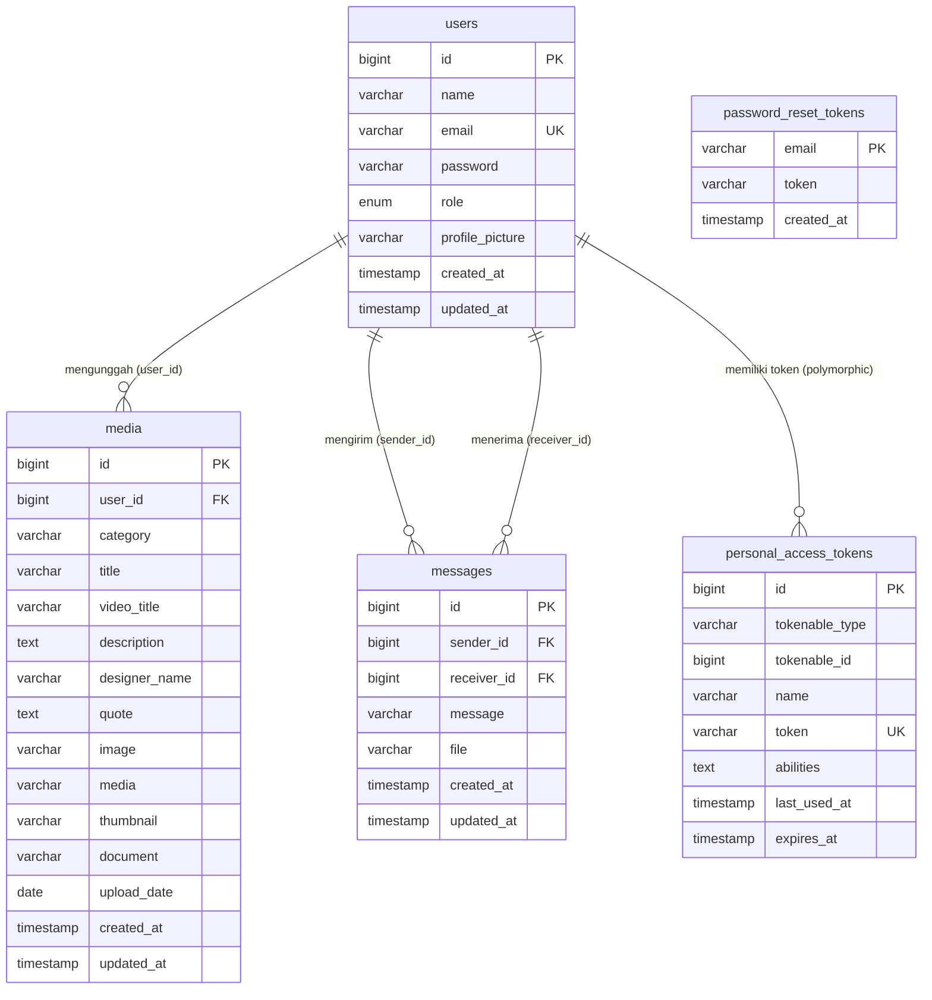

# 📱 Dokumentasi Tech Stack — Webapperlass (Alat Promosi Erlass)

> **Nama Aplikasi:** Alat Promosi Erlass  
> **URL Produksi:** http://promo.erlass.institute  
> **Lokasi Project:** `/root/alatpromosierlass`  
> **Database:** `alatpromosi_db` (MySQL)  
> **Terakhir Diperbarui:** 10 Juni 2026

---

## 🎯 Tentang Aplikasi

**Webapperlass** adalah aplikasi web manajemen media dan alat promosi untuk lembaga **Erlass Institute**. Aplikasi ini memungkinkan admin dan petugas untuk mengelola berbagai aset promosi seperti video promosi, desain grafis, quote motivasi, dan produk — yang kemudian dapat diakses oleh publik.

---

## 🏗️ Arsitektur Sistem

Aplikasi menggunakan pola arsitektur **MVC (Model-View-Controller)** bawaan Laravel:

```
Client (Browser)
      │
      ▼
  Web Server (Apache/Nginx)
      │
      ▼
  Laravel Application (PHP 8.1)
  ├── Routes (web.php, api.php)
  ├── Middleware (Auth, CheckRole)
  ├── Controllers
  │   ├── LoginController
  │   ├── AdminController
  │   ├── PetugasController
  │   ├── MediaController
  │   └── HomeController
  ├── Models (Eloquent ORM)
  │   ├── User
  │   └── Media
  └── Views (Blade Templates)
      │
      ▼
  MySQL Database (alatpromosi_db)
      │
      ▼
  File Storage (Laravel Storage / public disk)
```

---

## 🔧 Backend Stack

### Bahasa & Framework Utama

| Teknologi | Versi | Peran |
|-----------|-------|-------|
| **PHP** | ^8.1 | Bahasa pemrograman server-side |
| **Laravel** | ^10.0 | Framework MVC utama |
| **Laravel Sanctum** | ^3.2 | Autentikasi berbasis token (API) |
| **Laravel Tinker** | ^2.8 | REPL interaktif untuk debugging |

### Library Tambahan

| Library | Versi | Fungsi |
|---------|-------|--------|
| **Guzzle HTTP** | ^7.2 | Mengirim HTTP request ke API eksternal |
| **Intervention Image** | ^3.9 | Manipulasi & resize gambar (JPEG, PNG, GIF, SVG) |
| **PHP-FFmpeg** | ^1.2 | Pemrosesan & kompresi file video (MP4, MKV, AVI) |
| **Tesseract OCR** | ^2.13 | Optical Character Recognition dari gambar |
| **Carbon** | (bawaan Laravel) | Manipulasi tanggal & waktu |

### Dev Dependencies

| Library | Versi | Fungsi |
|---------|-------|--------|
| **PHPUnit** | ^10.0 | Unit testing |
| **Faker** | ^1.9 | Generate data dummy untuk testing/seeding |
| **Spatie Ignition** | ^2.0 | Error page yang informatif saat development |
| **Laravel Pint** | ^1.0 | Code formatter PHP |
| **Laravel Sail** | ^1.18 | Docker-based development environment |

---

## 🎨 Frontend Stack

| Teknologi | Versi | Peran |
|-----------|-------|-------|
| **Blade** | (bawaan Laravel) | Template engine untuk Views |
| **TailwindCSS** | ^4.2.2 | CSS framework utility-first |
| **Vite** | ^4.0 | Build tool & hot module replacement (HMR) |
| **Axios** | ^1.1.2 | HTTP client JavaScript untuk AJAX request |
| **PostCSS** | ^8.5.8 | Pemrosesan CSS (autoprefixer, dll.) |

### Struktur Views (Blade Templates)

```
resources/views/
├── layouts/         # Layout utama (header, sidebar, footer)
├── auth/            # Halaman login, register, forgot password
├── admin/           # Dashboard & manajemen (khusus Admin)
│   └── media/       # Upload, edit, kelola media
├── petugas/         # Dashboard & media (khusus Petugas)
│   └── media/
├── categories/      # Halaman publik per kategori media
│   ├── promotion_videos
│   ├── motivational_quotes
│   ├── design_corner
│   ├── alat_promosi_internal
│   ├── produk
│   └── detail
└── user/            # Halaman dashboard user
```

---

## 🗄️ Database

| Komponen | Konfigurasi |
|----------|------------|
| **Engine** | MySQL |
| **Host** | localhost:3306 |
| **Nama Database** | `alatpromosi_db` |
| **ORM** | Eloquent (bawaan Laravel) |
| **Migrasi** | Laravel Migrations |

### Tabel-Tabel Utama (Schema Aktual dari MySQL)

#### `users`
| Kolom | Tipe | Null | Key | Default | Keterangan |
|-------|------|------|-----|---------|------------|
| `id` | bigint unsigned | NO | PRI | — | Auto increment |
| `name` | varchar(255) | NO | | — | Nama lengkap |
| `email` | varchar(255) | NO | UNI | — | Email unik |
| `email_verified_at` | timestamp | YES | | NULL | Verifikasi email |
| `password` | varchar(255) | NO | | — | Hash bcrypt |
| `profile_picture` | varchar(255) | YES | | NULL | Path foto profil |
| `remember_token` | varchar(100) | YES | | NULL | Token "ingat saya" |
| `role` | enum('admin','petugas') | NO | | `petugas` | Role user |
| `created_at` | timestamp | YES | | NULL | |
| `updated_at` | timestamp | YES | | NULL | |

#### `media`
| Kolom | Tipe | Null | Key | Keterangan |
|-------|------|------|-----|------------|
| `id` | bigint unsigned | NO | PRI | Auto increment |
| `user_id` | bigint unsigned | NO | | FK → users.id (soft, tanpa constraint) |
| `category` | varchar(255) | NO | | Kategori konten |
| `title` | varchar(255) | YES | | Judul gambar/produk |
| `video_title` | varchar(255) | YES | | Judul video |
| `description` | text | YES | | Deskripsi konten |
| `designer_name` | varchar(255) | YES | | Nama desainer |
| `quote` | text | YES | | Teks motivasi |
| `image` | varchar(255) | YES | | Path gambar |
| `media` | varchar(255) | YES | | Path file video |
| `thumbnail` | varchar(255) | YES | | Path thumbnail |
| `document` | varchar(255) | YES | | Path dokumen |
| `upload_date` | date | YES | | Tanggal unggah |
| `created_at` | timestamp | YES | | |
| `updated_at` | timestamp | YES | | |

#### `messages`
| Kolom | Tipe | Null | Key | Keterangan |
|-------|------|------|-----|------------|
| `id` | bigint unsigned | NO | PRI | Auto increment |
| `sender_id` | bigint unsigned | NO | FK | FK → users.id (CASCADE DELETE) |
| `receiver_id` | bigint unsigned | NO | FK | FK → users.id (CASCADE DELETE) |
| `message` | varchar(255) | YES | | Isi pesan (nullable) |
| `file` | varchar(255) | YES | | Path file lampiran |
| `created_at` | timestamp | YES | | |
| `updated_at` | timestamp | YES | | |

#### `personal_access_tokens` *(Sanctum)*
| Kolom | Tipe | Keterangan |
|-------|------|------------|
| `id` | bigint unsigned | PK |
| `tokenable_type` | varchar | Polymorphic type (e.g. `App\Models\User`) |
| `tokenable_id` | bigint unsigned | Polymorphic ID |
| `name` | varchar | Nama token |
| `token` | varchar(64) | Token hash (unique) |
| `abilities` | text | Kemampuan token (JSON) |
| `last_used_at` | timestamp | Terakhir digunakan |
| `expires_at` | timestamp | Kedaluwarsa |

#### `password_reset_tokens`
| Kolom | Tipe | Keterangan |
|-------|------|------------|
| `email` | varchar | PK — email user |
| `token` | varchar | Token reset |
| `created_at` | timestamp | Waktu dibuat |

#### `failed_jobs` *(Queue)*
| Kolom | Tipe | Keterangan |
|-------|------|------------|
| `id` | bigint unsigned | PK |
| `uuid` | varchar | UUID unik job |
| `connection` / `queue` | text | Info koneksi queue |
| `payload` / `exception` | longtext | Data job & error |
| `failed_at` | timestamp | Waktu gagal |

---

### 🔗 Diagram Relasi Antar Tabel (ERD)



---

### 🧩 Relasi Eloquent (Laravel ORM)

#### `User` → `Media` (One-to-Many)
> Satu user bisa mengunggah banyak media.

```php
// Model: User
// (Relasi ini belum didefinisikan di User.php, tapi ada di Media.php)

// Model: Media
public function user() {
    return $this->belongsTo(User::class, 'user_id');
}
```

> ⚠️ **Catatan:** FK `media.user_id` **tidak memiliki FOREIGN KEY constraint** di database (tidak ada `ON DELETE CASCADE`). Relasi hanya dijaga di level aplikasi via Eloquent.

---

#### `User` → `Messages` (One-to-Many, Dua Arah)
> Satu user bisa mengirim dan menerima banyak pesan.

```php
// Model: User
public function sentMessages() {
    return $this->hasMany(Message::class, 'sender_id');
}

public function receivedMessages() {
    return $this->hasMany(Message::class, 'receiver_id');
}
```

> ✅ FK `messages.sender_id` dan `messages.receiver_id` **memiliki FOREIGN KEY constraint** dengan `ON DELETE CASCADE` — jika user dihapus, semua pesannya ikut terhapus.

---

#### `User` → `PersonalAccessTokens` (Polymorphic, via Sanctum)
> Relasi polymorphic untuk API token (Laravel Sanctum).

```php
// Model: User — via trait HasApiTokens
use Laravel\Sanctum\HasApiTokens;

// Membuat token baru:
$token = $user->createToken('nama-token')->plainTextToken;
```

---

### 📊 Ringkasan Jenis Relasi

| Dari | Ke | Jenis Relasi | Constraint DB | Keterangan |
|------|----|-------------|--------------|------------|
| `users` | `media` | One-to-Many | ❌ Tidak ada FK constraint | Soft relation via `user_id` |
| `users` | `messages` (sender) | One-to-Many | ✅ CASCADE DELETE | Pesan ikut terhapus |
| `users` | `messages` (receiver) | One-to-Many | ✅ CASCADE DELETE | Pesan ikut terhapus |
| `users` | `personal_access_tokens` | Polymorphic | ❌ Soft (via morphs) | Token Sanctum |
| `users` | `password_reset_tokens` | Lookup by email | ❌ Tidak ada FK | Hanya relasi email |

### Kategori Media yang Didukung

| Kategori | Deskripsi | Tipe File |
|----------|-----------|-----------|
| `promotion_videos` | Video promosi Erlass | MP4, MKV, AVI + thumbnail |
| `motivational_quotes` | Quote motivasi bergambar | JPEG, PNG, GIF, SVG |
| `design_corner` | Karya desain tim | JPEG, PNG + PDF/DOCX |
| `alat_promosi_internal` | Materi promosi internal | JPEG, PNG |
| `produk` | Katalog produk | JPEG, PNG |

---

## 🔐 Sistem Autentikasi & Otorisasi

### Autentikasi
- Menggunakan **Laravel Session Auth** (bukan API token untuk web)
- **Laravel Sanctum** tersedia untuk kebutuhan API
- Password di-hash dengan **bcrypt**
- Mendukung: Login, Register, Forgot Password, Reset Password

### Otorisasi (Role-Based Access Control)
Middleware **`CheckRole`** (`app/Http/Middleware/CheckRole.php`) mengatur akses berdasarkan role:

| Role | Akses |
|------|-------|
| **admin** | Full access: kelola user, upload/edit/hapus semua media, lihat dashboard |
| **petugas** | Upload media, kelola media sendiri, lihat dashboard petugas |
| **public** | Akses read-only ke halaman kategori media (tanpa login) |

### Middleware yang Digunakan
- `auth` — Memastikan pengguna sudah login
- `role:admin` — Hanya admin yang bisa akses
- `role:petugas` — Hanya petugas yang bisa akses
- `VerifyCsrfToken` — Proteksi CSRF pada form
- `RedirectIfAuthenticated` — Redirect ke dashboard jika sudah login

---

## 📁 Penyimpanan File

Menggunakan **Laravel Storage** dengan disk `local` (filesystem):

| Jenis File | Lokasi Storage |
|------------|---------------|
| Gambar | `storage/app/public/images/` |
| Video | `storage/app/public/videos/` |
| Thumbnail | `storage/app/public/thumbnails/` |
| Dokumen | `storage/app/public/documents/` |
| Foto Profil | `storage/app/public/` |

> File diakses publik via symlink: `public/storage` → `storage/app/public`  
> Jalankan `php artisan storage:link` untuk mengaktifkan.

---

## 🛣️ Routing

File route utama: `routes/web.php`

| Kelompok Route | Middleware | Prefix | Keterangan |
|----------------|-----------|--------|------------|
| Admin routes | `auth`, `role:admin` | `/admin` | Manajemen user & media |
| Petugas routes | `auth`, `role:petugas` | `/petugas` | Upload & kelola media |
| Auth routes | — | `/` | Login, register, password reset |
| Public routes | — | — | Halaman kategori, produk, dokumen |

### Daftar Route Penting

```
GET  /                          → Login page
POST /login-proses              → Proses login
POST /logout                    → Logout
GET  /register                  → Form register
POST /register-proses           → Proses register

GET  /promotion-videos          → Halaman video promosi (publik)
GET  /design-corner             → Halaman design corner (publik)
GET  /motivational-quotes       → Halaman quote motivasi (publik)
GET  /alat-promosi-internal     → Halaman alat promosi internal (publik)
GET  /produk                    → Halaman produk (publik)
GET  /produk/{id}               → Detail produk (publik)
GET  /media/document/{id}       → Lihat dokumen (publik)

GET  /admin/dashboard           → Dashboard admin
GET  /admin/media               → Daftar semua media
GET  /admin/upload              → Form upload media
POST /admin/media/upload        → Proses upload media
PUT  /admin/media/{id}          → Update media
DELETE /admin/media/{id}        → Hapus media

GET  /petugas/dashboard         → Dashboard petugas
GET  /petugas/media             → Daftar media petugas
POST /petugas/media/upload      → Upload media (petugas)
```

---

## ⚙️ Konfigurasi Lingkungan

File konfigurasi: `.env`

```env
APP_NAME=Laravel
APP_ENV=local          # Ubah ke 'production' saat deploy
APP_URL=http://promo.erlass.institute
ASSET_URL=http://promo.erlass.institute

DB_CONNECTION=mysql
DB_HOST=localhost
DB_PORT=3306
DB_DATABASE=alatpromosi_db

CACHE_DRIVER=file
SESSION_DRIVER=file
QUEUE_CONNECTION=sync    # Ubah ke 'database' atau 'redis' jika butuh queue
FILESYSTEM_DISK=local
```

---

## 🏃 Cara Menjalankan Development

```bash
# 1. Clone / masuk ke direktori project
cd /root/alatpromosierlass

# 2. Install dependencies PHP
composer install

# 3. Install dependencies Node.js
npm install

# 4. Salin file environment
cp .env.example .env

# 5. Generate app key
php artisan key:generate

# 6. Jalankan migrasi database
php artisan migrate

# 7. (Opsional) Jalankan seeder
php artisan db:seed

# 8. Buat symlink storage
php artisan storage:link

# 9. Jalankan frontend dev server (Vite)
npm run dev

# 10. Jalankan Laravel server (terminal lain)
php artisan serve
```

---

## 🧪 Testing

```bash
# Jalankan semua test
php artisan test

# Jalankan dengan PHPUnit langsung
./vendor/bin/phpunit
```

---

## 📦 Perintah Artisan Penting

```bash
php artisan migrate              # Jalankan migrasi database
php artisan migrate:rollback     # Rollback migrasi terakhir
php artisan migrate:fresh --seed # Reset database + seed ulang
php artisan storage:link         # Buat symlink public storage
php artisan cache:clear          # Bersihkan cache
php artisan config:clear         # Bersihkan config cache
php artisan route:list           # Lihat semua route
php artisan tinker               # Buka REPL interaktif
php artisan queue:work           # Jalankan queue worker
```

---

## 🔗 Dependencies Ringkas

```
Backend:
  PHP 8.1 + Laravel 10
  └── Laravel Sanctum (auth)
  └── Intervention Image (gambar)
  └── PHP-FFmpeg (video)
  └── Tesseract OCR (OCR)
  └── Guzzle HTTP (HTTP client)

Frontend:
  Blade Templates
  └── TailwindCSS 4.x (styling)
  └── Vite 4 (bundler)
  └── Axios (AJAX)

Database:
  MySQL
  └── Eloquent ORM (query builder)
  └── Laravel Migrations (schema)

DevTools:
  PHPUnit + Faker (testing)
  Laravel Pint (formatter)
  Spatie Ignition (error reporting)
```

---

*Dokumentasi ini dibuat secara otomatis berdasarkan analisis kode sumber project `/root/alatpromosierlass`.*
