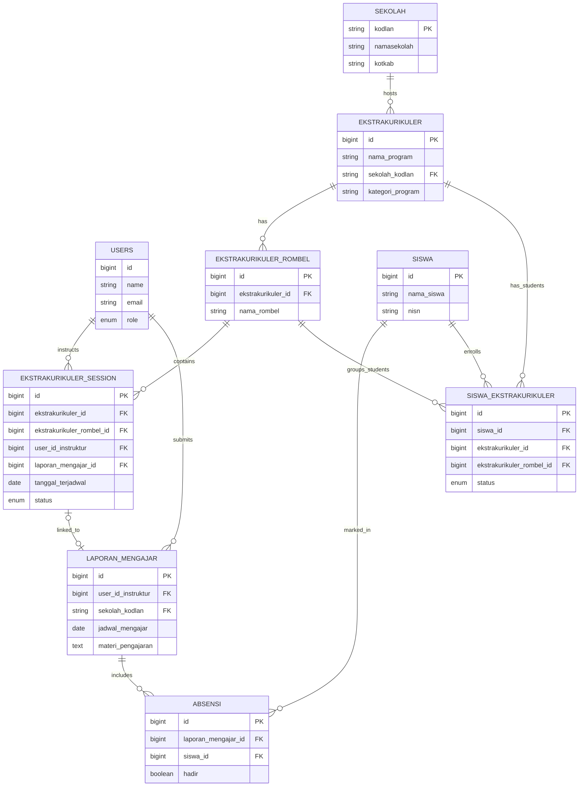

# Database Relations Documentation - erlass.institute

This document describes the core entities and relationships within the `erlass.institute` database schema.

## Entity Relationship Diagram (ERD)

## Core Workflows & Relations

### 1. Program & Enrollment
- **Ekstrakurikuler** represents a specific subject or activity (e.g., Coding, Robotics).
- **Ekstrakurikuler Rombel** is a specific group or class within that program (e.g., Coding Class A).
- **Siswa Ekstrakurikuler** is the pivot table managing student enrollment. A student (`siswa`) is linked to both a program and a specific rombel.

### 2. Scheduling & Execution
- **Ekstrakurikuler Session** holds the schedule for a specific rombel.
- When an instructor performs the session, they submit a **Laporan Mengajar** (Teaching Report).
- The `ekstrakurikuler_session` is then linked to the `laporan_mengajar` via `laporan_mengajar_id`.

### 3. Attendance
- Each **Laporan Mengajar** has multiple **Absensi** records.
- Each `absensi` record links a `siswa` to the report and marks whether they were `hadir` (present).

### 4. Schools & Data Partitioning
- All programs are linked to a **Sekolah** via `sekolah_kodlan` (NPSN/Unique Code).
- Reports also track the school to allow for school-based analytics.

## Important Foreign Keys
- `ekstrakurikuler.sekolah_kodlan` -> `sekolah.kodlan`
- `siswa_ekstrakurikuler.siswa_id` -> `siswa.id`
- `ekstrakurikuler_session.laporan_mengajar_id` -> `laporan_mengajar.id`
- `absensi.laporan_mengajar_id` -> `laporan_mengajar.id`
