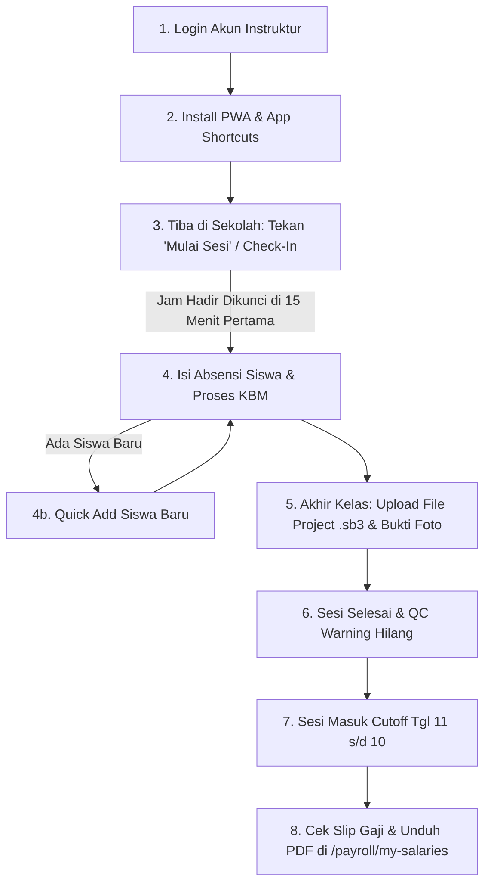

# 🧪 Panduan & Skenario UAT (User Acceptance Testing) - Role Instruktur
## Alur Lengkap: Dari Login, Check-in Awal Kelas, Upload Project, Cutoff, hingga Slip Gaji

> [!NOTE]
> Dokumen ini dirancang sebagai panduan operasional lapangan resmi bagi **Instruktur** dan tim QA untuk menguji seluruh alur kerja pengajaran pada aplikasi **erlass.institute** (baik via Mobile Browser/PWA maupun Desktop).

---

## 📑 Daftar Isi
1. [Prasyarat UAT & Kredensial Pengujian](#1-prasyarat-uat--kredensial-pengujian)
2. [Peta Alur Pengujian (User Journey)](#2-peta-alur-pengujian-user-journey)
3. [Panduan Langkah demi Langkah UAT](#3-panduan-langkah-demi-langkah-uat)
   - [Tahap 1: Login & Aktivasi Akun Instruktur](#tahap-1-login--aktivasi-akun-instruktur)
   - [Tahap 2: Pemasangan Aplikasi PWA di Smartphone](#tahap-2-pemasangan-aplikasi-pwa-di-smartphone)
   - [Tahap 3: Check-in Kedatangan / Mulai Sesi (Awal Kelas / 15 Menit Pertama)](#tahap-3-check-in-kedatangan--mulai-sesi-awal-kelas--15-menit-pertama)
   - [Tahap 4: Pengisian Absensi & Quick Add Siswa Baru](#tahap-4-pengisian-absensi--quick-add-siswa-baru)
   - [Tahap 5: Upload File Project Karya Siswa & Bukti Foto (Akhir Kelas)](#tahap-5-upload-file-project-karya-siswa--bukti-foto-akhir-kelas)
   - [Tahap 6: Verifikasi QC Warning & Status Sesi Selesai](#tahap-6-verifikasi-qc-warning--status-sesi-selesai)
   - [Tahap 7: Pemahaman Periode Cutoff Penggajian (Tanggal 11 s.d. 10)](#tahap-7-pemahaman-periode-cutoff-penggajian-tanggal-11-sd-10)
   - [Tahap 8: Peninjauan Slip Gaji & Rekap Honorarium Bulanan](#tahap-8-peninjauan-slip-gaji--rekap-honorarium-bulanan)
4. [Lembar Checklist Test Case UAT Instruktur](#4-lembar-checklist-test-case-uat-instruktur)

---

## 1. Prasyarat UAT & Kredensial Pengujian

*   **URL Aplikasi Production/Staging**: `https://erlass.institute`
*   **Perangkat Pengujian**: 
    *   Smartphone Android (Google Chrome) / iOS (Safari)
    *   Laptop / Desktop Browser (Chrome/Edge/Firefox)
*   **Kredensial Uji Coba**:
    *   **Email**: `instruktur@erlass.institute` (atau akun instruktur terdaftar)
    *   **Password**: `password` (atau password default sistem)

---

## 2. Peta Alur Pengujian (User Journey)

---

## 3. Panduan Langkah demi Langkah UAT

### Tahap 1: Login & Aktivasi Akun Instruktur
1. Buka browser pada HP/Laptop dan ketik `https://erlass.institute/login`.
2. Masukkan **Email** dan **Password** Instruktur.
3. Klik tombol **Login**.
4. **Hasil yang Diharapkan**: Pengguna berhasil masuk ke **Dashboard Instruktur** dan melihat ucapan selamat datang beserta ringkasan agenda mengajar.

---

### Tahap 2: Pemasangan Aplikasi PWA di Smartphone
1. Di layar HP (Chrome/Safari), perhatikan banner atau tombol **"Install App"**.
2. Klik **Install / Tambahkan ke Layar Utama (Add to Home Screen)**.
3. Buka aplikasi Erlass dari ikon di layar utama HP.
4. Tekan lama ikon aplikasi di HP untuk menguji **App Shortcuts**:
   *   `Buat Laporan`
   *   `Agenda Kegiatan`
   *   `Kelola Absensi`
5. Matikan sebentar WiFi/Data Seluler untuk menguji **Offline Toast Notification** (Notifikasi melayang merah: *"Koneksi terputus (Offline)"*). Hidupkan kembali untuk melihat notifikasi hijau *"Koneksi kembali terhubung (Online)"*.
6. **Hasil yang Diharapkan**: Aplikasi PWA terpasang seperti aplikasi native HP dan indikator sinyal berfungsi real-time.

---

### Tahap 3: Check-in Kedatangan / Mulai Sesi (Awal Kelas / 15 Menit Pertama)
> [!IMPORTANT]
> **PENTING UNTUK KEDISIPLINAN PAYROLL:**
> Saat tiba di sekolah (di 15 menit pertama), instruktur WAJIB menekan tombol Check-in agar tidak terkena denda keterlambatan!

1. Buka detail sesi mengajar hari ini pada Dashboard atau menu Agenda (`/ekstrakurikuler/sessions`).
2. Begitu tiba di lokasi sekolah sebelum/saat kelas dimulai, klik tombol **"Mulai Sesi" / Check-In**.
3. **Penjelasan Sistem Payroll**:
   - Sistem secara otomatis mengunci timestamp detik itu sebagai `jam_mulai_aktual`.
   - Selama ditekan dalam toleransi 15 menit pertama dari jam jadwal, instruktur **100% Bebas Denda Keterlambatan (Denda Rp 0)**.
4. **Hasil yang Diharapkan**: Status sesi berubah menjadi `Berlangsung` dan jam hadir terkunci secara permanen.

---

### Tahap 4: Pengisian Absensi & Quick Add Siswa Baru
1. Pada halaman Sesi, pilih status presensi tiap siswa:
   *   🟢 **Hadir** | 🟡 **Izin** | 🔵 **Sakit** | 🔴 **Alpha**
2. Gunakan tombol **"Mark All Hadir"** jika seluruh siswa hadir.
3. **Jika ada siswa baru yang belum terdaftar di Rombel**:
   - Klik tombol **"+ Tambah Siswa Baru (Quick Add)"**.
   - Masukkan **Nama Lengkap**, **Kelas**, dan **Jenis Kelamin** (WA Orang Tua opsional).
   - Klik **Auto** pada NISN jika belum ada NISN kementerian.
   - Klik **Simpan & Daftarkan ke Rombel Ini**. Siswa baru otomatis terdaftar (*auto-enrolled*).
4. **Hasil yang Diharapkan**: Presensi tersimpan real-time dan siswa baru dapat langsung diabsen.

---

### Tahap 5: Upload File Project Karya Siswa & Bukti Foto (Akhir Kelas)
> [!TIP]
> **PENJELASAN UNTUK INSTRUKTUR:**
> Mengunggah file project karya siswa (`.sb3`) dan foto di akhir kelas (menit ke-60/90) **TIDAK AKAN MERUSAK KEDISIPLINAN ATAU MENYEBABKAN DENDA**, karena jam kedatangan Anda sudah aman terkunci pada **Tahap 3** saat menekan *Mulai Sesi* di awal kelas.

1. Setelah pembelajaran selesai dan siswa menghasilkan karya/coding, buka formulir Laporan Mengajar (`/sessions/{id}/report/create`).
2. Unggah file karya project siswa:
   *   **File Project**: Unggah file karya siswa (format `.sb3`, `.zip`, `.rar` maks. 10MB).
   *   **Foto Kegiatan**: Unggah foto aktivitas suasana kelas.
   *   **Foto Presensi Fisik**: Unggah foto absensi kertas yang ditandatangani/stempel sekolah.
3. Isi topik materi, keaktifan kelas, pemahaman materi, dan catatan refleksi.
4. Klik tombol **"Kirim Laporan Mengajar"**.
5. **Hasil yang Diharapkan**: Laporan tersimpan, status sesi berubah dari `Berlangsung` menjadi `Selesai`, dan notifikasi sukses ditampilkan.

---

### Tahap 6: Verifikasi QC Warning & Status Sesi Selesai
1. Kembali ke Dashboard utama.
2. Perhatikan kartu **Log Warning Quality Control**:
   - Sebelum laporan dikirim: Tampil peringatan QC dengan rincian nama sekolah & rombel.
   - Setelah laporan dikirim: Peringatan QC pada sesi tersebut **otomatis hilang/bersih**.
3. **Hasil yang Diharapkan**: QC Engine mendeteksi penyelesaian laporan secara otomatis.

---

### Tahap 7: Pemahaman Periode Cutoff Penggajian (Tanggal 11 s.d. 10)
> [!NOTE]
> **ATURAN CUTOFF PENGGAJIAN BULANAN:**
> Penggajian dihitung berdasarkan rentang **Tanggal 11 Bulan Sebelumnya s.d. Tanggal 10 Bulan Berjalan**.

1. **Aturan Penarikan Laporan**:
   - Laporan mengajar yang diisi dari tanggal 11 bulan lalu s/d tanggal 10 bulan ini akan masuk pada pencairan **Batch Bulan Berjalan**.
   - Contoh: Batch Periode **Juli** menghitung laporan dari **11 Juni s/d 10 Juli**.
   - Laporan yang diisi setelah tanggal 10 (misal tanggal 11–31 Juli) akan **otomatis ditarik pada Batch Periode AGUSTUS** (tidak akan pernah hangus).
2. **Hasil yang Diharapkan**: Instruktur memahami dengan jelas jadwal penarikan honorarium bulanan.

---

### Tahap 8: Peninjauan Slip Gaji & Rekap Honorarium Bulanan
1. Akses menu **Payroll / Slip Gaji Saya** (`/payroll/my-salaries`).
2. Periksa rincian pendapatan pada Batch Payroll yang telah diterbitkan:
   - Banner transparansi ketentuan honorarium & periode cutoff.
   - Jumlah Sesi Mengajar & Honorarium Dasar (Rp 150rb / Rp 115rb / Rp 100rb / Rp 75rb per sesi).
   - Biaya Transportasi Operasional (Rp 350/KM + Rp 7.500 sewa kendaraan untuk jarak $\ge 10\text{ KM}$).
   - Status Kedisiplinan (*Excellent* / *On Time* / *Penalty*).
   - Honorarium Bersih (*Net Salary*).
3. Klik tombol **Detail Slip** (`/payroll/slip/{id}`) untuk melihat rincian per pertemuan.
4. Klik tombol **Unduh Slip Gaji (PDF)** untuk menyimpan dokumen resmi slip gaji.
5. **Hasil yang Diharapkan**: Instruktur dapat melihat transparansi honorarium secara 100% dan mengunduh slip gaji PDF.

---

## 4. Lembar Checklist Test Case UAT Instruktur

| No | Kode UAT | Skenario Pengujian | Langkah Pengujian | Hasil yang Diharapkan | Status (Pass/Fail) |
| :-: | :--- | :--- | :--- | :--- | :-: |
| 1 | `UAT-INS-01` | Login Akun Instruktur | Masukkan email & password di `/login` | Masuk ke Dashboard tanpa error | [ ] Pass / [ ] Fail |
| 2 | `UAT-INS-02` | Instalasi PWA & Shortcuts | Klik Install PWA & tekan lama ikon di HP | App Shortcut & mode standalone berfungsi | [ ] Pass / [ ] Fail |
| 3 | `UAT-INS-03` | Indikator Network Toast | Matikan & hidupkan koneksi internet HP | Notifikasi melayang Offline/Online muncul | [ ] Pass / [ ] Fail |
| 4 | `UAT-INS-04` | Check-in Awal Kelas | Klik "Mulai Sesi" saat tiba di sekolah | Jam hadir terkunci & status `Berlangsung` | [ ] Pass / [ ] Fail |
| 5 | `UAT-INS-05` | Presensi Siswa | Pilih status Hadir/Izin/Sakit/Alpha | Presensi tersimpan & log tercatat | [ ] Pass / [ ] Fail |
| 6 | `UAT-INS-06` | Quick Add Siswa Baru | Klik "+ Tambah Siswa", isi data, klik Simpan | Siswa otomatis masuk ke Rombel | [ ] Pass / [ ] Fail |
| 7 | `UAT-INS-07` | Upload File Project & Laporan | Unggah file `.sb3` + foto kegiatan di akhir kelas | Status sesi berubah menjadi `Selesai` tanpa denda | [ ] Pass / [ ] Fail |
| 8 | `UAT-INS-08` | Verification Kedisiplinan | Cek status kedisiplinan pada detail laporan | Punctuality tercatat *On Time* meski upload di akhir kelas | [ ] Pass / [ ] Fail |
| 9 | `UAT-INS-09` | Auto Resolve Warning QC | Cek kartu Warning QC di Dashboard | Peringatan sesi terkait otomatis bersih | [ ] Pass / [ ] Fail |
| 10 | `UAT-INS-10` | Cek Banner Cutoff Tgl 11-10 | Buka menu `/payroll/my-salaries` | Banner informasi cutoff tgl 11–10 tampil jelas | [ ] Pass / [ ] Fail |
| 11 | `UAT-INS-11` | Cek Slip Gaji & Download PDF | Klik detail slip & unduh file PDF | Transparansi honor & download PDF lancar | [ ] Pass / [ ] Fail |

---

> **Petunjuk Tambahan QA:**
> Jika menemukan ketidaksesuaian selama pengujian UAT, harap catat **Kode UAT**, **Skenario**, dan **Screenshot Error**, lalu laporkan ke Tim pengembang `erlass.institute`.
