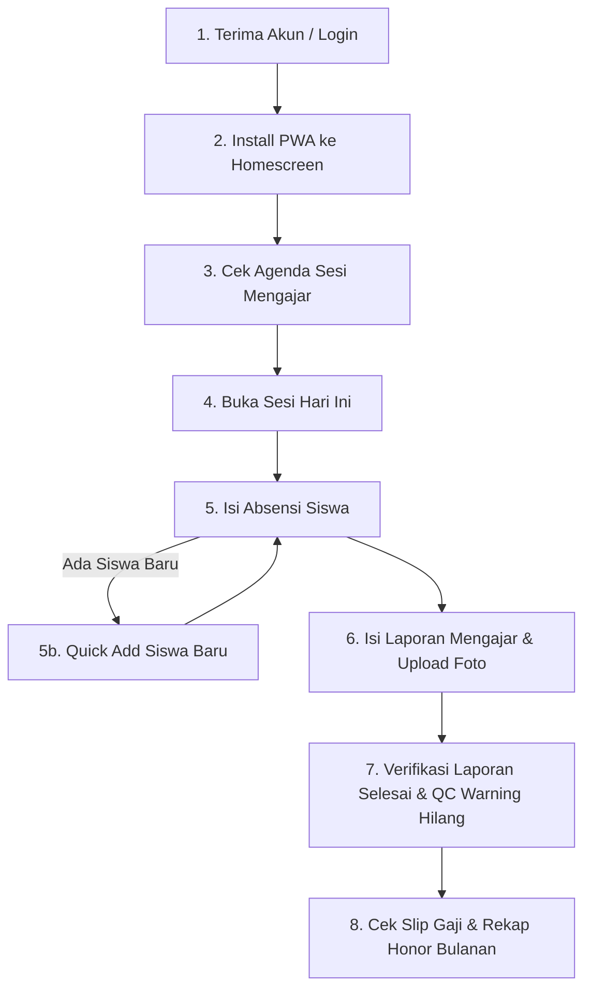

# 🧪 Panduan & Skenario UAT (User Acceptance Testing) - Role Instruktur
## Alur Lengkap: Dari Login Akun, Absensi, hingga Pembuatan Laporan Mengajar

> [!NOTE]
> Dokumen ini dirancang sebagai panduan pengujian lapangan bagi **Instruktur** dan tim QA untuk menguji seluruh alur kerja operasional pengajaran pada aplikasi **erlass.institute** (baik via Mobile Browser/PWA maupun Desktop).

---

## 📑 Daftar Isi
1. [Prasyarat UAT & Kredensial Pengujian](#1-prasyarat-uat--kredensial-pengujian)
2. [Peta Alur Pengujian (User Journey)](#2-peta-alur-pengujian-user-journey)
3. [Panduan Langkah demi Langkah UAT](#3-panduan-langkah-demi-langkah-uat)
   - [Tahap 1: Login & Aktivasi Akun Instruktur](#tahap-1-login--aktivasi-akun-instruktur)
   - [Tahap 2: Pemasangan Aplikasi PWA di Smartphone](#tahap-2-pemasangan-aplikasi-pwa-di-smartphone)
   - [Tahap 3: Meninjau Dashboard & Agenda Sesi Mengajar](#tahap-3-meninjau-dashboard--agenda-sesi-mengajar)
   - [Tahap 4: Pengisian & Manajemen Absensi Siswa](#tahap-4-pengisian--manajemen-absensi-siswa)
   - [Tahap 5: Penambahan Siswa Baru Cepat (Quick Add)](#tahap-5-penambahan-siswa-baru-cepat-quick-add)
   - [Tahap 6: Pembuatan Laporan Mengajar & Upload Bukti Foto](#tahap-6-pembuatan-laporan-mengajar--upload-bukti-foto)
   - [Tahap 7: Deteksi Status Laporan & Warning QC](#tahap-7-deteksi-status-laporan--warning-qc)
   - [Tahap 8: Peninjauan Rekap Honor & Slip Gaji](#tahap-8-peninjauan-rekap-honor--slip-gaji)
4. [Lembar Checklist Test Case UAT Instruktur](#4-lembar-checklist-test-case-uat-instruktur)

---

## 1. Prasyarat UAT & Kredensial Pengujian

*   **URL Aplikasi Production/Staging**: `https://erlass.institute`
*   **Perangkat Pengujian**: 
    *   Smartphone Android (Google Chrome) / iOS (Safari)
    *   Laptop / Desktop Browser (Chrome/Edge/Firefox)
*   **Kredensial Uji Coba**:
    *   **Email**: `instruktur@erlass.institute` (atau akun instruktur yang didaftarkan Admin)
    *   **Password**: `password` (atau password default sistem)

---

## 2. Peta Alur Pengujian (User Journey)

---

## 3. Panduan Langkah demi Langkah UAT

### Tahap 1: Login & Aktivasi Akun Instruktur
1. Buka browser pada HP/Laptop dan ketik `https://erlass.institute/login`.
2. Masukkan **Email** dan **Password** Instruktur.
3. Klik tombol **Login**.
4. **Hasil yang Diharapkan**: Pengguna berhasil masuk ke **Dashboard Instruktur** dan melihat ucapan selamat datang beserta ringkasan sesi.

---

### Tahap 2: Pemasangan Aplikasi PWA di Smartphone
1. Di layar HP (Chrome/Safari), perhatikan banner atau tombol **"Install App"** di bagian atas/bawah layar.
2. Klik **Install / Tambahkan ke Layar Utama (Add to Home Screen)**.
3. Buka aplikasi Erlass dari ikon aplikasi di layar utama HP.
4. Tekan lama ikon aplikasi di HP untuk menguji **App Shortcuts**:
   *   `Buat Laporan`
   *   `Agenda Kegiatan`
   *   `Kelola Absensi`
5. Matikan sebentar WiFi/Data Seluler untuk menguji **Offline Toast Notification** (Muncul notifikasi melayang warna merah: *"Koneksi terputus (Offline)"*). Hidupkan kembali koneksi untuk melihat notifikasi hijau *"Koneksi kembali terhubung (Online)"*.
6. **Hasil yang Diharapkan**: Aplikasi PWA terpasang seperti aplikasi native HP dan indikator sinyal berfungsi real-time.

---

### Tahap 3: Meninjau Dashboard & Agenda Sesi Mengajar
1. Dari halaman utama Dashboard, lihat kartu **Agenda Mengajar Hari Ini** atau **Sesi Mendatang**.
2. Periksa detail informasi: Nama Sekolah, Nama Program (misal: *Robotika / Coding*), Rombel, Hari, Jam Mulai/Selesai, dan Status Sesi (`Terjadwal` / `Belum Dilaporkan`).
3. Klik tombol **Isi Laporan / Kelola Sesi**.
4. **Hasil yang Diharapkan**: Sistem menampilkan halaman detail sesi mengajar dengan status yang tepat.

---

### Tahap 4: Pengisian & Manajemen Absensi Siswa
1. Pada halaman Sesi / Laporan Mengajar, pilih opsi presensi tiap siswa:
   *   🟢 **Hadir**
   *   🟡 **Izin**
   *   🔵 **Sakit**
   *   🔴 **Alpha**
2. Gunakan tombol **"Mark All Hadir"** jika seluruh siswa hadir untuk mempercepat pengisian.
3. Ubah salah satu status siswa (misal dari *Alpha* menjadi *Hadir*) untuk menguji fitur **Audit Trail Absensi Anti-Manipulasi**.
4. **Hasil yang Diharapkan**: Status kehadiran tersimpan secara real-time dan setiap perubahan terekam otomatis di Activity Log sistem.

---

### Tahap 5: Penambahan Siswa Baru Cepat (Quick Add)
Jika di lapangan terdapat siswa baru yang belum terdaftar di Rombel:
1. Klik tombol **"+ Tambah Siswa Baru (Quick Add)"**.
2. Masukkan **Nama Lengkap Siswa**, **Kelas**, dan **Jenis Kelamin**.
3. Kolom **No. WA Orang Tua** bersifat **Opsional** (boleh dikosongkan).
4. Klik **Auto** pada kolom NISN jika belum ada NISN resmi kementerian.
5. Klik **Simpan & Daftarkan ke Rombel Ini**.
6. **Hasil yang Diharapkan**: Siswa baru otomatis dibuat dan langsung terdaftar (*auto-enrolled*) pada Rombel & Program Ekstrakurikuler yang sedang berjalan tanpa perlu keluar dari formulir laporan.

---

### Tahap 6: Pembuatan Laporan Mengajar & Upload Bukti Foto
1. Isi formulir Laporan Mengajar:
   *   **Topik / Materi Pengajaran**: Pilih dari dropdown materi dinamis.
   *   **Target Capaian & Realisasi**: Tuliskan ringkasan hasil pembelajaran.
   *   **Catatan Instruktur**: Tuliskan progres atau kendala kelas (jika ada).
2. **Upload Foto Kegiatan Mengajar**:
   *   Klik area upload foto kegiatan, pilih foto kelas dari Galeri atau Kamera HP.
3. **Upload Foto Presensi Fisik Tanda Tangan Sekolah**:
   *   Unggah foto lembar absensi kertas yang sudah ditandatangani oleh PIC/Humas Sekolah.
4. Klik tombol **"Kirim Laporan Mengajar"**.
5. **Hasil yang Diharapkan**: Laporan tersimpan, status sesi berubah menjadi `Selesai`, dan notifikasi sukses ditampilkan.

---

### Tahap 7: Deteksi Status Laporan & Warning QC
1. Kembali ke Dashboard utama.
2. Perhatikan kartu **Log Warning Quality Control**:
   *   Sebelum laporan dibuat: Muncul peringatan QC dengan rincian **Nama Sekolah 🏫** & **Nama Rombel 👥** (misal: *"Sesi pertemuan ke-1 hari ini belum diselesaikan..."*).
   *   Setelah laporan berhasil dikirim: Peringatan QC pada sesi tersebut otomatis **hilang/selesai**.
3. **Hasil yang Diharapkan**: QC Engine mendeteksi penyelesaian laporan secara otomatis dan menghilangkan log peringatan.

---

### Tahap 8: Peninjauan Rekap Honor & Slip Gaji
1. Akses menu **Payroll / Slip Gaji Saya** (`/payroll/my-salaries`).
2. Periksa rekapitulasi sesi mengajar bulan berjalan:
   *   Jumlah Sesi Selesai & Tervalidasi.
   *   Kedisiplinan Check-in (Punctuality Status: *On Time* / *Penalty*).
   *   Rincian Honorarium Dasar & Uang Transport.
3. Klik tombol **Unduh Slip Gaji (PDF)**.
4. **Hasil yang Diharapkan**: Instruktur dapat melihat transparansi honor dan mengunduh slip gaji resmi berformat PDF.

---

## 4. Lembar Checklist Test Case UAT Instruktur

Beri tanda centang (✔️) pada kolom **Hasil** setelah pengujian dilakukan:

| No | Kode UAT | Skenario Pengujian | Langkah Pengujian | Hasil yang Diharapkan | Status (Pass/Fail) |
| :-: | :--- | :--- | :--- | :--- | :-: |
| 1 | `UAT-INS-01` | Login Akun Instruktur | Masukkan email & password di `/login` | Masuk ke Dashboard tanpa error | [ ] Pass / [ ] Fail |
| 2 | `UAT-INS-02` | Instalasi PWA & Shortcuts | Klik Install PWA & tekan lama ikon di HP | App Shortcut & mode standalone berfungsi | [ ] Pass / [ ] Fail |
| 3 | `UAT-INS-03` | Indikator Network Toast | Matikan & hidupkan koneksi internet HP | Notifikasi melayang Offline/Online muncul | [ ] Pass / [ ] Fail |
| 4 | `UAT-INS-04` | Cek Agenda Sesi | Buka Dashboard & klik detail sesi | Informasi Sekolah & Rombel akurat | [ ] Pass / [ ] Fail |
| 5 | `UAT-INS-05` | Presensi Siswa | Pilih status Hadir/Izin/Sakit/Alpha | Presensi tersimpan & log tercatat | [ ] Pass / [ ] Fail |
| 6 | `UAT-INS-06` | Quick Add Siswa | Klik "+ Tambah Siswa", isi data, klik Simpan | Siswa otomatis masuk ke Rombel | [ ] Pass / [ ] Fail |
| 7 | `UAT-INS-07` | Auto Generator NISN | Klik tombol "Auto" di form siswa | Terisi kode NISN sementara (`TMP...`) | [ ] Pass / [ ] Fail |
| 8 | `UAT-INS-08` | Form Sekolah Redesign | Buka form `/siswa/create` | Dropdown sekolah preloaded & searchable | [ ] Pass / [ ] Fail |
| 9 | `UAT-INS-09` | Upload Foto & Submit Laporan | Unggah foto kegiatan + TTD sekolah, submit | Status sesi berubah menjadi `Selesai` | [ ] Pass / [ ] Fail |
| 10 | `UAT-INS-10` | Auto Resolve Warning QC | Cek kartu Warning QC di Dashboard | Peringatan sesi terkait otomatis bersih | [ ] Pass / [ ] Fail |
| 11 | `UAT-INS-11` | Cek Slip Gaji | Buka menu `/payroll/my-salaries` | Transparansi honor & download PDF lancar | [ ] Pass / [ ] Fail |

---

> **Petunjuk Tambahan QA:**
> Jika menemukan ketidaksesuaian selama pengujian UAT, harap catat **Kode UAT**, **Skenario**, dan **Screenshot Error**, lalu laporkan ke Tim pengembang `erlass.institute`.
