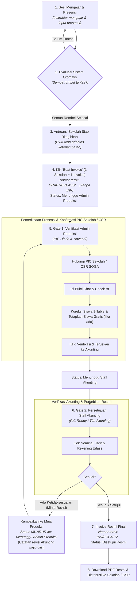

# Panduan Operasional & Penagihan Invoice (Billing Workflow SOP)
**Erlass Institute — Sistem AOQCS & Finance Terpadu**

Dokumen ini merupakan panduan resmi alur penagihan invoice sekolah, mulai dari evaluasi laporan mengajar instruktur di lapangan, antrean sekolah siap ditagihkan, proses *dual-approval* (Operasional & Akunting), hingga penerbitan dan pengunduhan dokumen PDF resmi.

---

## 1. Ringkasan & Prinsip Utama Penagihan

1. **1 Invoice per Sekolah**:
   - Seluruh rombel aktif (Ekskul & Pelatihan) dalam 1 sekolah digabungkan ke dalam **1 dokumen invoice resmi** dengan rincian item per rombel.
2. **Aturan Keserentakan (All Rombels Done)**:
   - Sekolah baru masuk ke antrean *Siap Ditagihkan* apabila **seluruh rombel aktif** di sekolah tersebut telah menyelesaikan target sesinya.
3. **Pemisahan Bersih Skema vs. Periode Tagihan**:
   - **Skema Tagihan**: Nama jenis kontrak (`Bulanan`, `Per 4 Pertemuan`, `Semesteran`, `Tahunan`, `CSR Reguler SOGA`).
   - **Periode Tagihan**: Tempat detail waktu diletakkan (misal: `Agustus 2026`, `Semester 1 — Jul–Des 2026`, `Sesi 1–4`, atau `CSR SOGA — 2026/2027`).
   - **Skema CSR Reguler SOGA (Solidaritas Erlangga)**:
     - **Pihak Ditagihkan (Bill To)**: Tertuju resmi kepada **CSR SOGA (Solidaritas Erlangga)**, dengan mencantumkan nama sekolah mitra dan alamat sasaran kegiatan.
     - **Trigger Penagihan**: Muncul otomatis di antrean setelah **seluruh laporan mengajar sesi kegiatan selesai** (`pending_sessions = 0`).
4. **Bulan Laporan Terakhir**:
   - Periode bulan tagihan dialokasikan berdasarkan tanggal sesi/laporan mengajar riil terakhir yang diselesaikan oleh instruktur.
5. **Dual-Approval Gate (Gerbang Persetujuan Bertingkat)**:
   - **Gate 1 (Admin Produksi - PIC Dinda & Novandi)**: Wajib konfirmasi dengan PIC Sekolah / PIC CSR, penetapan siswa gratis, dan checklist verifikasi kehadiran. Admin Produksi bertugas mengonfirmasi & meneruskan berkas (tidak ada opsi batal/tolak karena koreksi data dilakukan langsung via panel koreksi).
   - **Gate 2 (Staff Akunting - PIC Rendy)**: Wajib otorisasi Staf Akunting, memverifikasi rekening & nominal tagihan, dan menerbitkan invoice resmi. Jika ditemukan ketidaksesuaian, Akunting mengembalikan berkas ("Kembalikan ke Produksi (Minta Revisi)") dengan catatan wajib; status invoice mundur ke Gate 1.
6. **Penomoran Draft ke Final**:
   - Saat dibuat: nomor berlabel DRAFT murni tanpa kata INV (`DRAFT/ERLASS/YYYYMM/KODLAN/NNN`).
   - Saat disetujui Akunting: prefix `DRAFT/` berganti otomatis menjadi nomor resmi final (`INV/ERLASS/YYYYMM/KODLAN/NNN`).
7. **Pencegahan Duplikasi Lintas Skema (Cross-Skema Deduplication)**:
   - Sistem secara cerdas memeriksa riwayat penagihan sesi (`sesi_dari` s.d. `sesi_sampai`). Apabila suatu sekolah bermigrasi skema tagihan (misal dari *Per 4 Pertemuan* ke *Bulanan*), sesi-sesi yang telah terbit invoice resminya tidak akan dimunculkan kembali ke dalam antrean eligible pembuatan invoice baru.
8. **Penyaringan Program Non-Invoiceable**:
   - Program yang bersifat non-tagihan (seperti kegiatan *Sosialisasi*, workshop pengenalan gratis, atau program internal sales) secara otomatis disaring keluar dari antrean penagihan melalui scope `invoiceable()`.

---

## 2. Diagram Alur Kerja (End-to-End Workflow)

---

## 3. Struktur Tabel Antrean (`https://erlass.institute/invoice`)

Panel atas halaman invoice menampilkan tabel **Sekolah Siap Ditagihkan** dengan 8 kolom standar:

| No | Nama Kolom | Keterangan & Format Data |
| :-: | :--- | :--- |
| 1 | **Sekolah** | Kode KODLAN & nama instansi sekolah (misal: `[20106318] SDS Strada Wiyatasana`). |
| 2 | **Rombel & Program (Item)** | Total rombel dan pill rincian per rombel beserta jumlah siswa billable per rombel. |
| 3 | **Skema Tagihan** | Nama skema bersih: `Bulanan`, `Per 4 Pertemuan`, `Semesteran`, `Tahunan`, atau `CSR SOGA`. |
| 4 | **Periode Tagihan** | **Detail waktu/periode penagihan:** • **Bulanan**: `Agustus 2026`, `September 2026`, dll. • **Per 4 Pertemuan**: `Sesi 1–4`, `Sesi 5–8` (disertai penanda `Lap: [Bulan] [Tahun]`). • **Semesteran**: `Semester 1 — Jul–Des 2026`, `Semester 2 — Jan–Jun 2027`. • **Tahunan**: `Tahun 2026`. • **CSR Reguler SOGA**: `CSR SOGA — 2026/2027` (Ditagihkan ke Solidaritas Erlangga). |
| 5 | **Total Siswa Billable** | Total siswa billable aktif dari seluruh rombel di sekolah tersebut. |
| 6 | **Target Invoice** | Tanggal jatuh tempo pembuatan invoice (berdasarkan tanggal sesi terakhir). |
| 7 | **Keterlambatan** | Indikator urgensi keterlambatan pembuatan invoice: • Merah: Terlambat ≥ 7 hari. • Kuning: Terlambat 1–6 hari. • Biru: Hari ini (Jatuh tempo). |
| 8 | **Aksi** | Tombol aksi: **"Buat Invoice"** (1-Klik Generate). |

> **Fitur Filter & Search:**
> Di header card antrean terdapat **Filter Dropdown Skema** (`Semua Skema`, `Bulanan`, `Per 4 Pertemuan`, `Semesteran`, `Tahunan`, `CSR SOGA`) serta **Live Search** yang langsung menyaring baris tabel tanpa refresh halaman.

---

## 4. Prosedur Tahap demi Tahap

### Langkah 1: Pembuatan Draft Invoice
1. Buka menu **Invoice Penagihan** (`/invoice`).
2. Periksa daftar antrean sekolah pada card hijau **Sekolah Siap Ditagihkan**.
3. Klik tombol hijau **"Buat Invoice"** pada baris sekolah yang ingin diproses (atau klik **"Generate Semua (Bulk)"** untuk memproses seluruh antrean sekaligus).
4. Sistem akan membuat draft invoice dengan nomor format:
   `DRAFT/ERLASS/YYYYMM/[KODLAN]/[NNN]` (tanpa kata INV)
5. Status invoice awal: **`pending_operasional`** (Menunggu Admin Produksi).

---

### Langkah 2: Approval Operasional / Pemeriksaan Produk (PIC Dinda & Novandi)
1. Buka detail invoice yang berstatus *Menunggu Operasional*.
2. **Koreksi Siswa Billable (Opsional):**
   - Jika terdapat perbedaan kehadiran antara sistem dan data riil sekolah, klik tombol koreksi (ikon pensil) pada item rombel yang bersangkutan.
   - Masukkan jumlah siswa efektif baru dan tuliskan alasan koreksi (minimal 10 karakter untuk audit trail).
3. **Konfirmasi PIC Sekolah:**
   - Hubungi kontak person sekolah (Wakasek / Koordinator Ekskul).
   - Pastikan kegiatan pembelajaran telah terlaksana dan data siswa telah terkonfirmasi.
4. **Isi Form Approval Operasional:**
   - Centang checkbox: `[x] Telah mendapat konfirmasi dari PIC Sekolah` *(Wajib)*.
   - Ketikkan nama PIC sekolah pada kolom: `Nama PIC Sekolah yang Dihubungi` (misal: *Ibu Maria - Wakasek Kurikulum*).
   - Centang ketiga checklist pemeriksaan produk:
     - `[x]` Presensi & sesi mengajar instruktur telah lengkap diverifikasi.
     - `[x]` Modul/materi dan laporan akhir sesi telah sesuai standar.
     - `[x]` Total siswa billable telah sesuai data konfirmasi PIC sekolah.
   - Tambahkan catatan jika diperlukan.
5. Klik **"Setujui & Teruskan ke Akunting"**.
   - Status invoice berubah menjadi **`pending_akunting`** (Menunggu Akunting).

---

### Langkah 3: Approval Akunting & Cetak Invoice (PIC Rendy)
1. Buka detail invoice yang berstatus *Menunggu Akunting*.
2. **Verifikasi Finansial:**
   - Periksa kebenaran nilai total tagihan, rincian per rombel, dan nomor rekening penampung Erlass Institute.
3. **Pencetakan / Penyiapan Dokumen:**
   - Cetak berkas invoice fisik atau siapkan dokumen digital resmi.
4. **Isi Form Approval Akunting:**
   - Centang checkbox: `[x] Invoice telah tercetak / dokumen PDF resmi siap diterbitkan` *(Wajib)*.
   - Centang item checklist akunting:
     - `[x]` Nomor invoice, nama sekolah & rekening Erlass terverifikasi.
     - `[x]` Tarif per siswa dan total tagihan akurat sesuai kesepakatan.
     - `[x]` Berkas siap dikirimkan secara resmi ke pihak sekolah.
   - Tambahkan catatan akunting jika diperlukan.
5. Klik **"Final Approve (Terbitkan Nomor Resmi)"**.

---

### Langkah 4: Finalisasi & Pengunduhan Dokumen
1. Setelah disetujui Akunting, sistem otomatis:
   - **Menghapus prefix `DRAFT-`** sehingga nomor invoice berubah permanen menjadi nomor resmi:
     `INV/ERLASS/YYYYMM/[KODLAN]/[NNN]`
   - Mengubah status invoice menjadi **`approved`** (Disetujui Resmi).
   - Mengunci invoice dari segala bentuk perubahan koreksi.
   - Mencatat log audit lengkap (waktu, user approver, nama PIC sekolah, dan checklist terverifikasi).
2. Tombol hijau **"Download PDF"** akan aktif.
3. Klik tombol tersebut untuk mengunduh dokumen PDF resmi bertanda tangan & rincian komitmen kontrak.
4. Distribusikan dokumen fisik / PDF kepada pihak sekolah untuk proses penagihan dan pencairan dana.

---

## 5. Ringkasan Hak Akses (Role Access Matrix)

| Aksi / Fitur | Instruktur | Admin / Operasional | Akunting / Finance | Superadmin |
| :--- | :---: | :---: | :---: | :---: |
| Input Presensi & Laporan | ✅ | ✅ | ❌ | ✅ |
| Lihat Antrean Siap Tagih | ❌ | ✅ | ✅ | ✅ |
| Generate Draft Invoice | ❌ | ✅ | ❌ | ✅ |
| Koreksi Siswa Billable | ❌ | ✅ | ❌ | ✅ |
| Approval Operasional (Gate 1) | ❌ | ✅ | ❌ | ✅ |
| Approval Akunting (Gate 2) | ❌ | ❌ | ✅ | ✅ |
| Download PDF Resmi | ❌ | ✅ | ✅ | ✅ |

---
*Dokumen ini diperbarui secara berkala sesuai perkembangan sistem AOQCS Erlass Institute.*
