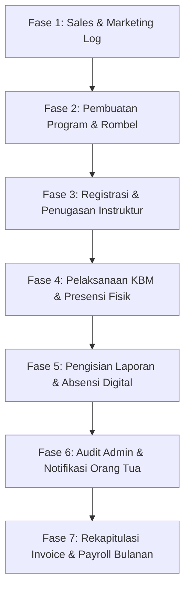

# Standar Operasional Prosedur (SOP) Hulu ke Hilir
## Sistem Informasi Manajemen Ekstrakurikuler — Erlass Institute

Dokumen ini menyajikan panduan operasional terintegrasi dari hulu (upstream/pemasaran) hingga hilir (downstream/keuangan & payroll) dalam ekosistem **Erlass Institute**. SOP ini ditujukan bagi seluruh pemangku kepentingan (*Webmaster, Admin Sistem, Admin Operasional, Sales,* dan *Instruktur*).

---

## Peta Alur Kerja Global (Overview)

---

## FASE 1: Pemasaran & Negosiasi Klien (Hulu - Sales & Marketing)

Fase paling hulu difokuskan pada pendekatan sekolah mitra dan pendataan awal negosiasi program.

1. **Pencatatan Prospek Sekolah**: 
   * Tim Sales mencari prospek sekolah mitra baru dan mencatat detail interaksi (kunjungan, telepon, email, atau rapat) di menu **Sales Log**.
   * Status prospek diperbarui secara berkala untuk memonitor kemajuan negosiasi.
2. **Negosiasi Program**:
   * Menentukan kategori program yang akan diambil sekolah (misal: *Coding Scratch, Microbit, Python*, dsb.).
   * Mengidentifikasi Penanggung Jawab (PJ/PIC) dari pihak sekolah dan nomor WhatsApp aktif mereka.
   * Melakukan kesepakatan kebutuhan fasilitas teknis di lapangan (ketersediaan ruang kelas, koneksi internet, proyektor, steker/kabel listrik).

---

## FASE 2: Inisiasi Program & Registrasi Siswa (Admin & Sales)

Setelah kesepakatan dicapai, program didaftarkan secara resmi ke dalam sistem.

1. **Pembuatan Program Baru (Multi-Step Wizard)**:
   * Tim Sales atau Admin membuat program di menu **Program Ekskul** melalui 6 langkah:
     1. **Info Program**: Memilih kategori program ekskul dan menentukan Sales PIC.
     2. **Sekolah**: Memilih sekolah mitra dari database (alamat dan PIC otomatis dimuat).
     3. **Teknis**: Mengonfigurasi prasyarat perangkat (internet, proyektor, steker).
     4. **Struktur**: Menentukan estimasi jumlah siswa, ruangan kelas, dan jumlah Rombel (Kelompok Belajar) yang akan dibentuk.
     5. **Detail Rombel**: Mengisi nama Rombel, hari belajar, jam mulai, dan tanggal mulai/selesai (durasi default dihitung otomatis 2 jam).
     6. **Review & Preview**: Memeriksa simulasi jadwal sebelum menekan tombol **Simpan**.
2. **Maker-Checker Approval**:
   * Program yang baru dibuat berstatus **Draft**.
   * Admin mengajukan program (**Diajukan**), dan Webmaster/Admin Sistem melakukan verifikasi serta memberikan persetujuan (**Disetujui**) agar program siap berjalan.
3. **Pendaftaran Peserta (Siswa)**:
   * **Langkah Awal**: Admin memastikan seluruh database siswa sekolah mitra telah terimpor di menu `Data Master > Siswa` (menggunakan template Excel/CSV).
   * **Enrollment**: Admin masuk ke **Detail Program > Tab Peserta** lalu memetakan siswa akademik ke Rombel Ekskul terkait menggunakan fitur **Bulk Import per Kelas**.
   * **Otomatisasi WhatsApp**: Sesaat setelah siswa masuk Rombel, sistem otomatis mengirim pesan sambutan WhatsApp (`WelcomeParentNotification`) kepada orang tua siswa yang berisi jadwal hari, jam, nama program, serta permohonan pengecekan ejaan nama anak untuk kebutuhan sertifikat akhir.

---

## FASE 3: Otorisasi & Penjadwalan Instruktur (Admin)

Fase persiapan sebelum kegiatan belajar mengajar dimulai di kelas.

1. **Registrasi & Verifikasi Instruktur**:
   * Calon instruktur melakukan pendaftaran mandiri melalui portal registrasi, melengkapi jadwal ketersediaan waktu mengajar (*schedule matrix*), data profil diri, rekening bank, serta dokumen administrasi.
   * Webmaster/Admin Sistem meninjau berkas di **Pusat Verifikasi** dan menandai akun sebagai instruktur terverifikasi.
   * **Otomatisasi WhatsApp**: Sistem mengirim WhatsApp otomatis (`WelcomeInstructorNotification`) kepada instruktur berisi **ID Instruktur** dan **Password Sementara**.
2. **Pembuatan Sesi & Penugasan**:
   * Admin masuk ke detail Rombel dan mengklik **Generate Session** untuk menerbitkan seluruh pertemuan (misalnya 12-16 pertemuan).
   * Admin menugaskan **Instruktur Utama** dan **Asisten** (jika ada) untuk rombel tersebut. 
   * Sistem otomatis melakukan *Conflict Detection* guna mendeteksi apabila instruktur memiliki jadwal mengajar lain yang bentrok di jam yang sama.

---

## FASE 4: Persiapan & Pelaksanaan Mengajar (Instruktur & Admin)

Aktivitas rutin mingguan ketika KBM berlangsung di lokasi sekolah mitra.

1. **Pengingat H-1 Jadwal Mengajar**:
   * **Otomatisasi WhatsApp**: Setiap pukul 18:00 WIB, server scheduler mengirim pesan pengingat jadwal otomatis (`ScheduleReminderNotification`) kepada instruktur yang terjadwal mengajar keesokan harinya.
2. **Persiapan Sebelum Kelas (Hari H)**:
   * Instruktur masuk ke dashboard aplikasi, membuka detail sesi hari ini, dan mengklik tombol **Cetak Presensi** untuk mengunduh form absensi fisik (format cetak langsung muat 4 pertemuan sekaligus dalam kertas A4 Landscape).
3. **Pelaksanaan di Kelas (KBM)**:
   * Instruktur melaksanakan proses KBM di kelas sekolah mitra.
   * Instruktur menandai kehadiran siswa secara manual pada lembar presensi fisik yang telah dicetak.
   * **Validasi Fisik (Wajib)**: Di akhir sesi, instruktur meminta **tanda tangan dan stempel resmi dari PIC Sekolah** pada lembar absen fisik, serta menandatanganinya sendiri sebagai bukti realisasi pengajaran.
   * Instruktur mengambil foto dokumentasi suasana pembelajaran kelas dan foto lembar presensi fisik yang telah berstempel/ditandatangani.

---

## FASE 5: Pelaporan & Penguncian Administrasi (Instruktur)

Fase pasca-mengajar untuk mencatat administrasi secara digital ke dalam sistem.

1. **Input Laporan Mengajar & Absensi Digital (Batas H+1)**:
   * Instruktur masuk ke detail sesi yang baru selesai dan mengisi laporan mengajar:
     * Memilih **Topik Materi** yang diajarkan (wajib).
     * Mengunggah **Foto Kegiatan** (suasana KBM) dan **Foto Lembar Presensi** bertanda tangan PIC/Stempel (wajib).
     * Mengisi evaluasi keaktifan siswa.
     * Menginput kehadiran digital dengan mencentang siswa yang hadir sesuai lembar fisik (tersedia tombol pintas **Hadir Semua** untuk efisiensi).
   * Instruktur mengklik **Simpan Laporan & Selesaikan Sesi** sehingga status sesi berubah menjadi **Selesai (Hijau)**.
2. **Batas Waktu Penguncian (SLA)**:
   * Pembuatan laporan dibatasi maksimal **H+1 pukul 23:59 WIB** setelah sesi berlangsung.
   * Jika melewati batas waktu tersebut, sesi akan **dikunci** secara otomatis oleh sistem. Instruktur harus menghubungi Admin Operasional untuk pembukaan kunci manual (dan dapat dikenakan penalti keterlambatan pada sistem payroll).

---

## FASE 6: Audit Laporan & Laporan ke Orang Tua (Admin)

Proses penjaminan mutu data dan pelaporan transparansi kepada wali murid.

1. **Audit & Verifikasi Laporan**:
   * Admin membuka menu `Riwayat Laporan` untuk memverifikasi laporan yang diunggah instruktur.
   * Admin membandingkan kesesuaian antara jumlah kehadiran digital yang dicentang dengan foto lembar absensi fisik bertanda tangan PIC sekolah yang diunggah.
2. **Otomatisasi Laporan ke Orang Tua**:
   * **Laporan Mingguan**: Setiap kali instruktur submit laporan, ringkasan materi dan status kehadiran anak dikirimkan ke orang tua siswa.
   * **Progress Report Berkala (Setiap 4 Pertemuan)**: Ketika sesi pertemuan merupakan kelipatan ke-4 (sesi 4, 8, 12, 16), sistem secara otomatis menembakkan pesan WhatsApp ke orang tua siswa yang menyajikan tabel checklist kehadiran (✅ / ❌) lengkap beserta progres kemajuan belajar anak.

---

## FASE 7: Invoice Sekolah & Payroll Instruktur (Hilir - Keuangan)

Fase paling hilir yang mengatur penagihan ke sekolah mitra dan penggajian instruktur.

1. **Rekapitulasi Absensi untuk Invoice Sekolah**:
   * Admin Keuangan membuka menu `/rekap-absensi` (Rekap Invoice) dan menyaring berdasarkan Sekolah dan Rombel.
   * **Aturan Penagihan (Rule Invoice)**: Sistem menggunakan sistem periode 4 pertemuan. Siswa dianggap **Billable** (dapat ditagihkan biayanya ke sekolah) jika hadir **minimal 2 kali** dalam rentang 4 pertemuan tersebut (ditandai dengan baris berwarna hijau otomatis di aplikasi).
2. **Proses Payroll Bulanan Instruktur**:
   * Admin Keuangan membuat **Batch Payroll Baru** berstatus **Draft** untuk bulan berjalan.
   * Sistem secara otomatis menghitung akumulasi gaji instruktur dengan komponen:
     * **Gaji Pokok Mengajar**: Dihitung dari jumlah sesi mengajar dikalikan tarif dasar sesuai level kepangkatan instruktur (Junior, Madya, Senior, Expert, Master Trainer).
     * **Bonus Materi**: Diberikan jika instruktur mengajar kategori program tertentu.
     * **Denda Keterlambatan**: Sistem secara otomatis memotong honor sebesar **Rp 25.000** per sesi jika waktu check-in digital instruktur terlambat lebih dari 15 menit dari jadwal seharusnya.
   * **Override & Finalisasi**: Admin Keuangan / Webmaster meninjau draf payroll, melakukan koreksi nominal (*override*) jika diperlukan, menambahkan bonus/potongan manual beserta catatan, lalu mengubah status menjadi **Processed** (mengunci seluruh data sesi) dan akhirnya **Paid** (dibayarkan).
3. **Slip Gaji Instruktur**:
   * Setelah status batch diubah menjadi **Paid**, instruktur dapat langsung melihat dan mengunduh rincian slip gaji bulanan mereka di portal personal melalui menu **Slip Gaji Saya**.

---

## PENANGANAN KONDISI KHUSUS (EXCEPTION HANDLING)

### 1. Prosedur Reschedule (Perubahan Jadwal)
* Instruktur **TIDAK memiliki akses** untuk mengubah atau membatalkan sesi mengajar sendiri.
* Jika instruktur berhalangan hadir, ia wajib menghubungi Admin selambat-lambatnya H-1.
* Admin melakukan perubahan tanggal/jam melalui menu **Jadwal Mengajar** > **Edit Sesi**.

### 2. Prosedur Substitusi (Instruktur Pengganti)
* Jika instruktur utama berhalangan dan digantikan instruktur lain, Admin mengedit sesi terjadwal tersebut dan mengubah kolom **Instruktur Utama/Asisten** ke nama instruktur pengganti.
* Hak pengisian absensi digital dan laporan mengajar otomatis berpindah ke instruktur pengganti. Honor mengajar sesi tersebut juga otomatis dialokasikan ke instruktur pengganti saat kalkulasi payroll.

### 3. Prosedur Laporan Ad-Hoc (Luar Jadwal Rutin)
* Digunakan untuk kegiatan non-rutin seperti pameran sekolah, sosialisasi ekskul, atau pendampingan lomba.
* Instruktur mengklik **Buat Laporan Baru** di sudut kanan atas dashboard.
* Instruktur mengetik nama rombel/kelas secara manual (misal: "Booth Pameran SDN 01") dan melengkapi dokumentasi foto kegiatan. Laporan ini akan divalidasi admin dan dihitung sebagai sesi honor tambahan.

### 4. Prosedur Pembatalan Program Ekstrakurikuler
* Digunakan jika program berhenti di tengah jalan (misal: kekurangan peserta, sekolah memutus kontrak).
* Admin membuka menu **Ekstrakurikuler** dan memilih opsi **Batalkan Program** pada program terkait serta wajib mengisi alasan pembatalan.
* **Dampak Transaksi Otomatis**:
  * Status program berubah menjadi **Dibatalkan**.
  * Sesi-sesi terjadwal di **hari ini & masa depan** otomatis dibatalkan. Sesi masa lalu (selesai) tetap aman sebagai arsip keuangan.
  * Status seluruh siswa yang terdaftar di rombel tersebut otomatis diubah menjadi **Keluar** dengan alasan yang sama dengan pembatalan program.
