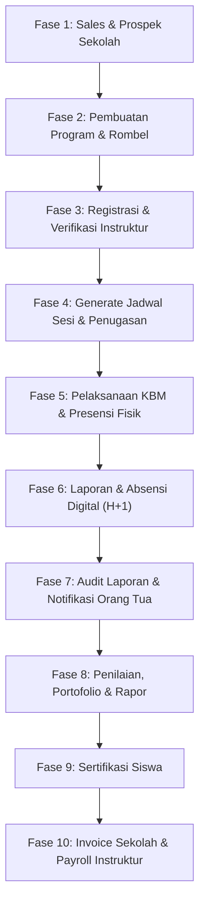

# Standar Operasional Prosedur (SOP) Hulu ke Hilir
## Sistem Informasi Manajemen Ekstrakurikuler — Erlass Institute
## *"Jika tidak tercatat di sistem, maka kegiatan dianggap belum terjadi."*

> Dokumen ini adalah panduan operasional terpadu dari hulu (upstream/pemasaran) hingga hilir (downstream/keuangan & payroll) untuk ekosistem **Erlass Institute**. Ditujukan bagi seluruh pemangku kepentingan: Webmaster, Admin Sistem, Admin Operasional, Sales, dan Instruktur.
>
> **Dasar Hukum Internal**: Blueprint AOQCS 2026 (Academic Operations & Quality Control System)

---

## 📌 Peta Alur Kerja Global (End-to-End Overview)



---

## ──────────────────────────────────────────────
## FASE 1: Pemasaran & Negosiasi Klien (Hulu — Sales)
## ──────────────────────────────────────────────

**PIC**: Sales / Marketing  
**Alat**: Menu **Sales Log** + Modul Surat Pesanan (SP)

### 1.1 Pencatatan Prospek Sekolah

1. Tim Sales membuka menu **Sales Log** di aplikasi.
2. Mencatat setiap interaksi dengan sekolah prospek (kunjungan, telepon, email, rapat) beserta detail waktu, nama kontak, dan hasil percakapan.
3. Memperbarui **status prospek** secara berkala: *Prospek → Pendekatan → Negosiasi → Closing → Aktif*.

### 1.2 Penerbitan Surat Pesanan (SP)

Setelah ada kesepakatan awal, Sales menerbitkan **Surat Pesanan (SP)** sebagai dokumen pengikat:

1. Buka menu **Surat Pesanan (SP)** → klik **Buat SP Baru**.
2. Isi data berikut secara lengkap:
   - **Nomor SP**: Diisi otomatis oleh sistem dengan format unik.
   - **Sekolah**: Pilih dari database sekolah (otomatis muat alamat & PIC).
   - **Salesman PIC**: Memilih nama salesman yang bertanggung jawab.
   - **Produk/Program**: Pilih kategori program (Scratch, Microbit, Python, Robotik, dll.) dari database `products`.
   - **Estimasi Peserta**: Jumlah perkiraan siswa.
   - **Jenis Kegiatan**: Regular, Intensif, Sosialisasi, dll.
   - **Tanggal Mulai Rencana & Jumlah Pertemuan**.
   - **Catatan Khusus**: Persyaratan teknis sekolah (ketersediaan internet, proyektor, steker, dll).
3. Simpan SP dengan status **Draft**.
4. Ajukan SP untuk validasi → status berubah menjadi **Menunggu Validasi Akademik**.

### 1.3 Identifikasi PIC Sekolah

Sebelum program dibuat, Sales wajib mendokumentasikan:
- Nama lengkap Penanggung Jawab (PJ/PIC) dari pihak sekolah.
- Nomor WhatsApp aktif PIC Sekolah (digunakan untuk approval perubahan jadwal).
- Email PIC Sekolah (opsional, untuk keperluan surat resmi).
- Jabatan PIC di sekolah.

---

## ──────────────────────────────────────────────
## FASE 2: Inisiasi Program & Registrasi Siswa (Admin & Sales)
## ──────────────────────────────────────────────

**PIC**: Admin Operasional / Admin Sistem  
**Alat**: Menu **Program Ekskul** (Wizard Multi-Step) + Menu **Data Master**

### 2.1 Validasi Akademik SP

Sebelum program dibuat, Admin Akademik memvalidasi kelayakan SP:

1. Buka menu **Validasi SP** atau halaman detail SP yang berstatus *Menunggu Validasi*.
2. Lakukan checklist validasi:
   - ✅ Ketersediaan instruktur sesuai hari & jam yang diminta.
   - ✅ Ketersediaan alat yang dibutuhkan (laptop, kabel, perangkat Microbit, dll).
   - ✅ Konfirmasi ruang kelas dari pihak sekolah.
   - ✅ Kuota siswa masuk akal (jika >20 siswa per kelas, sistem menampilkan *soft warning* bahwa dibutuhkan Asisten Instruktur).
3. Jika semua layak → ubah status SP menjadi **Disetujui**.

### 2.2 Pembuatan Program Ekstrakurikuler (Wizard 10 Langkah)

1. Buka menu **Program Ekskul** → klik **Tambah Program Baru**.
2. Ikuti wizard langkah demi langkah:
   - **Step 1 – Info Program**: Kategori program (Coding Scratch, Microbit, Python, Robotik, dll.) & Sales PIC.
   - **Step 2 – Sekolah**: Pilih sekolah mitra → alamat, PIC, dan nomor telepon dimuat otomatis.
   - **Step 3 – Teknis**: Konfigurasi kebutuhan teknis (internet, proyektor, jenis kabel yang tersedia, jenis alat/laptop).
   - **Step 4 – Struktur**: Total siswa estimasi, total ruangan, dan **jumlah Rombel** yang akan dibentuk.
   - **Step 5 – Detail Rombel (Dinamis)**: Untuk setiap Rombel, isi:
     - Nama Rombel (contoh: "Rombel 1", "Kelas A").
     - Hari belajar (Senin-Minggu).
     - Jam mulai (jam selesai dihitung otomatis + 2 jam).
     - Tanggal mulai & tanggal selesai program.
     - Total pertemuan.
   - **Step 6 – Review & Preview**: Periksa simulasi jadwal sebelum simpan. Sistem menampilkan kalender visual pertemuan termasuk deteksi hari libur nasional & kalender khusus sekolah.
3. Klik **Selesai & Simpan**. Program tersimpan dengan status **Draft**.

### 2.3 Proses Maker-Checker Approval Program

| Tahapan | Status | PIC |
|---------|--------|-----|
| Program baru dibuat | `draft` | Sales / Admin |
| Diajukan untuk review | `diajukan` | Admin Ops |
| Disetujui & siap berjalan | `disetujui` | Webmaster / Admin Sistem |
| Ditolak & perlu revisi | `ditolak` | Webmaster / Admin Sistem |
| Sedang berlangsung | `aktif` | Sistem (otomatis) |
| Semua sesi selesai | `selesai` | Sistem (otomatis) |

### 2.4 Persiapan Database Siswa

Sebelum melakukan enrollment, pastikan:

1. Buka menu `Data Master > Siswa`.
2. Jika belum ada data siswa sekolah tersebut → gunakan fitur **Import Siswa** (upload file Excel/CSV) dengan kolom wajib:
   - `nama_lengkap` (digunakan untuk sertifikat — perhatikan ejaan!)
   - `nisn` (Nomor Induk Siswa Nasional — harus unik)
   - `sekolah_kodlan` (Kode sekolah)
   - `rombel` (nama kelas akademik siswa)
   - `kelas` (tingkat kelas, contoh: "Kelas 1")
   - `no_hp_orangtua` (WAJIB untuk notifikasi WhatsApp otomatis)
3. Import cukup dilakukan **sekali per tahun ajaran** dan diperbarui berkala.

### 2.5 Enrollment (Pendaftaran Siswa ke Rombel Ekskul)

1. Buka **Detail Program** → tab **Peserta**.
2. Gunakan tombol **Tambah Peserta** (manual) atau **Bulk Import per Kelas** (massal).
   - Contoh: "Masukkan seluruh siswa **Kelas 1A** ke dalam **Rombel Ekskul Scratch A**".
3. Siswa yang berhasil didaftarkan akan muncul di daftar peserta dengan status `aktif`.

> 🤖 **Otomatisasi WhatsApp — WelcomeParentNotification**:  
> Sesaat setelah siswa masuk ke Rombel, jika field `no_hp_orangtua` terisi, sistem otomatis mengirimkan pesan sambutan kepada orang tua siswa berisi:
> - Konfirmasi pendaftaran anak.
> - Hari belajar & jam mulai kelas.
> - Nama program ekstrakurikuler.
> - Himbauan mengecek ejaan nama siswa (untuk kebutuhan cetak sertifikat akhir).

---

## ──────────────────────────────────────────────
## FASE 3: Registrasi & Verifikasi Instruktur (Admin & Instruktur)
## ──────────────────────────────────────────────

**PIC**: Webmaster / Admin Sistem (verifikasi) + Instruktur (registrasi mandiri)  
**Alat**: Halaman `/register/instructor` + Menu **Pusat Verifikasi**

### 3.1 Pendaftaran Mandiri Instruktur

Calon instruktur mengakses halaman registrasi dan mengisi:

1. **Data Diri**: Nama lengkap, email, tanggal lahir, pendidikan terakhir, kompetensi utama & kedua.
2. **Kontak**: Nomor HP WhatsApp aktif (wajib untuk penerimaan notifikasi jadwal & pengingat).
3. **Jadwal Ketersediaan (Schedule Matrix)**: Tabel interaktif (Baris = Hari, Kolom = Jam) untuk menandai waktu mengajar yang tersedia.
4. **Kompetensi Program**: Memilih kategori program yang mampu diajarkan.
5. Data disimpan dengan status **pending** (menunggu verifikasi admin).

### 3.2 Verifikasi Instruktur oleh Admin

1. Admin Sistem / Webmaster membuka menu **Pusat Verifikasi** → tab **Pending**.
2. Tinjau kelengkapan dokumen yang diunggah:
   - Foto KTP (format gambar)
   - Foto NPWP (jika ada)
   - CV/Portofolio (link atau file)
   - Data rekening bank untuk pembayaran honor
   - Data fisik (tinggi/berat badan, kondisi kesehatan, kendaraan)
3. Jika semua lengkap dan memenuhi kriteria → klik **Verifikasi & Aktifkan Akun**.
4. Sistem meng-generate **ID Instruktur** unik (format: `ICE2026XXX`).

> 🤖 **Otomatisasi WhatsApp — WelcomeInstructorNotification**:  
> Setelah akun aktif, instruktur otomatis menerima pesan WhatsApp berisi:
> - **ID Instruktur** untuk login.
> - **Password Sementara** (instruktur wajib ganti setelah login pertama).
> - Link halaman login aplikasi.

---

## ──────────────────────────────────────────────
## FASE 4: Generate Jadwal Sesi & Penugasan Instruktur (Admin)
## ──────────────────────────────────────────────

**PIC**: Admin Operasional / Admin Sistem  
**Alat**: Halaman Detail Rombel → Tombol **Generate Session**

### 4.1 Generate Sesi Pertemuan Otomatis

1. Buka **Detail Program → Detail Rombel**.
2. Klik tombol **Generate Session**.
3. Sistem secara otomatis membuat **daftar sesi/pertemuan** (misal: 12 pertemuan setiap Senin) dengan menghindari:
   - Hari libur nasional (data dari tabel `holidays`).
   - Libur/event khusus sekolah (data dari tabel `school_calendars`).
4. Setiap sesi terbuat dengan status `terjadwal` dan dicatat dengan tanggal, jam mulai, dan jam selesai terjadwal.

### 4.2 Penugasan Instruktur & Asisten

1. Pada halaman Rombel, klik **Edit Instruktur**.
2. Tetapkan:
   - **Instruktur Utama**: Satu instruktur yang bertanggung jawab penuh atas kelas.
   - **Asisten Instruktur** (wajib jika jumlah siswa > 20 — sistem memunculkan *soft warning*).
3. Sistem otomatis melakukan **Conflict Detection**: Jika instruktur pilihan sudah memiliki jadwal lain yang bentrok di hari dan jam yang sama, sistem akan menolak penugasan dan menampilkan peringatan.

### 4.3 Konfirmasi Kehadiran H-1

> 🤖 **Otomatisasi WhatsApp — ScheduleReminderNotification**:  
> Setiap hari pukul **18:00 WIB**, cron job server berjalan dan mengirimkan **pengingat jadwal mengajar** otomatis kepada instruktur yang memiliki sesi terjadwal keesokan harinya. Pesan berisi: sekolah, program, jam, link Google Maps, dan catatan.

Instruktur yang menerima notifikasi wajib melakukan konfirmasi:
- Klik **Konfirmasi Hadir** → status `session_confirmations` berubah menjadi `confirmed`.
- Klik **Berhalangan** → sistem segera menampilkan **warning merah 🚨** di dasbor admin agar koordinator akademik segera mencari instruktur pengganti.

---

## ──────────────────────────────────────────────
## FASE 5: Pelaksanaan KBM & Presensi Fisik (Instruktur)
## ──────────────────────────────────────────────

**PIC**: Instruktur (di lapangan)

### 5.1 Persiapan Sebelum Mengajar (Hari H atau H-1)

1. Login ke aplikasi → buka menu **Jadwal** atau **Dashboard**.
2. Cari sesi yang akan dilaksanakan → klik **Detail Sesi**.
3. Klik tombol **🖨️ Cetak Presensi** untuk mencetak form absensi fisik.
   - Format: Kertas A4 Landscape, memuat **4 pertemuan sekaligus** per halaman.
   - Berisi: Nama siswa, kolom tanda tangan, kolom stempel.
4. Bawa lembar presensi ke lokasi mengajar.

### 5.2 Pelaksanaan di Kelas (KBM)

1. Mulai kelas sesuai jadwal yang telah ditetapkan.
2. Lakukan **absensi manual** — tandai kehadiran siswa di lembar presensi fisik.

> ⚠️ **Kedisiplinan Waktu (Check-In Punctuality)**  
> Waktu check-in instruktur dicatat oleh sistem untuk kalkulasi payroll:
> - 📗 **Excellent** (Hadir ≥ 10 menit sebelum jadwal)
> - ✅ **On Time** (Hadir tepat waktu ± 0 menit)
> - ⚠️ **Warning** (Terlambat 5–15 menit)
> - 🚨 **Penalty** (Terlambat >15 menit → **dipotong Rp 25.000** dari honor sesi tersebut secara otomatis saat payroll)

### 5.3 Validasi Fisik di Akhir Sesi (WAJIB)

Setelah KBM selesai, sebelum meninggalkan kelas:

1. Minta **Tanda Tangan PIC Sekolah** (Kepala Sekolah / Guru Koordinator Ekskul) pada lembar presensi fisik.
2. Minta **Stempel Resmi Sekolah** pada lembar presensi fisik.
3. Bubuhkan **Tanda Tangan Instruktur** sendiri pada lembar yang sama.
4. Ambil **Foto Dokumentasi KBM** (suasana kelas, siswa sedang belajar).
5. Ambil **Foto Lembar Presensi** yang sudah ada TTD PIC & Stempel (foto harus jelas, tidak buram).

---

## ──────────────────────────────────────────────
## FASE 6: Pengisian Laporan & Absensi Digital (Instruktur — Batas H+1)
## ──────────────────────────────────────────────

**PIC**: Instruktur  
**SLA**: Laporan wajib selesai **paling lambat H+1 pukul 23:59 WIB**

### 6.1 Input Laporan Mengajar Rutin

1. Login ke aplikasi → buka **Detail Sesi** yang sudah dilaksanakan.
2. Klik tombol **📋 Buat Laporan & Absensi**.
3. Data sekolah, rombel, dan daftar siswa sudah **terisi otomatis**.
4. Isi formulir laporan secara lengkap:

| Field | Keterangan | Wajib? |
|-------|------------|--------|
| Topik Materi | Pilih dari referensi silabus | ✅ Wajib |
| Jam Mulai / Selesai Aktual | Waktu realisasi mengajar | ✅ Wajib |
| Foto Kegiatan | Foto suasana KBM | ✅ Wajib |
| Foto Lembar Presensi | Foto dengan TTD PIC & Stempel terlihat jelas | ✅ **Sangat Wajib** |
| Evaluasi Keaktifan | Sangat Pasif / Pasif / Aktif / Sangat Aktif | ✅ Wajib |
| Evaluasi Pemahaman | Belum Paham / Sedikit Paham / Paham / Sangat Paham | ✅ Wajib |
| Catatan Tambahan | Kendala, topik lanjutan, catatan khusus | Opsional |

5. Isi **Absensi Digital**:
   - Centang setiap siswa yang hadir berdasarkan lembar fisik.
   - Gunakan tombol **HADIR SEMUA** atau **TIDAK HADIR** untuk efisiensi, lalu koreksi individual.
   - Status kehadiran: `Hadir`, `Izin`, `Sakit`, `Alpha`.
6. Klik **Simpan Laporan & Selesaikan Sesi**.
7. Status sesi berubah menjadi **Selesai (Hijau ✅)**.

### 6.2 Input Laporan Ad-Hoc (Kegiatan Luar Jadwal Rutin)

Untuk kegiatan non-jadwal rutin (pameran sekolah, sosialisasi, lomba, pendampingan):

1. Klik menu **Buat Laporan Baru** di navigasi atas (bukan dari detail sesi).
2. Isi **Sekolah** dan ketik **Nama Rombel/Kelas** secara manual (misal: "Booth Pameran SDN 01 Mei 2026").
3. Upload foto dokumentasi kegiatan dan foto presensi.
4. Jika ada siswa yang belum terdaftar di database → gunakan tombol **Tambah Siswa Baru** di dalam form absensi.
5. Submit laporan → laporan ini masuk sebagai *Laporan Tambahan* dan tetap dihitung dalam honor bulanan.

### 6.3 Prosedur Jika Melewati Batas Waktu H+1

Jika instruktur melewati batas **H+1 pukul 23:59 WIB**:
1. Sistem secara otomatis **mengunci** sesi dan mencegah pembuatan laporan mandiri.
2. Instruktur harus mengajukan **Permohonan Laporan Terlambat** melalui halaman sesi terkait → klik **Ajukan Toleransi Laporan Terlambat**.
3. Admin meninjau permohonan (dengan alasan yang tercatat) → jika disetujui, kunci dibuka.
4. Keterlambatan dapat menyebabkan **pemotongan honor** sesi tersebut saat proses payroll bulanan.

---

## ──────────────────────────────────────────────
## FASE 7: Audit Laporan & Notifikasi Orang Tua (Admin)
## ──────────────────────────────────────────────

**PIC**: Admin Operasional / Admin Sistem

### 7.1 Audit & Verifikasi Laporan Mengajar

1. Buka menu **Riwayat Laporan** atau **Absensi > Rekap Laporan**.
2. Filter berdasarkan rentang tanggal, sekolah, atau instruktur.
3. Untuk setiap laporan masuk, verifikasi:
   - ✅ Foto kegiatan menunjukkan aktivitas KBM nyata (bukan foto lama atau foto tidak relevan).
   - ✅ Foto lembar presensi terbaca jelas, tanda tangan PIC sekolah dan stempel terlihat.
   - ✅ Jumlah siswa hadir di absensi digital konsisten dengan lembar presensi fisik.
   - ✅ Topik materi sesuai dengan urutan silabus yang ditetapkan.
4. Jika ada ketidaksesuaian → admin dapat menghubungi instruktur via WhatsApp menggunakan nomor HP yang tersimpan di profil.

### 7.2 Sistem Otomatisasi Notifikasi ke Orang Tua

Sistem mengirimkan notifikasi WhatsApp otomatis ke orang tua siswa pada dua kondisi:

**A. Notifikasi Laporan Per-Sesi (SessionReportNotification)**:
- **Trigger**: Setiap kali instruktur berhasil submit laporan mengajar.
- **Penerima**: Orang tua siswa yang hadir & memiliki `no_hp_orangtua` valid.
- **Isi**: Tanggal sesi, topik materi yang diajarkan, catatan instruktur, dan link detail laporan.

**B. Progress Report Berkala (ProgressReminderNotification)**:
- **Trigger**: Otomatis saat sesi merupakan kelipatan ke-4 kehadiran siswa (sesi ke-4, ke-8, ke-12, ke-16).
- **Penerima**: Orang tua siswa yang sudah hadir ≥4 kali & memiliki nomor HP valid.
- **Isi**: Tabel checklist kehadiran 4 pertemuan terakhir dengan format:
  ```
  ✅ P.1 (Senin, 02 Juni 2026): Pengenalan Coding Scratch
  ❌ P.2 (Senin, 09 Juni 2026): (Tidak Hadir)
  ✅ P.3 (Senin, 16 Juni 2026): Mengenal Sprite & Stage
  ✅ P.4 (Senin, 23 Juni 2026): Animasi Sederhana
  ```

**C. Kirim Manual Progress Reminder (oleh Admin)**:
- Admin dapat mengirimkan ulang Progress Reminder secara manual dari halaman **Detail Sesi** yang sudah selesai → klik tombol **Bagikan Progress Reminder**.

### 7.3 Warning System — Quality Control Otomatis

Sistem secara otomatis mendeteksi dan menampilkan peringatan di dasbor admin:

**🚨 Warning Merah (Urgent — harus ditangani segera)**:
- Sesi besok belum memiliki instruktur utama.
- Sesi hari ini belum dikonfirmasi instruktur (H-1 terlewati).
- Kelas sudah selesai tetapi belum ada laporan mengajar dalam 24 jam.

**⚠️ Warning Kuning (Tren Negatif — pantau berkala)**:
- Tingkat kehadiran siswa rombel di bawah 70%.
- Jumlah perubahan jadwal rombel >3 kali dalam satu periode.
- Kemajuan pembelajaran tertinggal dari target mingguan.
- Siswa melebihi batas izin/alpha tanpa keterangan.

---

## ──────────────────────────────────────────────
## FASE 8: Penilaian Siswa & Portofolio Karya (Instruktur & Admin)
## ──────────────────────────────────────────────

**PIC**: Instruktur (input nilai & portofolio) + Admin (finalisasi)

### 8.1 Input Nilai Siswa (Student Scores)

Dilakukan di akhir semester/program, buka menu **Nilai Siswa**:

1. Pilih **Rombel** yang akan dinilai.
2. Isi nilai untuk setiap siswa pada empat komponen penilaian:
   - **Nilai Tugas** (1–8 pertemuan, skala 0–100)
   - **Nilai Proyek** (1–8 proyek, skala 0–100)
   - **Nilai Sikap** (1–8 aspek, skala 0–100)
   - **Nilai Kehadiran** (dihitung otomatis dari data absensi)
3. Sistem menghitung **Nilai Akhir (Weighted Average)** secara otomatis.
4. Tambahkan **Catatan Guru** dan informasi **Proyek Utama** (misal: link proyek Scratch, file `.hex` Microbit).
5. Klik **Finalisasi Nilai** → nilai dikunci dan siap untuk generate rapor.

### 8.2 Upload Portofolio Karya Siswa (Student Portfolios)

Setiap kategori program memiliki **berkas portofolio wajib** yang diupload oleh instruktur:

| Kategori Program | Format Portofolio Wajib |
|-----------------|------------------------|
| Coding Scratch | File `.sb3` (project Scratch) |
| Micro:bit | File `.hex` (kode firmware) |
| Python | Source code (`.py`) |
| Robotik | Foto / Video karya robot |

1. Buka halaman **Portofolio** → pilih Rombel dan siswa.
2. Upload file beserta judul, deskripsi singkat, dan nomor pertemuan terkait.
3. Portofolio menjadi lampiran pendukung dalam rapor dan sertifikat.

---

## ──────────────────────────────────────────────
## FASE 9: Generate Rapor & Sertifikasi Siswa (Admin)
## ──────────────────────────────────────────────

**PIC**: Admin Operasional / Admin Sistem  
**Prasyarat**: Nilai Siswa sudah difinalisasi + Foto portofolio sudah diupload

### 9.1 Generate Rapor Belajar (Report Cards)

1. Buka menu **Rapor** → pilih Program & Rombel.
2. Klik **Generate Rapor** untuk seluruh siswa sekaligus.
3. Sistem menghasilkan file **PDF rapor** per siswa menggunakan template resmi Erlass berisi:
   - Identitas siswa (nama, NISN, sekolah, program ekskul).
   - Rekap nilai: Tugas, Proyek, Sikap, Kehadiran, Nilai Akhir.
   - Catatan guru.
   - Foto/link portofolio utama.
4. File PDF disimpan di server dan dapat **diunduh** atau **dicetak** oleh admin & instruktur.

### 9.2 Generate Sertifikat Kelulusan (Certificates)

Sertifikat diterbitkan untuk siswa yang memenuhi kriteria kelulusan:

**Kriteria Kelulusan**:
- Nilai Akhir ≥ batas lulus yang ditetapkan program.
- Kehadiran minimal 70% dari total pertemuan.

1. Buka menu **Sertifikat** → pilih Program.
2. Sistem otomatis menampilkan daftar siswa yang **memenuhi syarat** dan **tidak memenuhi syarat**.
3. Klik **Generate Sertifikat** untuk siswa yang layak.
4. Sistem menghasilkan file PDF sertifikat dengan:
   - **Kode Sertifikat Unik** (format: `CERT-2026-XXXX`) yang dapat diverifikasi.
   - **QR Code** yang dicetak di sertifikat → saat di-scan, menampilkan data verifikasi keaslian sertifikat.
   - Nama siswa yang sudah terverifikasi ejaannya.
   - Tanda tangan digital pejabat yang berwenang.

> ⚠️ **Perhatikan Ejaan Nama**: Pastikan nama siswa sudah benar sebelum generate sertifikat. Proses ini sangat sulit direvisi setelah sertifikat dicetak dan diserahkan. (Itulah mengapa sistem mengirim WA ke orang tua untuk pengecekan ejaan nama sejak awal pendaftaran.)

---

## ──────────────────────────────────────────────
## FASE 10: Invoice Sekolah & Payroll Instruktur (Hilir — Keuangan)
## ──────────────────────────────────────────────

**PIC**: Admin Keuangan / Webmaster  
**Frekuensi**: Bulanan (akhir bulan)

### 10.1 Rekapitulasi Absensi untuk Invoice Sekolah

1. Buka menu `/rekap-absensi` (Rekap Invoice).
2. Filter berdasarkan **Sekolah** dan **Rombel** yang akan ditagih.
3. **Aturan Penagihan Resmi (Billable Rule)**:
   - Sistem menggunakan siklus **periode 4 pertemuan**.
   - Siswa dianggap **Billable** (dapat ditagihkan ke sekolah) jika hadir **minimal 2 kali** dari 4 pertemuan dalam periode tersebut.
   - Tampilan: Sel berwarna **Hijau** = siswa billable. Angka "3/4" = hadir 3 dari 4 sesi.
4. Export data rekap ke **Excel** untuk lampiran invoice ke pihak sekolah.

### 10.2 Persiapan & Kalkulasi Payroll Instruktur

1. Buka menu **Payroll** → klik **Buat Batch Payroll Baru**.
2. Pilih periode bulan yang akan diproses → status batch dimulai sebagai **Draft**.
3. Sistem otomatis menghitung honorarium setiap instruktur berdasarkan:

| Komponen | Cara Hitung |
|----------|------------|
| **Gaji Pokok Mengajar** | Jumlah sesi selesai × Tarif Dasar sesuai Level Instruktur |
| **Bonus Materi/Produk** | Sesuai kategori program yang diajarkan (Scratch, Python, Microbit, Robotik) |
| **Denda Keterlambatan** | −Rp 25.000 per sesi jika check-in terlambat >15 menit |
| **Bonus Manual (Custom)** | Ditambahkan manual oleh admin keuangan (misal: bonus acara khusus) |
| **Potongan Manual (Custom)** | Dipotong manual oleh admin (misal: pinjaman, potongan lain) |

**Tabel Tarif Level Instruktur**:
| Level | Keterangan |
|-------|-----------|
| Junior | Instruktur baru, ≤1 tahun pengalaman |
| Madya | Instruktur menengah, 1–2 tahun |
| Senior | Instruktur berpengalaman, 2–4 tahun |
| Expert | Instruktur ahli, >4 tahun + sertifikasi |
| Master Trainer | Trainer tier tertinggi, dapat melatih instruktur lain |

### 10.3 Review, Override & Finalisasi Payroll

1. **Review Detail**: Pada halaman detail batch, admin dapat melihat rincian per instruktur: total sesi, tarif dasar, bonus, denda, dan total bersih.
2. **Override Sesi**: Admin dapat mengubah nominal tarif per sesi tertentu jika ada kondisi khusus (misal: sesi pengganti, tarif negosiasi khusus).
3. **Tambah Catatan**: Setiap penyesuaian dilengkapi catatan yang tersimpan sebagai audit trail.
4. Ubah status batch ke **Processed** → semua data sesi **dikunci** (tidak dapat diubah).
5. Lakukan verifikasi akhir dan pembayaran → ubah status ke **Paid** → pencatatan lunas selesai.

### 10.4 Portal Slip Gaji Instruktur

Setelah status batch berubah menjadi **Paid**:
1. Instruktur login → buka menu **Slip Gaji Saya**.
2. Dapat melihat struk rinci bulan tersebut:
   - Total sesi mengajar.
   - Rincian tarif per sesi.
   - Bonus kepakaran program.
   - Denda keterlambatan (jika ada).
   - Penyesuaian manual dari admin.
   - **Total Bersih** yang dibayarkan.
3. Instruktur dapat mengunduh slip gaji dalam format PDF.

---

## ══════════════════════════════════════════════
## PENANGANAN KONDISI KHUSUS (EXCEPTION HANDLING)
## ══════════════════════════════════════════════

### E-1: Perubahan Jadwal (Reschedule)

Instruktur **TIDAK** memiliki akses untuk mengubah/membatalkan jadwal sesi sendiri.

**Prosedur**:
1. Instruktur menghubungi Admin selambat-lambatnya **H-1** (sebelum jadwal berlangsung).
2. Admin atau Instruktur mengajukan **Perubahan Jadwal** melalui menu *Jadwal Mengajar* → **Ajukan Perubahan**.
3. Mengisi: tanggal/jam lama, tanggal/jam usulan baru, dan **alasan perubahan** yang jelas.
4. Perubahan melalui proses **Approval Bertingkat**:

| Tahapan Approval | PIC | Status |
|-----------------|-----|--------|
| Pengajuan | Admin / Instruktur | `pending` |
| Persetujuan Akademik Erlass | Admin Sistem / Webmaster | `approved_academic` |
| Persetujuan PIC Sekolah | PIC Sekolah | `approved_pic` |
| Perubahan Diterapkan | Sistem (otomatis) | `applied` |

5. Setelah semua approve, sistem secara otomatis memperbarui tanggal & jam di database sesi.

> Tidak ada perubahan tanggal pada sesi yang terjadi tanpa adanya record di tabel `schedule_changes` dengan status `applied`. Audit trail selalu terjaga.

### E-2: Substitusi Instruktur (Instruktur Pengganti)

Jika instruktur utama tidak bisa hadir dan sudah mendapatkan instruktur pengganti:

1. Admin membuka detail sesi yang bersangkutan → klik **Edit**.
2. Ganti kolom **Instruktur Utama** atau **Asisten** ke nama instruktur pengganti.
3. Sistem otomatis melakukan conflict detection untuk memastikan tidak ada jadwal bentrok.
4. Klik **Simpan**. Instruktur pengganti kini memiliki hak untuk mengisi laporan & absensi sesi itu.
5. Honor sesi tersebut pada payroll bulanan **otomatis dialokasikan** ke instruktur yang benar-benar mengajar (pengganti).

### E-3: Pembatalan Program Ekstrakurikuler

Jika program harus dihentikan permanen di tengah jalan (kekurangan peserta, kebijakan sekolah berubah, dll.):

1. Admin buka menu **Ekstrakurikuler** → temukan program → klik **Batalkan Program**.
2. **Wajib** mengisi **Alasan Pembatalan** secara rinci.
3. Konfirmasi → sistem menjalankan transaksi atomik berikut secara otomatis:

| Dampak | Keterangan |
|--------|-----------|
| Status program | Berubah menjadi `dibatalkan` |
| Sesi masa depan | Semua sesi `terjadwal` hari ini & setelah hari ini dibatalkan otomatis |
| Sesi masa lalu | Tetap tersimpan utuh (arsip keuangan & audit) |
| Status siswa | Semua siswa aktif di rombel diubah menjadi `keluar` dengan alasan = alasan pembatalan |
| Audit trail | Sistem mencatat siapa yang membatalkan, kapan, dan mengapa |

> Sangat tidak disarankan menggunakan fitur **Hapus** untuk kasus ini. Pembatalan menjaga integritas data historis untuk keperluan laporan keuangan dan evaluasi tahunan.

### E-4: Transfer Siswa antar Rombel

Jika siswa perlu dipindahkan ke kelas/rombel lain:

1. Buka **Detail Rombel** → tab **Peserta** → cari nama siswa.
2. Klik **Transfer Siswa**.
3. Pilih Rombel tujuan (di program yang sama).
4. Sistem otomatis:
   - Mengubah status enrollment lama menjadi `pindah`.
   - Membuat enrollment baru di Rombel tujuan dengan status `aktif`.
   - Mencatat tanggal transfer dan alasan.
5. Riwayat absensi siswa di rombel lama tetap tersimpan sebagai arsip.

---

## ══════════════════════════════════════════════
## MATRIKS HAK AKSES PER ROLE (QUICK REFERENCE)
## ══════════════════════════════════════════════

| Fitur / Aksi | Webmaster | Admin Sistem | Admin Ops | Sales | Instruktur |
|---|:---:|:---:|:---:|:---:|:---:|
| Verifikasi Instruktur | ✅ | ✅ | ❌ | ❌ | ❌ |
| Kelola User / Role | ✅ | ✅ (terbatas) | ❌ | ❌ | ❌ |
| Buat Program Ekskul | ✅ | ✅ | ✅ | ✅ | ❌ |
| Approve Program | ✅ | ✅ | ✅ | ❌ | ❌ |
| Import Siswa (Excel) | ✅ | ✅ | ✅ | ❌ | ❌ |
| Tambah Siswa Saat Laporan | ✅ | ✅ | ✅ | ❌ | ✅ (Quick Add) |
| Generate Jadwal Sesi | ✅ | ✅ | ✅ | ❌ | ❌ |
| Edit / Batalkan Sesi | ✅ | ✅ | ✅ | ❌ | ❌ |
| Lihat Semua Jadwal | ✅ | ✅ | ✅ | ❌ | ❌ (Milik sendiri) |
| Buat Laporan Mengajar | ✅ | ✅ | ✅ | ❌ | ✅ (Milik sendiri) |
| Lihat Semua Laporan | ✅ | ✅ | ✅ | ❌ | ❌ (Milik sendiri) |
| Rekap Absensi / Invoice | ✅ | ✅ | ✅ | ❌ | ❌ |
| Input Nilai Siswa | ✅ | ✅ | ✅ | ❌ | ✅ (Milik sendiri) |
| Generate Rapor & Sertifikat | ✅ | ✅ | ✅ | ❌ | ❌ |
| Kelola Master Tarif Payroll | ✅ | ✅ | ❌ | ❌ | ❌ |
| Proses Batch Payroll | ✅ | ✅ | ❌ | ❌ | ❌ |
| Lihat Slip Gaji Sendiri | ✅ | ✅ | ❌ | ❌ | ✅ |
| Kirim Broadcast WA Massal | ✅ | ✅ | ❌ | ❌ | ❌ |
| Kirim Reminder Manual | ✅ | ✅ | ✅ | ❌ | ❌ |

---

## ══════════════════════════════════════════════
## ALUR NOTIFIKASI WHATSAPP OTOMATIS (FONNTE)
## ══════════════════════════════════════════════

| # | Notifikasi | Trigger | Penerima | Isi Pesan |
|---|-----------|---------|----------|-----------|
| 1 | WelcomeInstructorNotification | Instruktur baru terverifikasi | Instruktur | ID login + password sementara |
| 2 | WelcomeParentNotification | Siswa didaftarkan ke Rombel | Orang Tua | Sambutan, jadwal, cek ejaan nama |
| 3 | ScheduleReminderNotification | Cron job jam 18:00 WIB setiap hari | Instruktur | Detail jadwal mengajar esok hari |
| 4 | SessionReportNotification | Submit laporan mengajar | Orang Tua | Topik materi hari ini, catatan instruktur |
| 5 | ProgressReminderNotification | Kehadiran kelipatan ke-4 siswa | Orang Tua | Rekap 4 pertemuan terakhir dengan checklist ✅/❌ |
| 6 | InstructorBroadcastNotification | Admin kirim broadcast | Semua Instruktur | Pengumuman/informasi penting bebas |

> **Status Integrasi Fonnte**: Notifikasi otomatis memerlukan konfigurasi `WHATSAPP_PROVIDER=fonnte` dan `WHATSAPP_FONNTE_TOKEN` yang valid di file `.env`. Jika token tidak aktif, sistem akan mencatat pesan ke log file lokal (`storage/logs/laravel.log`) tanpa error fatal.

---

*Dokumen ini diperbarui secara berkala mengikuti perkembangan fitur sistem Erlass. Versi terakhir: **Juni 2026**.*  
*Lihat juga: [SOP_TUPOKSI.md](./SOP_TUPOKSI.md) | [ROLE_ACCESS_MATRIX.md](./ROLE_ACCESS_MATRIX.md) | [USER_GUIDE.md](./USER_GUIDE.md)*
